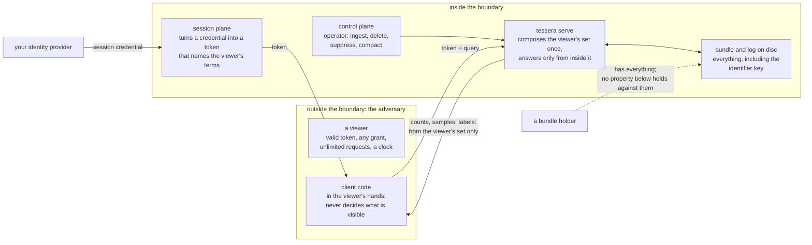

# Security

Every count, cluster, density figure and label Tessera serves is computed from inside the
requesting viewer's own authorised set, not filtered into that shape afterward. This chapter
states that guarantee in full: the adversary it is built against, the five properties that make it
up, how each is enforced, what is accepted rather than closed, and what is not claimed.

## The adversary and the boundary

Three parties reach the system, and the design treats them differently.

A viewer holds a session token: whatever credentials it presented at authorisation, and as many
requests as it likes against the resulting access. This is the adversary the properties below are
built against: someone who can hold any grant, ask anything, and read every response, but cannot
forge a credential or bypass the authorisation step itself. The evidence in this chapter, and the
register in particular, states what such a viewer can learn.

A bundle holder holds the built artifact on disk: the manifest, the per-deployment key, the full
term index and the geometry. None of the properties below defend against this party. Anyone with
the bundle already has the masks, the term index and the coordinates; the identifier scheme
described below adds nothing against them, and none is claimed.

An operator drives the control plane: ingest, deletion, suppression and compaction. The design
treats this party as trusted. The write path's own correctness against a trusted operator is that
chapter's subject rather than this one's.

A client (the TypeScript or Python library, or a component built on it) is not a trust boundary at
all. Every count, sample and label it receives has already been computed inside the principal's own
mask before it left the server. What a client can get wrong is truthful display, not disclosure;
that is covered in the clients chapter.

*What crosses each boundary. A viewer receives responses computed inside its own mask; an
operator's writes are trusted; a bundle holder already has everything the server has.*

## Every quantity is computed from the viewer's own set

A served quantity MUST be computed from inside the requesting viewer's authorised set alone. A
count, a density cell, a cluster's shape or a label taken over the whole corpus and then checked
against that set before display would be a defect here, not a filtered view.

Access is expressed as a set of terms an item carries and a set of terms a token satisfies; an item
is visible to a token if the two sets intersect. Effective visibility is composed once per request,
from the token's own set, the overlay (deletions and suppressions not yet compacted), and
everything ingested since the token's own baseline, before anything downstream reads it. Every consumer of that composition,
whether it counts a tile, draws marks or walks a cluster's membership tree, reads the same composed
set; nothing computes a quantity first and masks it afterward.

Filtering sits after this. A filter narrows which of the authorised items are drawn or counted; it
can never widen the authorised set. Filters are order-independent and are composed only by
intersecting with the authorised set already computed, so a new filter form cannot introduce an
access-control defect on its own.

Two facts about the data layout make this checkable rather than only argued. Access data is
expressed over a permanent identity for each item, and the map's layout (screen position,
ordering) is expressed over a separate identity assigned per view; the two meet at exactly one
lookup table, and nothing else in the code converts between them. That separation is proved by a
build check (`check-layers.sh`) and by tests that require a shortcut between the two spaces to fail
to compile. A request also resolves which generation of the data it is answering against exactly
once, at its start, and uses that generation throughout: answering part of a request against one
generation and part against another would not merely be stale, it would name the wrong rows once
anything has reordered them, so this resolution point is fixed rather than read again mid-request.

## A label is served only when its whole basis is visible

A label MUST be served only if every item in the set it was built from is inside the requesting
principal's authorised set. If even one member of that set is outside it, the label is withheld in
full; there is no partial or hedged version. The check runs on the authorised set, never on a
filtered one, so narrowing a query cannot make an otherwise-withheld label appear, and it runs
fresh on every request rather than being decided once and cached.

The set a label is checked against is fixed once the label is supplied and does not grow with later
arrivals; an item added to the corpus afterward is not treated as part of that label's basis. That
rule keeps the containment check meaningful over time, and belongs to how labels are built rather
than to what a viewer can learn, so it is stated in full in the data model chapter rather than here.

## Samples are taken after masking

Where the number of items in view exceeds what a response carries, the sample shown MUST be drawn
from the viewer's own authorised set, evaluated directly, rather than taken as the visible slice of
a sample computed over the whole corpus. A principal with a narrow grant sees a sample of what they
can see, never a filtered-down sample built for someone wider. Anywhere a precomputed structure
exists as a shortcut for this, an exact fallback computed the same way as the direct evaluation is
required, so the shortcut can change how quickly an answer arrives and never what is served.

## A client never sees an entity id

Every item has a permanent identity that all access data, cluster membership and labels are
expressed against. That identity MUST NOT appear in any response, log or on-wire structure a client
can read. What a client receives instead is a keyed permutation of the identity, computed by an eight-round
Feistel construction over a per-deployment key. Two facts about
the data layout hold regardless of how strong that construction is. No structure on the request path
stores the underlying identity at all, so nothing on that path could hand one out even by mistake;
and once an item's identity is assigned, it is never reused, so a deleted item's slot cannot later
grant a new item the access the old one held.

## An incomplete answer is refused

A response that was not actually computed in full MUST be refused. It MUST NOT be returned as
though it were complete, and MUST NOT be returned as an empty result standing in for "not
answered." Where two requests share work in progress, such as a row projection being built for a
session, a failure or a cancelled build on one request never leaves a waiting second request reading
a half-built result: that request either receives a typed refusal or finds no cached work and builds
its own. This half is built and exercised in tests.

**Not built yet:** the design also states two further rules for a compartment (a further store
holding data that must be kept physically apart, not merely masked). A compartment a token cannot
reach must count as contributing nothing satisfied, never as though it had been checked and passed.
A compartment unreachable because the system cannot reach it, rather than because the token is not
authorised for it, must be reported as an error rather than as an empty contribution. Neither rule
has anything to test it today, because a deployment has exactly one compartment: every token reaches
the only store there is, and neither case can arise until a second compartment exists. What that
means for compartmented isolation as a whole is stated below.

## What this does not claim

| Not claimed | Why not |
|---|---|
| Cryptographic protection of the identifier a client receives | The permutation is an eight-round non-cryptographic mixer, chosen to blind a viewer holding only the scrambled values, not to resist an adversary who already holds matched pairs of the real and scrambled identity. If a viewer ever obtained such a pair, this half of the defence would no longer hold. |
| A defence against a bundle holder | Anyone holding the built artifact already has the key, the term index and the coordinates; the identifier scheme adds nothing against them, and none of the properties above are claimed for that party. |
| Isolation of compartmented partitions | **Not built yet.** The design specifies a second, physical separation for data that must be held apart, gated by a required-term check on every token. None of it exists: a deployment today has one store, so no isolation beyond masking is available, and a requirement for physical separation cannot be met by deploying the system as it stands. |
| Agreement between the two authorisation functions | See the paragraph below this table. |
| Closure of the timing and activity family | The register below states this family as accepted, and for its core timing question, open and unquantified rather than closed. |
| Protection of data at rest | This chapter covers what a viewer can learn from responses it is entitled to read. A persisted authorisation result (a cached mask fragment kept on disk between sessions) is a different asset with a different attacker, filesystem access rather than a viewer holding a token, and its own integrity argument, described where that mechanism lives. |
| The client as a trust boundary | The client is never responsible for disclosure; every value it holds has already passed through the server's own mask. Its rules concern truthful display, and are covered in the clients chapter. |
| Availability and denial of service | Out of scope for this chapter. The serving chapter covers admission control and load shedding. |

The two authorisation functions a caller supplies, one deriving terms from an item's access label
and one deriving terms from a principal's credentials, must agree about what each term means: if
the first indexes an item under a term, every principal for whom the second yields that term must
be authorised for that item. Every property above rests on that agreement holding, and nothing
checks it. The only authorisation logic that exists today passes an item's or a principal's own
strings straight through, so its two functions cannot disagree, and there is nothing yet for a check
to run against. It cannot be checked until a plugin exists whose two functions could disagree.

## Residual disclosure

Every quantity above is stated as a rule with no exception. The channels below are the accepted
exceptions: things a viewer can learn beyond a single item's own visibility, each judged worth
carrying rather than worth closing. The specification enumerates thirty-three such channels
individually; the table groups ones that share a shape and states each group's full severity range
and status. The rightmost column names every specification row a group absorbs, so a reader working
from the specification or the conformance suite can trace a code to its place here; that column is
the only place one of those codes appears in this chapter.

| Channel | What a viewer can infer | Severity | Status and why | Specification rows |
|---|---|---|---|---|
| Density and coarse counts restate an already-served quantity | That a viewer's own visible items cluster together in a region, and how many visible marks a tile holds, at a finer grain than a bare count | Low | Accepted, no new channel: the exact masked count is already served for any region or zoom level; these are coarser or cached views of the same figure | C1, C18 |
| Response time and corpus activity track work outside the viewer's own set | How much data outside their own set a request walked, from timing; and that the corpus is being written to, from a staleness signal, in both cases without any content reaching them | Low | Open for the core timing question: unmitigated and unquantified. Accepted elsewhere in the family, on the ground that a principal already knows how much of the corpus is its own | C4, C14, C15, C19, C21, C24, C25, C26, C31 |
| A stable identifier admits existence-probing and linkage | Whether a held identifier still resolves, which timestamps a delete, a suppression or a grant change; that two principals or two sessions are looking at the same item; a caller's own external identifiers can leak structure if the caller chooses to keep them | Medium | Accepted as the intended trade of a bookmarkable identifier. Probing how identifiers moved across a key rotation is closed specifically: no parameter exists to vary | C6, C17, C20 |
| Caller declarations the service cannot verify | Content or a vocabulary value the caller asserted rather than derived from membership, served exactly as declared | Medium, high if mis-declared | Accepted, the caller's control: provenance is not something the service can check. All five are built: a vocabulary's visibility, a layer's label and its membership requirement are declared in the corpus file, and supplied content arrives through the control plane with its declaration or is refused. The specification's rows still carry stale not-built markers for three of them | C7, C12, C23, C27, C28 |
| A vocabulary's values, and a densely pinned ordinal | A value's existence, gated the same way a label is; where an author pins codes densely, the largest visible code coarsely bounds how many values exist | Low to medium | Closed for existence, gated on a visible member carrying the value. Accepted for the ordinal, an owner ruling that set-size leakage from a caller's own chosen numbering is not a threat this system defends against | C11, C22 |
| Node metadata and a routing registry, once compartments exist | That a grouping or a label draws on a given compartment | Low to medium | Node metadata is closed. The registry is accepted, and meaningful only once compartmented partitions exist. **Not built yet:** with one store today there is nothing to separate | C13, C16 |
| A drill-down names relations already served in full | An artifact's served parents; an item's own satisfied labels, reachable views and scoped values | Low | Accepted, bounded to what the requesting principal already sees in full | C29, C30 |
| The highlight and browse verbs answer a second question over an existing candidate set | Nothing beyond what two ordinary filtered requests would already disclose | Low | Accepted. Built; the specification's row still carries a stale not-built marker | C32, C33 |
| Extractive-tier background frequencies | Corpus-wide term distributions, if drawn from the live corpus | Low | Closed: a fixed public reference corpus is used instead of the live one | C5 |
| Pre-intersection filter cardinality | A raw match count taken over unauthorised records | High if exposed | Closed structurally: no route serves a match count before it has been intersected with the viewer's own set | C8 |
| Text relevance scores and ranks | Corpus-wide statistics that would let unreadable content be inferred | High if ranking were added | Closed by scope: filtering is boolean only, and no ranking exists | C9 |
| Vector similarity results and thresholds | Neighbours that vary observably with items outside the viewer's own set | High if post-filtered | Closed structurally: threshold filters push the viewer's own set down before any comparison runs | C10 |
| Checked and found not to leak | Nothing; recorded because each was checked | None | A node's bounding box and hull shape are recomputed from masked members only; label existence omits every unsatisfied candidate from the response | C2, C3 |

## Evidence

| Property | How it is checked | What is not covered |
|---|---|---|
| Every quantity computed from the viewer's own set | Compared, value for value, against an independent second implementation across three planted states, over every served surface: tiles, the points batch and the density layer. The same property was probed manually against a running server across the request contract and the memory-safety surface beneath it, and no route past it was found | Served artifacts travel on their own frame and are not part of this comparison today |
| A label served only when its whole basis is visible | Compared against an independent implementation with two principals differing by exactly one item inside a label's basis, and the difference asserted before anything downstream rests on it | None |
| Samples taken after masking | Compared against an independent implementation with a wrong-shaped stand-in, a sample taken in storage order rather than from the authorised set, that the comparison is required to disagree with | None |
| A client never sees an entity id | Scanned across every wire surface, the sub-cell stream and the logs for a byte pattern matching the underlying identity, with a planted true positive on every scan confirming the scan itself works | None |
| An incomplete answer is refused | The built half is covered by tests around shared in-progress work and cancellation, though not by the differential test form the design describes | The two compartment rules have no test at all, for the reason stated above: nothing exists yet for either to apply to |

## Sources

`docs/design/architecture.md` §4, §6, Appendix C; `docs/design/conformance.md` §0, §4.6;
`docs/design/client-obligations.md`; decisions 0014, 0017, 0019, 0023, 0024, 0027, 0061, 0101;
`docs/evidence/memos/2026-08-14-access-control-redteam.md`.
