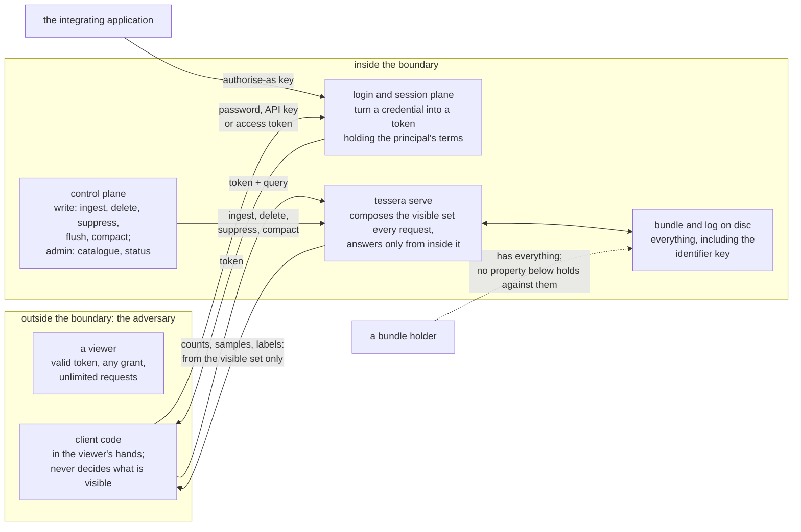

# Security

Every count, cluster, density figure and label Tessera serves is computed from inside the
requesting viewer's own visible set, not filtered into that shape afterward.

## The adversary and the boundary

A viewer holds a valid session token and can make as many requests with it as they like. This is
the adversary the properties below are built against: a legitimate user with any grant, who can
ask anything and read every response, but cannot forge a credential or bypass authorisation.

A viewer's token is worth exactly the terms its principal resolved to when the session was minted.
The identity catalogue decides them: a local principal holds the terms granted to it and to its
groups, and an OIDC identity the terms its provider's claim rules produce from a token whose
signature, issuer, audience and lifetime the server has checked. A session is minted at
`POST /v1/login` from a password, an API key or an access token, or at `POST /session/authorise`
by an API key whose principal holds `authorise-as`, which acts as any principal. That key belongs
to an integrator's backend; whoever holds it reads everything any principal may. A session minted
through `authorise-as` carries the target's terms and its `read` and `write`, and never its
`read-all`, so the key reads what each principal's terms admit and no more. The catalogue and
the server's credential checks are inside the trusted computing base. The terms they resolve, and
the access labels those terms satisfy, are what every later check in this chapter tests against.

A principal holding `read-all`, granted directly, through a group or through an OIDC role
mapping, authorises a session for itself that satisfies every index key, including one promoted
after the session was authorised. Its authorised set is every item listed under any key at the
corpus's current watermark, rebuilt at each publication, so it is every item the corpus holds, and
an item a flush places joins it when that publication reaches the session. The overlay is
subtracted from it at every request, so a deletion or suppression applies to it. It satisfies
every view's, group's, layer's and artifact's own label and every layer's default label, and an
artifact's membership requirement still applies to it. The operator credential mints such a
session for the superuser on the session plane, and may also mint one holding a set of terms it
names.

A session holds the terms resolved when it was minted. A catalogue change that could change them,
or the principal's permissions, ends the session: a grant, a membership, a disabled or deleted
principal, a password set or cleared, a revoked key, or a changed provider. A session also ends at
its key's expiry, its access token's `exp`, the deployment's configured token lifetime, a logout or
a revocation. An OIDC identity's claims are trusted as its provider asserts them; a change at the
provider reaches a session only when the session's token expires.

A bundle holder holds the built artifact on disk: the manifest with the bundle's identity key, the
full term index and the geometry. Nothing here defends against this party.

An operator drives the control plane: ingest, deletion, suppression, compaction and the catalogue.
Every route on the control plane, without exception, requires a credential: the operator
credential, which authenticates a built-in superuser holding every permission, an API key, or an
OIDC access token. Writes, flush and compaction need `write`. Status and the catalogue need
`admin`. **Not built yet:** writes masked by the writer's own terms
([users and access](../users-and-access.md#writes)). Until they are built, every principal with
`write` writes against the whole corpus, with or without `write-all`, and is trusted with every
item, as the operator is: a write can change or name an item the writer cannot see. A principal
with `write` can upsert an item it cannot see, by its unique value, and change its label, so
granting `write` grants what `read-all` grants wherever a view has a unique field.

`admin` can grant any permission to any principal, itself included. A principal holding `admin`
can therefore give itself `read-all` and `write-all` and read and write every item, so `admin` is
trusted as the operator is. A role mapping that gives an OIDC identity a group holding `admin`
extends that trust to whoever the identity provider says is in the mapped claim.

The operator credential is refused at startup when it is empty, since an empty bearer would
authenticate as the superuser. A password is checked over whatever transport reaches the viewer
listener, which serves plain HTTP, so a deployment that takes passwords terminates TLS in front of
it. Failed password attempts are limited per name, so anyone who knows a principal's name can
lock it out of password login with ten wrong attempts every fifteen minutes; its API keys and
sessions are unaffected.

Every cache that holds a viewer's visible set, or a quantity computed from it, is keyed to one
session and is never read by another session, with two exceptions keyed on the session's grant:
the index keys it satisfies, or every key for a session that reads every item. The authorised set
is shared by every session with the same grant. The per-artifact counts, centroids and boxes of an
annotation layer stored by row are shared by every session with the same grant whose visible set
was composed from the same inputs. That key names each input to the visible set: the grant, the build of the authorised set
the session's projection came from, the generation that projection was built at, the segment set,
which every flush and compaction replaces, and a counter that every accepted deletion, suppression,
lift and ingest moves. A request reads both once, at its start, so a request that starts after a
suppression is accepted cannot read an entry built before it, and cannot wait on a build begun
before it. Two sessions that share an entry have the same visible set, so neither is served
anything the other could not see. What the sharing does disclose, through response time, is in the
residual table below.

A client (the TypeScript or Python library, or a component built on it) is not a trust boundary at
all. Every count, sample and label it receives has already been computed inside the viewer's own
visible set before it left the server. A bug in client code can only misdraw what the server
already sent it.

```mermaid
flowchart LR
  subgraph untrusted["outside the boundary: the adversary"]
    viewer["a viewer<br/>valid token, any grant,<br/>unlimited requests"]
    client["client code<br/>in the viewer's hands;<br/>never decides what is visible"]
  end

  subgraph trusted["inside the boundary"]
    session["login and session plane<br/>turn a credential into a token<br/>holding the principal's terms"]
    serve["tessera serve<br/>composes the visible set every request,<br/>answers only from inside it"]
    control["control plane<br/>write: ingest, delete, suppress,<br/>flush, compact;<br/>admin: catalogue, status"]
    bundle["bundle and log on disc<br/>everything, including the<br/>identifier key"]
  end

  issuer["the integrating application"] -- "authorise-as key" --> session
  client -- "password, API key<br/>or access token" --> session
  session -- "token" --> client
  client -- "token + query" --> serve
  serve -- "counts, samples, labels:<br/>from the visible set only" --> client
  control -- "ingest, delete,<br/>suppress, compact" --> serve
  serve <--> bundle

  holder["a bundle holder"] -. "has everything;<br/>no property below holds against them" .-> bundle
```

*What crosses each boundary. A viewer receives responses computed inside its own visible set; a
writer is trusted; a bundle holder already has everything the server has.*

## Every quantity is computed from the viewer's own visible set

A served quantity MUST be computed from inside the requesting viewer's visible set alone. A count,
a density cell, a cluster's shape or a label taken over the whole corpus and then checked against
that set before display is a defect, not a filtered view.

An item carries access labels, each an expression over terms such as `secret&(team_a|team_b)`,
and a token holds the terms its credential names. An item is in the authorised set when the token's
terms satisfy one of its labels, and the authorised set is built once per session, at
authorisation ([access control](access-control.md#how-labels-are-indexed)). The expressions have no
negation, so holding more terms never admits fewer items. The visible set is the authorised set minus the overlay, the record
of every item currently hidden by a deletion or a suppression, composed at the start of every
request, before anything reads it. Everything that counts, draws or labels an item reads that one
set. A filter narrows which of the visible set is drawn or counted into the filtered set, and can
never widen it, so adding a filter cannot introduce an access defect. The visible set is the only
path to the geometry: the geometry arrays have no other entry point, so no code path can build an
aggregate over rows the visible set excludes. Nothing checks this at build time; the guarantee
rests on the code's shape and on review.

A suppression applies to every request that starts after it is accepted, because the overlay is
read fresh each time the visible set is composed. A request already running when it is accepted
may or may not reflect it. A deletion's rows leave the corpus only at
compaction; until then they are removed from the visible set the same way a suppressed item's are.

An edit moves an item to a new entity and deletes the old one, and none of it can widen what a
viewer sees. A suppression standing against the old entity is copied to the new one in the same WAL
record. An unsuppress lifts an item's suppression. A compaction drops the suppression of every
entity it removes, the old entity among them, while an item that still exists keeps its suppression
on its current entity, so an id freed there and issued to another item carries no suppression. The
item's label is the edit's from the acknowledgement: until a flush places the new entity's rows the
item is in no view, and once placed it is served under the new label only. A content generated from
the item keeps it among its generating items, so the content stays served, and still only to a
viewer who can see every one of them.

The content key on a response is advisory: it lets a client tell that the corpus has changed since
its last request, but it carries no authorisation weight, and presenting an old one never restores
access a newer request would refuse.

## A derived artifact is served on the terms its layer declares

Labels and artifacts such as clusters, hulls and hierarchy levels are built from sets of items.
Whether a viewer is served one is decided per request, over the viewer's own visible set, on two
axes the layer declares:

- **An access label of its own.** A layer, or an artifact within it, can carry an access label
  like an item, and is then visible only to viewers whose terms satisfy it.
- **A membership requirement.** How much of the artifact's member set the viewer must be able to
  see: all of it, any of it, a fraction, a count, or none. "All" withholds a label if a single
  member is hidden. "None" serves the artifact to every viewer the access label admits: that is
  right for a boundary that exists whether or not this viewer can see a document inside it.

Both tests MUST run on the visible set, never on the filtered set, so narrowing a query cannot make
a withheld artifact appear. A count or a hull served with an artifact is computed over the members
the viewer can see.

## Samples are taken after masking

Where more items are in view than a response carries, the sample MUST be drawn from the viewer's
own visible set. A viewer with a narrow grant sees a sample of what they can see, never a sample
taken over the whole corpus with the hidden points removed.

## A client never sees an entity id

Inside the server every item is addressed by an entity id: a dense integer assigned at ingest, and
the key under which its terms, memberships and labels are stored. It is an implementation detail
of the index, not a property of the data, and it is assigned once and kept for the item's life. An
item's identity outside the server is the `tessera_id` the client is given and the values of its
unique fields, which the operator supplied.

The entity id MUST NOT appear in anything a client can read.
Entity ids are dense and, within one ingest batch, ordered by access terms, so a viewer holding a
few could estimate a lower bound on how many items they cannot see and how the ones they can see
group by access. A bulk read in stored order discloses the second of these, as
[reading in bulk](#reading-in-bulk) states. No content is at stake: content is protected by the
first property.

The `tessera_id` a client receives is a keyed permutation of the entity id, so two of them reveal
nothing about whether their items are adjacent. The key is drawn from the operating system's random
source each time `tessera build` creates a bundle, and is stored in that bundle's manifest. Nobody
configures or supplies it, and no response or log line carries it. A copy of a bundle keeps its
`tessera_id`s. A rebuild creates a new bundle with a new key, so every `tessera_id` changes. No
request accepts an entity id, so a client cannot enumerate them by trying values. A bulk read's
cursor holds internal positions only inside its encryption, and a cursor the server did not issue
for that read does not open. The permutation is not cryptographic, and it should not be assumed to
resist a viewer who has obtained known pairs of an entity id and its `tessera_id`; no route on the
viewer plane yields one, so what the permutation hides does not depend on cryptographic strength.

## A lookup by value answers an invisible holder as absent

A viewer can ask for items by a value they name. An `eq` or `in` filter on a unique field names
values, and the server answers with the items holding them. The field's index maps a value to its
holder across the whole corpus, so the server intersects what the index returns with the viewer's
visible set before any other part of the request reads it. A value held only by an item the viewer
may not see gives the same answer, with the same status and the same shape, as a value no item
holds. The item card route does the same for a `tessera_id`: an item the viewer may not see and an
identifier naming nothing both answer `404 unknown`.

The control plane answers differently, because its caller is a writer, who is trusted with every
item until writes are masked. An ingest row carrying a unique value names the item that holds it, whether or not any
viewer can see that item, and the receipt answers its `tessera_id`. An ingest row whose values name
two items, as one setting a unique value another item holds does, is refused and listed by its
position and reason; in a strict batch the batch is refused with `409`, naming the values and the
holders' `tessera_id`s so that the operator can find the item to change. It names the
`tessera_id`, never the entity id. A declaration of `unique` at a running service is refused
where values are held twice, and the refusal names how many there are and up to ten of the values,
and no item. A build leaves out each later row naming an item or setting a value an earlier row of
its file named or set. Its report counts the rows it left out and names up to ten of their values,
and it names no item.

## An incomplete answer is refused

A response MUST NOT be returned in a form that looks complete when it is not, and MUST NOT be
returned as an empty result standing in for "not answered". Where a response streams, a connection
that drops, or a fault that cuts the stream mid-transfer, leaves the client holding a prefix of its
own response. That is allowed: the missing trailer frame makes the prefix detectable as incomplete
rather than mistakable for a complete answer. What the rule forbids is a partial answer a client
cannot tell from a complete one.

A bulk read follows the same rule. Every response the server ends closes with a trailer that says
why it ended and carries the cursor to continue from, so a response that stops at a limit is
complete as a response and says that the read is not ([serving](serving.md#bulk-reads)).

## Reading in bulk

`POST /v1/items` and `POST /v1/artifacts` answer under the properties above. Every page composes
the visible set again, an item's labels are the clauses of its labels the viewer satisfies, as on
the item card, and an artifact is served on its layer's terms, as on the viewport. An item's unique values are fields like
any other, returned only on request, in that item's own row.

A read of items whose filter bounds its matches through a unique field's index or an artifact's
membership is driven from those matches ([queries](queries.md#filters-across-pages)). The bound is
intersected with the viewer's visible set before it is counted or read, and the choice of route
follows its size, so a value held only by an item the viewer cannot see drives the read exactly as
a value nobody holds, with the same rows, counts and pages. The index lookup's own time can differ
between a value that is held and one that is not, which the timing row below covers.

**Stored order shows which items share a full set of index keys.** A read of items in stored
order returns a viewer's items in the order of their entity ids. Within each build batch and each
ingest window, entity ids are assigned in order of each item's full set of index keys: its labels
read as one disjunction, each term among its operands, and one key for each conjunction among them
([access control](access-control.md#how-labels-are-indexed)), including keys the viewer does not
satisfy. Within one set, a build orders
items by their map cell in the build's anchor view and then by source order, and an ingest orders
them in the order its window received them, so a viewer who reads positions or unique values can see
where one set ends and the next begins.

An edit moves an item to a new entity, taken in the window that commits it, so an edited item
reads as one arriving in that window.

A viewer therefore learns which of their visible items share a full set of index keys, and
roughly in which batch or window each arrived or was last edited. Where two such groups show the
same clauses on the item card, the viewer learns that the items of at least one of them carry a key
the viewer does not satisfy, which is what the item card withholds by serving only clauses the
viewer satisfies. The sets are ordered by the keys' internal numbers, which follow the order in
which keys first appeared, so the order of the sets hints at which keys the viewer does not satisfy
appeared first.
The viewer learns no term's name, no count of the items they cannot see, and nothing about any one
item outside their visible set. Map order discloses none of this grouping and serves every field
stored order serves. **Not built yet:** restricting stored order to some viewers. Every viewer may
ask for it, and a viewer held to map order would lose speed and no data.

**The cursor is sealed to one read.** A cursor carries internal positions: a map cell and a
`tessera_id` in map order, an entity id in stored order, and an artifact's level and publication
ordinal on the artifacts route. It also carries the order and the size of the next stretch the
filter is evaluated over. It is sealed with XChaCha20-Poly1305, an authenticated cipher, under a
key derived from the bundle's identity key, with a random nonce drawn for each cursor, so a viewer
can read nothing from a cursor, and two cursors for one position differ and cannot be matched.
Authenticated with it are the route, the view and its incarnation, a SHA-256 of the authorisation
data the session was opened with, and on the artifacts route the layer's name, its own internal
identity and the level named, and on the aggregate route a SHA-256 of the request's set, reference
and groupings with the internal identity of each layer they name. A cursor therefore opens only in
the read it was issued for, and only in a session opened with byte-identical authorisation data. A
viewer cannot use one to name a position they were not served. Every such failure is one refusal,
decided before any position in the cursor is used, and a cursor issued by another bundle does not
open.

**No stored block is sent as it is.** A compressed block of the record store, like a stored
column, holds the values of items the viewer may not see beside those they may. Every page is
therefore built afresh: each value of a row the read took inside the visible set is decoded and
written into a new Arrow batch, and a request for `zstd` compresses that new batch.

## Counting by group

`POST /v1/aggregate` counts how the viewer's items are distributed across the values of a
category field, the artifacts of a layer and the cells of the map, and it answers under the
properties above. Every page composes the visible set again, and the set and the reference set it
is compared with are both drawn from it, so every count, total and lift is taken over items the
viewer may see, and a deletion or suppression applies from the next page.

A value of a `derived` vocabulary gets a row only where the viewer can see an item carrying it,
and is never counted in `rest`. A named value the viewer may not see gets no row, exactly as a
value that does not exist. The artifacts of a layer are listed on the terms the viewport serves
them on, tested against the visible set and never the filtered set, and an item held only by an
artifact withheld from the viewer counts as `none`, so a withheld artifact cannot show through
`rest`. Rows carry vocabulary keys, `tessera_id`s and cell prefixes; the codes and ordinals the
engine counts with travel only inside the sealed cursor. Where a field keeps a record of which items
carry each value, a value's count is read from that record over the whole corpus and intersected
with the visible set, which puts this route in the timing row below.

## Residual disclosure

Seven channels let a viewer learn something beyond the items they are entitled to see, past what
the properties above bound. Each row states its own status: most channels are accepted for the
reason given, and one, the per-tile timing channel, remains open.

| What a viewer can learn | How | Severity | Why | Specification rows |
|---|---|---|---|---|
| Roughly how much of the corpus lies outside their own set; that a token, keyword, category value or unique field value they can name exists somewhere in the corpus, and coarsely how widely; and that the corpus is being written to | Response time for a viewport, a filter, a category listing, a count by group or a bulk read in either order grows with the work a request does over rows and terms the viewer cannot see, not only their own. A changed content key on a response says the corpus has changed since the viewer's last request | Low | Only the per-tile timing component of this row is open and unquantified: correlating cost with the viewer's own visible count leaves a residual nobody has bounded. A response's cost also varies with how many artifacts in view were withheld by their own label or their membership requirement, since each is found before it is tested, and the identifier route does more work for a withheld artifact than for an identifier naming nothing; a viewer needs an artifact's `tessera_id` to probe the second, and is never served one for an artifact withheld from them. Every other component (the category, text and suggestion timing variants, and the content key itself) is bounded to a quantity the viewer already possesses or is about to receive, and is accepted on that basis. A count by group reads each value's per-value record over the whole corpus where the field keeps one, as a category listing's visibility test and a suggestion's do, so its time depends on how many values exist and coarsely how widely each is held, including a value named in the request that the viewer cannot see. That is accepted, on the same basis as the listing and suggestion timing. A finer per-term version of the content key, and a timing channel over how many partitions a token reaches, are specified but not built: a deployment holds one partition today and nothing finer than the coarse content key reaches the wire | C4, C14, C15, C19, C21, C24, C25, C26, C31 |
| When an item they once saw was deleted or suppressed; and, by comparing `tessera_id`s out of band, that two viewers are looking at the same item | A `tessera_id` is stable for the item's life in one bundle, so a held one stops resolving on the viewer's next request after the change. Two viewers who compare `tessera_id`s for items they can each see can tell they name the same item. An operator's unique values carry whatever structure the operator put in them | Medium | The price of a `tessera_id` a client can bookmark and share. Nothing lets a client vary the key | C6, C17 |
| A lower bound on how many values a category has | Where an operator numbers a vocabulary's values densely, the largest code a viewer can see bounds the count from below | Low | The operator's own numbering; an owner ruling that set-size inference from it is not defended against | C22 |
| That their visible items in a region group together, a fact about structure that includes unseen items | A minimum-visible-count threshold a layer declares bounds how finely a grouping's presence is exposed against the viewer's own visible set, and filtering cannot deepen it | Low | The threshold decides whether a grouping's existence is announced, not whether its count is protected: a viewport and the density layer already serve exact masked counts over any region a viewer can name, whatever threshold a layer declares | C1 |
| That an item they were never entitled to see has been deleted, when a permissive annotation layer's membership set loses it | Under a layer declared permissive, content generated from a deleted item keeps serving until compaction removes the deleted member from the generating set. At that point the content stops serving for every viewer who satisfies the surviving members, including one who never satisfied the original generating set, telling them an item they were never entitled to see has been deleted | Medium | Bounded by the caller's own declaration: strict is the default and never shrinks, so an undeclared layer never signals this. Permissive is a caller's choice for a set where losing one member changes nothing the content asserts | C7 |
| Which of their visible items share a full set of index keys, and so, where two such groups show the same clauses on the item card, that items in at least one of them carry a key the viewer does not satisfy; roughly in which build batch or ingest window each arrived or was last edited; and a hint of the order in which keys they do not satisfy first appeared | A bulk read of items in stored order returns items in entity id order, which groups them by full key set, and their positions or unique values show where one set ends and the next begins ([reading in bulk](#reading-in-bulk)) | Medium | Bounded to how the viewer's own visible items group: no term's name, no count of the items the viewer cannot see, and nothing about any one item outside their visible set. Map order returns the same rows and fields and discloses none of it | none |
| That another session with the same grant, which includes every anonymous viewer of a public deployment, recently authorised or read a layer's level in this view; and, weakly, how busy sessions under other grants are | Two caches are shared by every session with the same grant: the authorised set, built at authorisation, and the per-artifact counts, centroids and boxes of a layer stored by row, built on a level's first read. A read the cache already holds answers in milliseconds and one that builds it takes up to seconds, so the time an authorisation or a level's first response takes says whether another such session asked for it since the last write. Eviction is least recently used across all grants, so an entry that was expected to be held and has to be built again says other sessions have been busy | Low | It discloses activity and nothing about any item: the shared entry is computed from a visible set equal to the asker's own, and an entry built before a deletion, suppression, ingest or compaction is never read after it | none |

A caller-declared quantity the service serves as declared, rather than a viewer's own inference, is
not a residual channel and does not appear above: a caller-declared generating set, an authored
gate label on a vocabulary value, an artifact layer's own access label, and a caller's
membership-requirement declaration are covered under what this does not claim, below.

## What this does not claim

| Not claimed | Why not |
|---|---|
| Cryptographic strength of the `tessera_id` | Not needed. The permutation hides a lower bound on the number of hidden items, a low-severity channel. The grouping by access it would also hide is disclosed by a stored-order read. An adversary who recovered the key would be back at that channel and nothing more. |
| A defence against a bundle holder | Anyone holding the bundle has the key, the term index and the coordinates. None of the properties above are claimed against them. |
| Isolation of partitions | **Not built yet.** The design specifies that a partition a token cannot reach must contribute nothing to an answer, and a partition the system cannot reach through failure must be treated as an error rather than an empty contribution. A deployment today has one partition, so neither case can arise, and neither rule has anything to test it. |
| Verification of what an operator declares | A vocabulary value, a layer's or an artifact's own access label, or supplied artifact content that the operator declares visible is served as declared. The service cannot check provenance. An item with no access label of its own is visible to nobody unless the declaration names a default label, in which case an unlabelled item is treated as if it carried that label and nothing wider. |
| Quantification of the timing channel | Open in the register: correlating a tile's service time with the viewer's own visible count leaves a residual nobody has quantified, so it is recorded rather than closed. |
| Protection of data at rest | This chapter covers what a viewer can learn from responses. Data on disc has a different adversary. |
| The client as a trust boundary | The client never decides what is visible; every value it holds has already been computed inside the visible set. Its rules concern truthful display. |

## Evidence

| Property | How it is checked | What is not covered |
|---|---|---|
| Every quantity computed from the viewer's own visible set | Compared, value for value, against an independent second implementation across three planted states, over the three surfaces the comparison covers: tiles, the points batch and the density layer's masked per-cell counts. The same property was probed manually against a running server across the request contract and the memory-safety surface beneath it, and no route past it was found | Served artifacts travel on their own frame and are not part of this comparison. The three-surface differential and the manual assessment ran over corpora whose items each carry single terms. A second differential covers access expressions on a built bundle: over items carrying conjunctions, disjunctions with a conjunction among their operands, several labels each, a conjunction another label absorbs and a quoted term, it compares which items a bulk read returns to each of fifteen principals, the `labels` beside each, and each item's card, with an oracle that parses and evaluates each item's own labels. It does not compare tiles or counts over such a corpus. Labels holding a conjunction written by ingest are checked by Rust tests of the engine over a flush and a restart |
| A derived artifact served on the terms its layer declares | Compared against an independent implementation with two viewers differing by exactly one item inside an artifact's member set, under the strictest requirement, and the difference asserted before anything downstream rests on it. An artifact's own label is compared against an independent implementation over a built bundle and a service the artifacts were published into, across a restart and a fold; and a viewer lacking a label is shown to get byte-identical answers, on every viewer route, from a deployment holding the artifact and one that never published it | The other membership requirements are covered by Rust tests rather than the differential suite |
| Samples taken after masking | Compared against an independent implementation with a wrong-shaped stand-in, a sample taken in storage order rather than from the visible set, that the comparison is required to disagree with | None |
| A client never sees an entity id | Scanned across every wire surface, including the density layer's sub-cell counts, and the logs, for a byte pattern matching the underlying identity, with a planted true positive on every scan confirming the scan itself works. The scan covers both bulk reads, each read whole across responses and the items read in both orders, and every cursor they issue, whose decoded bytes are swept at every offset | A cursor's bytes are swept for 8-byte values only |
| A lookup by value answers an invisible holder as absent | Rust tests of the engine ask, as a viewer lacking a holder's term, for its value in a keyword and an integer unique field, and check that the answer equals the answer for a value nobody holds. Server tests check that the control plane's strict `409` names the holder's `tessera_id` | Not compared with the independent implementation, and no scan covers the answer's timing |
| Counting by group answers under the properties above | Compared, row for row, against an independent implementation that counts sets of entities: over the adversarial mask catalogue under three principals of very different coverage, a `derived` and a `public` indexed field and a drawn one, by count and by a named list holding a hidden value, a value with no item and one that does not exist, alone and with cells down to depth 20, with no filter, a category filter and a region, against the whole visible set as reference; and cells over the whole view and over areas, which list only their own cells, with the whole view past the cell limit refused; over two spatial layers under three principals, by count and by a named list holding an id that names nothing; and over a tree of overlapping artifacts, some withheld by their own label, by a label no point carries, by their membership requirement or by the layer's default label. Server tests read tables whole through the cursor, apply a suppression from the next response, and check that a client going away frees its admission. Rust tests of the engine and the server plant a derived value whose only carrier is hidden, an artifact withheld by its own label, overlapping artifacts, a second view and a suppression between two pages of one table | A suppression between two pages of one table is not compared with the independent implementation, and no scan covers the response's timing |
| An incomplete answer is refused | The built half is covered by tests around shared in-progress work and cancellation, though not by the differential test form the design describes | The two partition rules have no test at all: a deployment has one partition, so neither can be exercised |
| A bulk read answers under the properties above | The identifier scan above reads the bulk read of items whole, over a synthetic catalogue of adversarial masks, in both orders and across several responses. It checks that no row is returned twice, that the number of rows equals the viewport's visible count, that both orders return the same set of rows, and that each row's unique `serial` is its own item's in the independent implementation's bundle. Rust tests of the items route plant a narrower viewer and a label the viewer does not hold, and a deletion and a suppression accepted between responses and between two pages of one response. Rust tests of the artifacts route plant an artifact withheld by its own label, an attached label whose target is withheld, content the viewer may not read and a parent the viewer is not served, and check that none of them leaves a row, a count, a parent entry or a page; a deny accepted between two responses applies from the next, and a merge between two pages of one response renews the filter. Server tests end responses at each budget and at the stream deadline, and check each trailer's cursor. The TypeScript, Python and command-line clients' tests cut responses before their trailers and check that each keeps its whole pages and the cursor after the last of them | Which rows a bulk read serves, and their values, are not compared with the independent implementation: the Rust tests compare them with each fixture's own expected values. The artifacts route has no test of a deny between two pages of one response. A response cut because its client stopped reading is tested only through the viewport, whose responses are sent by the same code |

## Sources

`docs/design/architecture.md` §4, §6, Appendix C; `docs/design/conformance.md` §0, §4.6;
`docs/design/client-obligations.md`; `docs/design/contracts.md` §3.1; `docs/design/configuration.md`;
decisions 0014, 0017, 0019, 0023, 0024, 0027, 0061, 0101;
`docs/evidence/memos/2026-08-14-access-control-redteam.md`.
