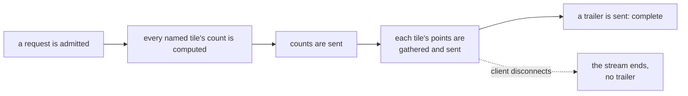

# Serving

By the time an answer to a viewport request leaves the engine, every count and every point in it
has already been computed from a viewer's own visible items. What is left is how that answer
reaches a client: the shape it travels in, what a client may already hold and never has to be sent
again, what the server keeps ready between requests, how the server behaves when it is busy, and
how quickly a change to the corpus becomes visible.

## How a response is delivered

A viewport response arrives as a sequence of frames rather than as one block: counts first, then
artifacts and points as they are found, then a trailer. A client can start drawing from the counts and the first
points before the rest of the answer has been computed, rather than waiting for the whole response
to finish.

*Counts are computed and sent before any point is gathered; points follow at whatever pace the
client reads them; only a response that reaches its trailer is complete.*

| Frame | Carries | How many |
|---|---|---|
| counts | a count for every tile the request named | exactly one, sent first |
| density | a count for each of a tile's [finer cells](queries.md#the-viewport), where a request asked for them | one, only when asked for |
| artifacts | one row per served artifact of the layers the request named | one, only when layers are named |
| points | a chunk of the matched points from one or more tiles | zero or more |
| trailer | how many points were served in total, marking the response complete | exactly one, sent last |

Within one tile, points are sent in ascending identifier order. Across tiles, points are sent in
the order the request named its tiles, or, where a request named a bounding box instead of a list,
in the order the server derives from it. A response that stops before it is finished, whether
because a client disconnects or because the server meets a fault partway through, still leaves
each tile's delivered points as a prefix of that tile's full answer, in that same order: nothing is
skipped or reordered, only cut off. What did arrive was computed against one version of the corpus
and can be trusted for what it is. Only the trailer's absence marks the response as incomplete, and
a fault partway through ends the connection without ever sending one.

## What a client may already hold

Two separate questions decide what a client may do with an answer it already has, and the server
answers both with a value on the response.

One says whether a held answer may still be shown at all. It depends on who the viewer is and
which coordinate system the answer is in, and it changes only when the viewer's own session
changes. The other says whether a held answer may still be declared to the server as something the
server can skip resending. It changes whenever the corpus has moved in a way that could add
something the client does not already have.

The second value travels on the response as an ETag, and a request that wants to declare what it
holds sends it back as an `If-Match` header. If the value a request echoes no longer matches what
the server currently holds, the server does not refuse the request: it answers in full, as though
nothing had been declared, because the request is still answerable and refusing it would gain
nothing.

Declaring what is held is built in one form only: a request can leave a tile out of the list it
asks for, and the server then does no work for that tile at all, not even to check it.
**Not built yet:** anything finer than that. A client cannot tell the server it holds part of a
tile's answer, up to some point, and have the server compute or send only what comes after that
point. Deciding which of a tile's points are visible at all is the most expensive part of
answering it, and every tile a request does name pays that cost in full, whatever the client
already has.

## What the server keeps warm

A viewer's session is authorised once, and the set of items that session may see, arranged into
the row order a response actually reads from, is built once as well and then kept rather than
rebuilt on every request. Rebuilding either from nothing is by far the most expensive step
anywhere in the path a request takes, so a session pays it once, and every ordinary request after
that reads what was already there.

Keeping that kept copy correct as the corpus changes does not mean rebuilding it on every change.
Rebuilding it on the thread answering a request would cost far more than a continuous stream of
published changes can afford, so instead each change is folded into every session's kept copy in
the background, and a request reads whatever the most recent background pass produced rather than
a copy built specially for it. What that background pass can do depends on what changed:

| Change | What happens to a session's kept copy |
|---|---|
| New rows are published | Folded in behind the scenes; the next request reads the freshest version the background pass has reached |
| Rows are rearranged to bound how many separate pieces the server has to read | Cannot be folded in, because row identifiers now mean something different; the kept copy is rebuilt |
| The corpus is rewritten to drop what has been deleted | The kept copy is no longer valid at all; that session's next request starts exactly like a new session's first request |

The rows and positions a request reads live in files the server maps into memory rather than loads
into its own structures, so a value read by a recent request is more likely to still be found in
the operating system's own memory cache the next time, with nothing in the server managing that
layer directly.

**Not built yet:** caching a filter's own matching result apart from the viewport that used it. A
filter's result does not depend on which part of the map is being looked at, but nothing keeps it
from one request to the next, so panning or zooming with a filter applied repeats that evaluation
on every request.

## Admission and load

A request for a viewport, an item, or a new session needs an admission slot before the engine runs
it, separately from whatever is happening on the write side. Admission has two stages. A request
is first checked against an overall limit on how many such requests may be outstanding at once,
and a request that arrives once that limit is reached is refused immediately. A request that
clears that stage may still have to wait briefly for a share of running capacity, bounded by a
short timeout; a request that cannot start within that timeout is refused as well.

Both refusals arrive as a 429 response carrying an interval to wait before retrying:

| What happened | What to do |
|---|---|
| Every admission slot was already taken | Wait the interval given, then retry |
| The request's answer was already being built by another request, and the wait for it ran out | Retry immediately; the build it was waiting on may have finished by then |

The second case exists because a request that finds its answer already being built by an earlier,
matching request does not repeat the work: it waits for that build and is served its result,
bounded by the same short timeout, rather than being refused outright for arriving a moment too
late to start its own build.

A streamed viewport response holds its admission slot for as long as the response is still being
sent, not only for as long as it takes to compute, because a client reading slowly would otherwise
leave that slot appearing free while still occupying it. To stop a slow or unresponsive client
holding a slot indefinitely, the whole delivery is bounded by a fixed deadline measured from when
sending begins, and a response still incomplete when that deadline passes is cut off regardless of
what the client is doing.

If a client disconnects before a response finishes, the server notices at points it checks between
steps of the work still to do, and stops rather than continuing to compute or send an answer
nobody will read.

## Freshness

Every response names the [generation](write-path.md#generations) it was answered from, and a
request may echo that name back. The name never decides what the server answers with: a deletion
or a suppression applies to every request from the moment it is accepted, whatever generation a
request names.

## Serving other map stacks

Most mapping tools outside Tessera address a map by tile rather than by viewport: they ask for one
square at a time, identified by its zoom level and its position, and expect each square to answer
on its own. MapLibre, OpenLayers and QGIS all work this way. Answered naively, that means running
a full evaluation for every tile a screen needs rather than the one evaluation a viewport request
would do for the same area, and a screen typically needs many tiles at once. **Not built yet:**
anything that turns a tile address into a shared evaluation reused across the tiles it covers, so
a deployment serving these tools today pays the cost of one full evaluation per tile.

## Health and readiness

Two routes answer with no body and no credential required, so a load balancer or an orchestrator
can probe them directly: `/healthz`, which reports that the process is running and nothing more,
and `/readyz`, which reports whether the server should currently receive ordinary requests. Both
answer on the same two listeners a viewer or a session request reaches, not on the administrative
one, which already requires a credential on every call and gains nothing from an anonymous probe.

A node is ready when its write side is running normally and no partition it holds has fallen
behind its own record of what it should be serving. The write side reports one of four states:

| State | What it means | Ready |
|---|---|---|
| not started | the write side has not begun | no |
| running | accepting and applying ingest and denies normally | yes |
| write-ahead log failed | durability could not be confirmed for new writes, but denies already accepted keep being applied to what the server holds | no |
| stopped | the write side has stopped entirely | no |

A node reporting a failed write-ahead log keeps hiding items even though it reports not ready for
ordinary requests. An operator routing traffic away from a not-ready node must keep sending it
operations that hide items regardless, because a hidden item cannot wait for a repair.

## What is not built

No replica of any kind exists. What a session has cached and how fresh an answer is are properties
of the one process holding the corpus.

## Where this is tested and where it lives

The framed response, and the split between computing counts and streaming points, live in
`tessera-engine`'s `viewport` module; the frame encoding itself is in `tessera-wire`. A session's
kept authorised set and row arrangement, the background pass that keeps them current, and the
wait-rather-than-refuse behaviour for a request racing a build already in progress live in
`tessera-engine`, in its `cache`, `refresh` and `single_flight` modules. Admission, the streaming
transport and its deadlines, and the health and readiness routes live in `tessera-server`, in its
`state`, `viewer` and `health` modules.

Coverage of the properties this chapter describes is stated in `conformance.md`'s coverage matrix.

## Sources

`docs/design/streamed-serving.md`; `docs/design/delta-serving.md` §1–§6; `docs/design/caching.md`;
`docs/design/filter-result-cache.md` §1–§2; `docs/design/tile-addressed-integration.md`;
`docs/design/hot-row-geometry.md` §1–§2; `docs/design/concurrency-lifecycle.md` §7.2;
`docs/design/system-architecture.md` §5, §6.3, §9; decisions 0058, 0059, 0060, 0061;
`docs/system/write-path.md`; `docs/system/queries.md`; `crates/tessera-server/src/health.rs`;
`crates/tessera-server/src/viewer.rs`; `crates/tessera-server/src/state.rs`;
`crates/tessera-server/src/error.rs`; `crates/tessera-engine/src/cache.rs`;
`crates/tessera-engine/src/refresh.rs`; `crates/tessera-engine/src/single_flight.rs`;
`crates/tessera-engine/src/viewport.rs`.
