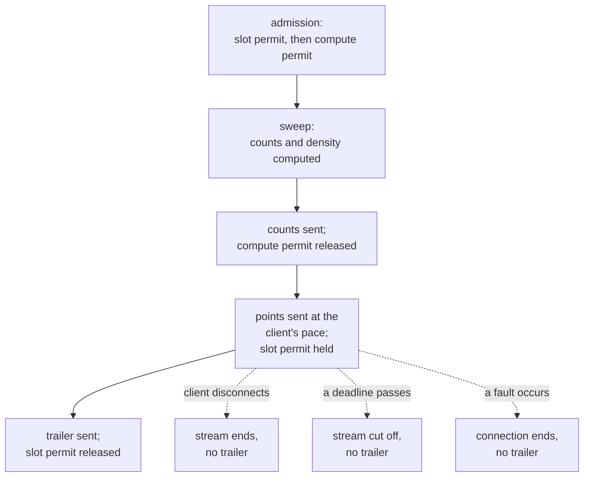

# Serving

By the time an answer to a viewport request leaves the engine, every count and every point in it
has already been computed from the viewer's own visible items. What is left is how that answer
reaches a client, and what happens on the server while it is busy or the corpus is changing under
it.

## Admission and load

A request for a viewport, an item, or a new session needs a slot permit before the engine runs it,
apart from whatever is happening on the write side. Admission checks two things in order. First,
an overall limit on how many requests may be outstanding at once: a request that arrives once
every slot is taken is refused immediately, with no wait. A request that clears that stage still
needs a compute permit, a share of running capacity, and waits up to a configured timeout,
`serve.admission_timeout_ms`, for one to open. A request that gets no compute permit within that
time is refused as well.

Both refusals answer with the same 429 status, carrying a fixed one-second interval to wait before
retrying. Two further cases carry the same status and the same interval, for reasons closer to a
session's own cached state than to the gate:

| What happened | What to do |
|---|---|
| Every slot was taken, or no compute permit opened up within the timeout | Wait the interval given, then retry |
| A concurrent request was already building this session's row projection, and the wait for it ran out | Wait the interval given, then retry; the build it was waiting on may have finished by then |
| A background pass was already rebuilding this session's row projection after a merge, and this request would otherwise pay that rebuild itself | Wait the interval given, then retry |

The last two rows share one status for different reasons. In the second, a matching request got
to this session's row projection first. It is being built now, so a later request for the same
session waits for that build, up to `serve.single_flight_wait_ms`, rather than starting a second
one. It is served that build's result if the build finishes within the wait. In the third, no
other request is building anything. A merge has moved this session's cached row projection out of
date, and a background pass, not a request, is already rebuilding it for every resident session.
Rebuilding it again on this request's own thread would cost far more than the fixed wait. The
request is refused instead and asked to come back once that pass has caught up.

A streamed viewport response holds its slot permit for as long as the response is being sent, not
only for as long as it takes to compute: the response occupies capacity for exactly as long as
bytes take to reach the client. The compute permit is narrower. It releases as soon as the
engine's sweep produces the first counts, before any point is gathered, so a slow but healthy
reader cannot hold compute capacity a waiting request needs.

## What the server keeps warm

A session's authorised set and its row projection, which [access control
describes](access-control.md#composing-the-viewers-set), are built once, together, and then kept
rather than rebuilt on every request. Rebuilding either from nothing is the most expensive step in
the path a request takes. What [a flush, a merge and a compaction fold](write-path.md#flush) each
do to that cached pair is described there; none of the three is applied on the thread answering a
request. A background pass folds a flush or a merge into every resident session's cached pair as
it reaches each one. Only a session the pass has not yet reached pays the cost inline, as an
ordinary cache miss, on its own next request. After a compaction fold the cached pair is invalid
outright for every session, and the same background pass rebuilds each one in turn.

The rows and positions a request reads live in files the server maps into memory rather than loads
into its own structures. A value a recent request read is more likely to still be in the operating
system's own page cache the next time. Nothing in the server manages that layer directly.

**Not built yet:** caching a filter's own matching result apart from the viewport that used it. A
filter's result does not depend on which part of the map is being looked at, but nothing keeps it
from one request to the next, so panning or zooming with a filter applied repeats that evaluation
on every request.

## How a response is delivered

A viewport response arrives as a sequence of frames rather than as one block: counts first, then
artifacts and points as they are found, then a trailer. A client can start drawing from the counts
and the first points before the rest of the answer has been computed.

| Frame | Carries | How many |
|---|---|---|
| counts | visible, matched, served and highlighted counts for each tile that has anything visible; a tile the request named with nothing visible carries no row | exactly one, sent first |
| density | a count for each of a tile's [finer cells](queries.md#the-viewport), where a request asked for them | one, only when asked for |
| artifacts | one row per served artifact of the layers the request named | one, only when layers are named |
| points | a chunk of the matched points from one or more tiles | zero or more |
| trailer | how many points were served in total, marking the response complete | exactly one, sent last |

Within one tile, points are sent in ascending identifier order. Across tiles, points are sent in
the order the request named its tiles, or, where a request named a bounding box instead of a list,
in the order the server derives from it.

A response that stops before it is finished, whether because a client disconnects or because the
server meets a fault partway through, is not discarded. Each tile's delivered points still form a
prefix of that tile's full answer, in that same order. Nothing is skipped or reordered, only cut
off. What did arrive was computed against one version of the corpus and can be trusted for what it
is. Only the trailer's absence marks the response as incomplete.

Two deadlines bound how long delivery may take. A send that stalls longer than
`serve.stream_write_stall_ms` aborts the stream. The whole delivery, from the first flush to the
trailer, may not outlive `serve.stream_deadline_ms`, however the client is reading. A reader that
accepts just enough bytes to dodge the stall limit still cannot hold a slot forever.

If a client disconnects before a response finishes, the server notices at points it checks between
steps of the work still to do, and stops rather than continuing to compute or send.

*A streamed request's lifetime. The compute permit releases once counts are sent; the slot permit
stays held until delivery ends, whichever of the four exits reaches it first.*

## What a client may already hold

A response carries two keys and a generation name a client can compare against what it already holds.

Whether a held answer may still be shown at all depends on the identity key, carried as
`x-tessera-identity-key`. It changes when the viewer's own session changes, and it changes for
every session at once when the [idset rotates](access-control.md#key-rotation), because it is
minted from that same idset.

Whether a held answer may still be declared to the server as something it can skip resending
depends on the content key, carried as an `ETag`. It changes whenever the corpus has moved in a
way that could add something a client does not already have. The one form of narrowing a response
the server acts on today is omission: a client leaves a tile out of what it asks for, and the
server does no work for that tile at all, not even a count.

**Not built yet:** reading a declaration back. The server mints and returns the content key as an
`ETag` on every response. A client that wanted to declare what it already holds would echo it as
`If-Match`. No request carries a declaration today, so nothing reads that header, and every
response is answered in full. Even a finer declaration would only change what is sent, not what is
computed. [Selecting which of a tile's matched points are
served](queries.md#how-many-points-are-shown) is the most expensive part of answering a tile, not
testing whether an item is visible at all. Every tile a request does name pays that cost in full,
whatever the client already has.

A third value, the generation a response was answered from, travels as a header,
`x-tessera-pin`, and a request may echo it back. While the background refresh after a
[flush](write-path.md#flush) has not reached a session, the header names the previous generation,
because the session's visible set is still that generation's projection. Deletions, suppressions
and segments are current either way. An echoed pin buys one comparison against the
generation the response was answered from, reported as a flag on the response, `x-tessera-stale`.

## Serving other map stacks

Most mapping tools outside Tessera address a map by tile rather than by viewport: they ask for one
square at a time, identified by its zoom level and its position, and expect each square to answer
on its own. MapLibre, OpenLayers and QGIS all work this way, and none of them speaks the viewport
request directly.

**Not built yet:** a route that accepts a tile address. An integrator wiring one of these tools to
Tessera today writes an adapter that turns each tile request into its own viewport request, one
evaluation per tile, rather than the single evaluation a native viewport request would do for the
same area.

## Health and readiness

Two routes answer with no body and no credential required, so a load balancer or an orchestrator
can probe them directly: `/healthz`, which reports that the process is running and nothing more,
and `/readyz`, which reports whether the server should currently receive ordinary requests. Both
answer on the same two listeners a viewer or a session request reaches, not on the administrative
one, which already requires a credential on every call and gains nothing from an anonymous probe.

A node is ready when its write side is running normally and no partition it holds has fallen
behind its own record of what it should be serving. The write side reports one of four states:

| State | What it means | Ready |
|---|---|---|
| not started | the write side has not begun | no |
| running | accepting and applying ingest and denies normally | yes |
| write-ahead log failed | durability could not be confirmed for new writes, but denies already accepted keep being applied to what the server holds | no |
| stopped | the write side has stopped entirely | no |

An executor stuck inside a disk write that never returns, a stalled mount or a stuck device, keeps
reporting as running. `/readyz` then answers 200 while every deny that should be applying is
blocked behind it. The probe cannot see the difference between healthy and stalled.

A node reporting a failed write-ahead log keeps hiding items even though it reports not ready for
ordinary requests. An operator routing traffic away from a not-ready node must keep sending it
operations that hide items regardless, because a hidden item cannot wait for a repair. A red probe
means stop routing ordinary requests to the node, never restart it. Replay does not reinstate a
deny that was applied but never made durable, so restarting in response to a red probe can bring a
hidden item back into view.

## What is not built

No replica of any kind exists. What a session has cached and how fresh an answer is are properties
of the one process holding the corpus.

## Where this is tested and where it lives

The framed response, and the split between computing counts and streaming points, live in
`tessera-engine`'s `viewport` module; the frame encoding itself is in `tessera-wire`. A session's
kept authorised set and row arrangement, the background pass that keeps them current, and the
wait-rather-than-refuse behaviour for a request racing a build already in progress live in
`tessera-engine`, in its `cache`, `refresh` and `single_flight` modules. Admission, the streaming
transport and its deadlines, and the health and readiness routes live in `tessera-server`, in its
`state`, `viewer` and `health` modules.

Coverage of the properties this chapter describes is stated in `conformance.md`'s coverage matrix.

## Sources

`docs/design/streamed-serving.md`; `docs/design/delta-serving.md` §1–§6; `docs/design/caching.md`;
`docs/design/filter-result-cache.md` §1–§2; `docs/design/tile-addressed-integration.md`;
`docs/design/concurrency-lifecycle.md` §7.2; `docs/design/system-architecture.md` §5, §6.3, §9;
decisions 0058, 0059, 0060, 0061; `docs/system/write-path.md`; `docs/system/queries.md`;
`docs/system/access-control.md`; `crates/tessera-server/src/health.rs`;
`crates/tessera-server/src/viewer.rs`; `crates/tessera-server/src/state.rs`;
`crates/tessera-server/src/error.rs`; `crates/tessera-engine/src/cache.rs`;
`crates/tessera-engine/src/refresh.rs`; `crates/tessera-engine/src/single_flight.rs`;
`crates/tessera-engine/src/viewport.rs`; `crates/tessera-wire/src/payload.rs`.
