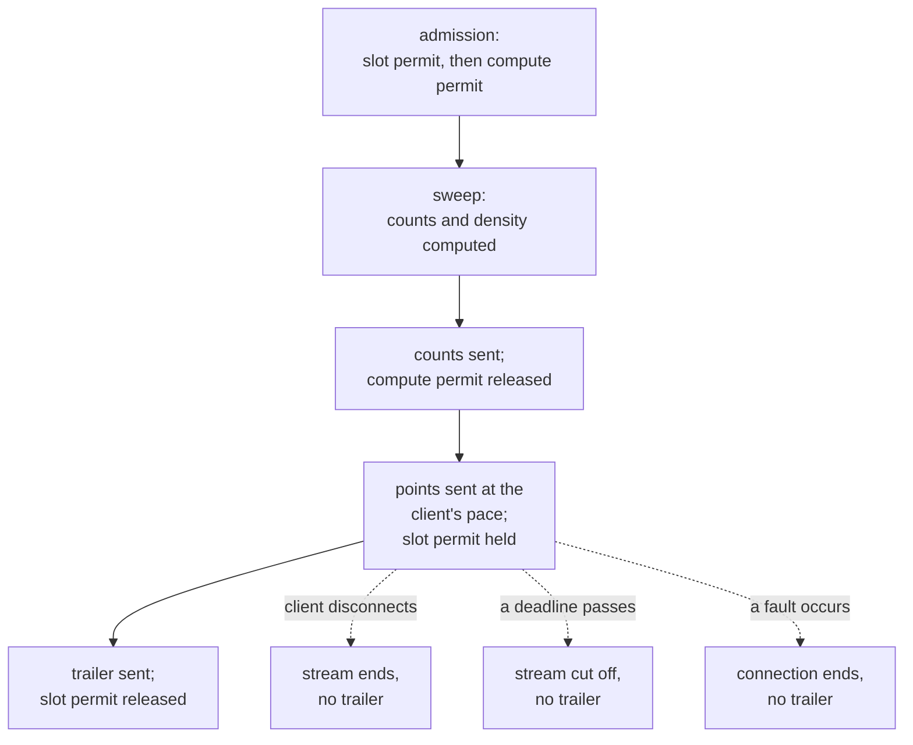
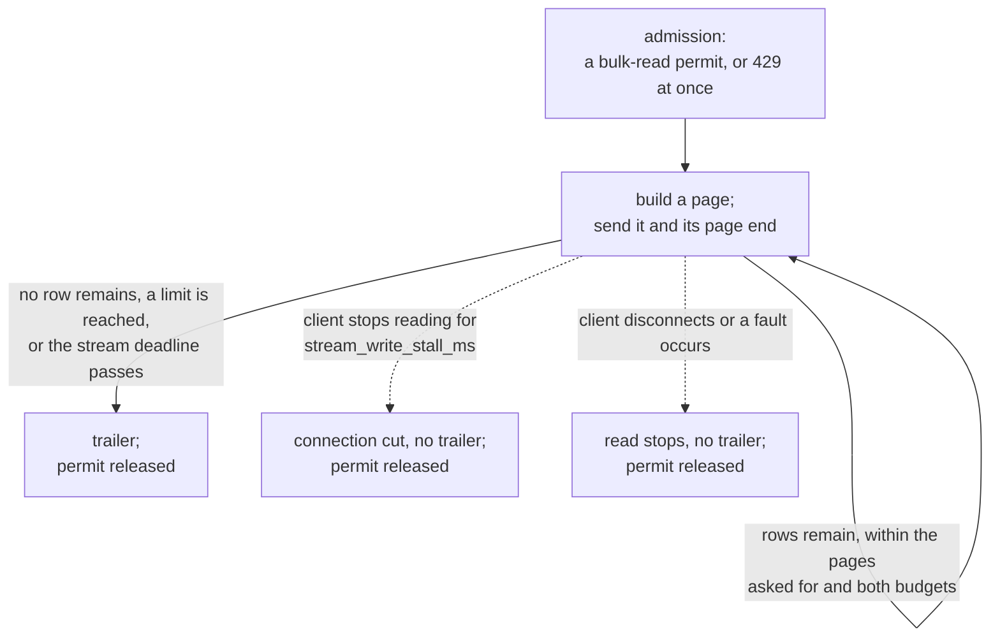
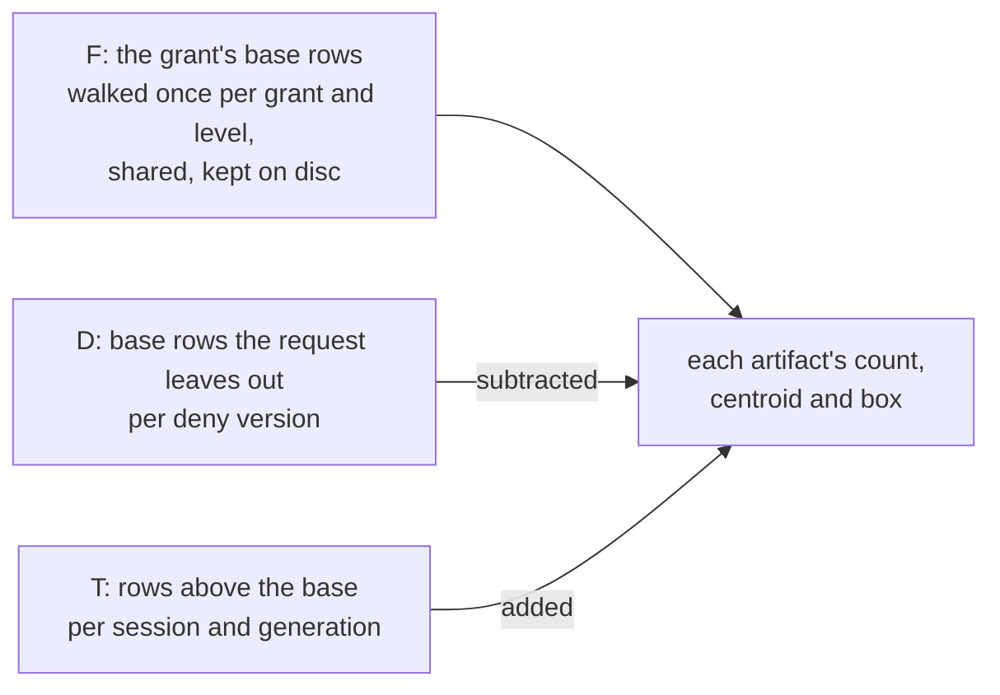

# Serving

By the time an answer to a viewport request leaves the engine, every count and every point in it
has already been computed from the viewer's own visible items. What is left is how that answer
reaches a client, and what happens on the server while it is busy or the corpus is changing under
it.

## Admission and load

A request for a viewport, an item, or a new session needs a slot permit before the engine runs it,
apart from whatever is happening on the write side. Admission checks two things in order. First,
an overall limit on how many requests may be outstanding at once: a request that arrives once
every slot is taken is refused immediately, with no wait. A request that clears that stage still
needs a compute permit, a share of running capacity, and waits up to a configured timeout,
`serve.admission_timeout_ms`, for one to open. A request that gets no compute permit within that
time is refused as well. A bulk read of items or artifacts is admitted under a limit of its own,
described under [bulk reads](#bulk-reads), and so is a request for the artifacts of each tile,
described under [the artifacts of each tile](#the-artifacts-of-each-tile).

Both refusals answer with the same 429 status, carrying a fixed one-second interval to wait before
retrying. Two further cases carry the same status and the same interval, for reasons closer to a
session's own cached state than to the gate:

| What happened | What to do |
|---|---|
| Every slot was taken, or no compute permit opened up within the timeout | Wait the interval given, then retry |
| A concurrent request was already building this session's row projection, and the wait for it ran out | Wait the interval given, then retry; the build it was waiting on may have finished by then |
| A background pass was already rebuilding this session's row projection after a merge, and this request would otherwise pay that rebuild itself | Wait the interval given, then retry |

The last two rows share one status for different reasons. In the second, a matching request got
to this session's row projection first. It is being built now, so a later request for the same
session waits for that build, up to `serve.single_flight_wait_ms`, rather than starting a second
one. It is served that build's result if the build finishes within the wait. In the third, no
other request is building anything. A merge has moved this session's cached row projection out of
date, and a background pass, not a request, is already rebuilding it for every resident session.
Rebuilding it again on this request's own thread would cost far more than the fixed wait. The
request is refused instead and asked to come back once that pass has caught up.

A streamed viewport response holds its slot permit for as long as the response is being sent, not
only for as long as it takes to compute: the response occupies capacity for exactly as long as
bytes take to reach the client. The compute permit is narrower. It releases as soon as the
engine's sweep produces the first counts, before any point is gathered, so a slow but healthy
reader cannot hold compute capacity a waiting request needs.

## What the server keeps warm

A session's authorised set and its row projection, which [access control
describes](access-control.md#what-a-request-answers-from), are built once, together, and then kept
rather than rebuilt on every request. Rebuilding either from nothing is the most expensive step in
the path a request takes. What [a flush, a merge and a compaction fold](write-path.md#flush) each
do to that cached pair is described there; none of the three is applied on the thread answering a
request. A background pass folds a flush or a merge into every resident session's cached pair as
it reaches each one. Only a session the pass has not yet reached pays the cost inline, as an
ordinary cache miss, on its own next request. After a compaction fold the cached pair is invalid
outright for every session, and the same background pass rebuilds each one in turn.

Each annotation level's figures are kept as well, per grant, in memory and on disc, as [a level's
figures](#a-levels-figures) describes.

The rows and positions a request reads live in files the server maps into memory rather than loads
into its own structures. A value a recent request read is more likely to still be in the operating
system's own page cache the next time. Nothing in the server manages that layer directly.

**Not built yet:** caching a filter's own matching result apart from the viewport that used it. A
filter's result does not depend on which part of the map is being looked at, but nothing keeps it
from one request to the next, so panning or zooming with a filter applied repeats that evaluation
on every request.

## How a response is delivered

A viewport response arrives as a sequence of frames rather than as one block: counts first, then
points as they are found, then a trailer. A client can start drawing from the counts and the first
points before the rest of the answer has been computed.

| Frame | Carries | How many |
|---|---|---|
| counts | visible, matched, served and highlighted counts for each tile that has anything visible; a tile the request named with nothing visible carries no row | exactly one, sent first |
| density | a count for each of a tile's [finer cells](queries.md#the-viewport), where a request asked for them | one, only when asked for |
| points | a chunk of the matched points from one or more tiles; where the request names layers, each point carries the `tessera_id` of its artifact in each, or a null | zero or more |
| trailer | how many points were served in total, marking the response complete | exactly one, sent last |

A viewport response carries no artifacts. They have a route of their own, below.

Within one tile, points are sent in ascending identifier order. Across tiles, points are sent in
the order the request named its tiles, or, where a request named a bounding box instead of a list,
in the order the server derives from it.

A response that stops before it is finished, whether because a client disconnects or because the
server meets a fault partway through, is not discarded. Each tile's delivered points still form a
prefix of that tile's full answer, in that same order. Nothing is skipped or reordered, only cut
off. What did arrive was computed against one version of the corpus and can be trusted for what it
is. Only the trailer's absence marks the response as incomplete.

Two deadlines bound how long a viewport's delivery may take. A send that stalls longer than
`serve.stream_write_stall_ms` aborts the stream. The whole delivery of a viewport response, from
the first flush to the trailer, may not outlive `serve.stream_deadline_ms`, however the client is
reading. A reader that accepts just enough bytes to dodge the stall limit still cannot hold a slot
forever. A bulk read uses the same two settings differently, as described under
[bulk reads](#bulk-reads).

If a client disconnects before a response finishes, the server notices at points it checks between
steps of the work still to do, and stops rather than continuing to compute or send.

```mermaid
flowchart TD
  A[admission:<br/>slot permit, then compute permit] --> B[sweep:<br/>counts and density computed]
  B --> C[counts sent;<br/>compute permit released]
  C --> D[points sent at the<br/>client's pace;<br/>slot permit held]
  D --> E[trailer sent;<br/>slot permit released]
  D -.client disconnects.-> X1[stream ends,<br/>no trailer]
  D -.a deadline passes.-> X2[stream cut off,<br/>no trailer]
  D -.a fault occurs.-> X3[connection ends,<br/>no trailer]
```

*A streamed request's lifetime. The compute permit releases once counts are sent; the slot permit
stays held until delivery ends, whichever of the four exits reaches it first.*

## Bulk reads

The bulk reads, `POST /v1/items` and `POST /v1/artifacts`
([queries](queries.md#reading-items-and-artifacts-in-bulk)), run under an admission limit of their
own, `serve.bulk_admission`, so a long read takes no slot from the viewport, item and session
routes, and those routes take none from it. A read past the limit is refused at once with the 429
and one-second interval above, and a limit of 0 refuses every bulk read. An admitted read holds its
permit until its response ends, on a blocking thread of its own: the server allows one such thread
for each read the limit admits. Bulk reads share the machine's CPU and the process's memory with
every other request. `/control/status` reports the limit under `bulk`, with the reads in flight and
how many have been refused.

| Key | Default | What it bounds |
|---|---|---|
| `serve.bulk_admission` | 2 | bulk reads running at once |
| `serve.max_page_rows` | 100,000 | rows in a page; published in `/v1/meta` as `selection.max_page_rows` |
| `serve.max_page_bytes` | 64 MiB | a page's Arrow bytes before compression; published as `selection.max_page_bytes`; at most 2 GiB |
| `serve.bulk_response_bytes` | 256 MiB | the Arrow bytes one response may carry: no page starts that could take the response past it; at least `serve.max_page_bytes` |
| `serve.bulk_response_ms` | 30,000 | how long one response runs |

The server refuses a configuration that sets `serve.max_page_rows` or `serve.max_page_bytes` to 0,
`serve.max_page_bytes` above 2 GiB, or `serve.bulk_response_bytes` below `serve.max_page_bytes`.

The server allows seven pages of `serve.max_page_bytes` for each bulk read. Building a page takes
about three: the engine's memory test, reading notes of 8 bytes and then of 100 KB under a 256 KiB
ceiling, measured 3.13 in the engine alone and holds it below eight. Encoded pages on their way to
the socket take at most two more, one in the body channel and one being written. All bulk reads
together can hold `serve.bulk_admission` × 7 × `serve.max_page_bytes`, 896 MiB at the defaults. The
server has no memory cap of its own to hold that against, so it logs the figure at startup as
`bulk_read_memory_bytes`, for the operator to compare with the cap the process runs under.

Every end the server chooses closes with a trailer that says why and carries the cursor to continue
from, null once no row remains. A response stops for its time budget only where stopping moves the
cursor on, so it can overrun by one filter evaluation and one chunk of its scan. The stream
deadline, `serve.stream_deadline_ms`, is measured from admission for a bulk read, and it cancels
the engine's work: the page under way is sent short and a trailer marked `deadline` follows. Those
last frames go at the client's pace, bounded by the stall limit, since a bulk read's body has no
send deadline of its own. At the defaults the 30-second time budget ends a response well before the
60-second deadline.

A client that stops reading for `serve.stream_write_stall_ms` is cut off without a trailer. It
resumes from the last page end it received and discards any records frame that no page end
follows.

```mermaid
flowchart TD
  A[admission:<br/>a bulk-read permit, or 429 at once] --> P[build a page;<br/>send it and its page end]
  P -- "rows remain, within the pages<br/>asked for and both budgets" --> P
  P -- "no row remains, a limit is reached,<br/>or the stream deadline passes" --> T[trailer;<br/>permit released]
  P -. "client stops reading for<br/>stream_write_stall_ms" .-> X1[connection cut, no trailer;<br/>permit released]
  P -. "client disconnects or a fault occurs" .-> X2[read stops, no trailer;<br/>permit released]
```

*How a bulk-read response ends. The permit is released on every path.*

## The artifacts of each tile

`POST /v1/artifacts/viewport` answers which artifacts lie in each tile
([queries](queries.md#the-artifacts-in-each-tile)), framed as a viewport response is. A frame for
the `nested` and `dag` layers the request names comes first, where it holds a row. Then comes
exactly one frame for each tile, in the order the request named its tiles or the order the server
derives from a bounding box, and then a trailer giving how many rows and frames were sent. A tile
with nothing to show still has its frame, of no rows. Each frame is whole, so a client can keep a
tile's artifacts as soon as its frame arrives. A response without its trailer is incomplete.

The route has its own admission limit, `serve.artifact_admission`, one request for each compute
thread by default. As many more may wait, each for at most `serve.admission_timeout_ms`. A request
past both is refused at once with the 429 and one-second interval above, and its detail names the
artifact-viewport limit. A limit of 0 refuses every such request. The route takes no slot from the
viewport, item and session routes, and they take none from it. An admitted request computes until
its last tile, so it holds its permit and a blocking thread until its response ends. It is
streamed under `serve.stream_write_stall_ms` and `serve.stream_deadline_ms`, as a viewport is, and
stops between tiles when its client goes away. `/control/status` reports the limit under
`artifacts`, with the requests in flight and waiting and how many have been refused.

Before its first frame, a request reads the figures of every level it names: each artifact's
count, centroid and box over the viewer's visible set, described in the next section. After that
a tile costs the candidates it tests. For a level served from a column, the candidates are the
artifacts whose coverings overlap the tile's rows, with those labelling a visible row of the tile
above the base. They are taken in order of count, and each is tested for a member the viewer can
see in the tile by probing its member bitmap. Once the probes have cost what one scan of the
tile's visible rows would, the rest of the tile is answered from that scan. A level stored by
artifact asks the tile index for its candidates and probes each one.

## A level's figures

Every count served beside an artifact of a level served from a column, on any route, is read
from that level's figures for the request. So are its centroid and box, except on a layer that
serves a hull, whose rows the server holds artifact by artifact and reads them from. The figures
are computed from the request's visible set in three parts:

- **F**, the grant's base rows: the rows, below the bundle's base row count, of every item listed
  under an index key the session satisfies. Every session with the same grant has the same F.
- **D**, the base rows the request's visible set leaves out of F: the rows of deleted and
  suppressed items, and of any buffered item whose labels this viewer does not satisfy.
- **T**, every row of the visible set outside F: rows above the base, and the flushed rows of items
  whose labels are still buffered, where the viewer satisfies them.

The visible set is F less D, together with T, and the three never overlap, so an artifact's count
is its count over F, less its count over D, plus its count over T. The same holds for the number
of its rows with a position and for the sums of their positions, which give the centroid.

```mermaid
flowchart LR
  F["F: the grant's base rows<br/>walked once per grant and level,<br/>shared, kept on disc"] --> S
  D["D: base rows the request leaves out<br/>per deny version"] -->|subtracted| S
  T["T: rows above the base<br/>per session and generation"] -->|added| S
  S["each artifact's count,<br/>centroid and box"]
```

*The three parts of a level's figures. Only F is shared between sessions, and it is never served
without the other two.*

F's figures are the expensive part: a walk of the grant's base rows that reads each row's label and,
where the layer serves a centroid or a box, its position. They are filled the first time any route
reads the level under that grant, on a pool of as many threads as `serve.compute_threads`. A request
that needs a level while its walk runs waits for that walk, for as long as its client stays
connected and at most ten minutes, and at most two walks run at once. A walk pauses between chunks
while a viewport is drawing points, so that the viewport's reads do not queue behind it, for at most
`serve.masked_count_give_way_ms` from its first pause.

Once filled, F's figures are shared by every session with the same grant: the same set of
satisfied index keys, or every key for a session that reads every item. They are held in memory
under `serve.masked_count_cache_bytes`, the least recently used leaving first. An eviction costs a
refill and never changes an answer. A growth or a publication between compactions adds its rows to
them in place. A flush adds none, since its rows are above the base, so an ingest window never
refills them. A compaction rotates the bundle identity, which is part of their key, so the first
read of each level after it walks again.

They are also written to the cache directory, under `figures/` and then the bundle identity, in
files named by a digest of what they describe and checked against a SHA-256 when they are read, so
a torn or altered file is read as a miss. A restart reads them back, and walks only a level it
finds no file for. The
directory is held under `serve.figures_disk_bytes`, the files least recently written or read
removed first, and the directory of a bundle identity a compaction has replaced is removed.

D's correction is computed at the request's start from the labels and positions of the view's denied
base rows, which the server holds per view and level and writes beside the counts. It is cached per
deny version, a number per view that moves exactly when the denied rows below the base change: at a
deny, a lift or a compaction, and never at an ingest or a flush. A request that starts after a
suppression is accepted therefore reads a new correction. The labels are read for every denied base
row in the view, whatever the grant. Where a request's own D holds a denied row and more than 4,096
of the view's denied base rows have no label held for the level, that request walks its whole
visible set instead, and the labels are read in the background for the requests after it.
[Security](security.md#residual-disclosure) states what that timing can reveal. T's correction is
held per session and generation.

The box of F less D is F's box unless a row D leaves out lies on one of its edges. For a layer that
serves a box, each artifact with more than sixteen placed rows keeps its eight most extreme rows on
each side, and the first of them D does not hold becomes the edge. Where D holds all eight on a
side, or the artifact has no more than sixteen placed rows, its box is worked out from its member
bitmap and the visible set.

The walk is the cost a new grant pays. On GBIF's 3,495,729,729 occurrences, with 12 threads, under
a 24 GB memory cap, starting with the bundle's pages out of memory and with the machine's
one-minute load between 2.1 and 7.4, one fill of a level of its taxonomy layer, which serves a
centroid and a box, measured:

| viewer sees | rows walked | family | genus | species |
|---|---:|---:|---:|---:|
| 1% | 34,956,939 | 0.29 s | 0.24 s | 1.1 s |
| 25% | 873,932,430 | 3.6 s | 2.2 s | 3.2 s |
| all | 3,495,729,729 | 8.8 s | 10.7 s | 12.5 s |

*One run each, from `probes/2026-10-06-first-open-fills/`. After a restart over the kept cache, the
same requests filled nothing.*

A grant pays the walk once per level, the first time it reads that level, and keeps the result
across restarts until a compaction, or until the bound on the cache directory removes it. A
deployment in which every user holds a grant of their own pays it once per user.

## What a client may already hold

A response carries two keys and a generation name a client can compare against what it already
holds.

Whether a held answer may still be shown at all depends on the identity key, carried as
`x-tessera-identity-key`. It is derived from the session's authorisation data, its visible set
and the view, and changes when any of them does. The visible set's identity is keyed by the
bundle, so the identity key also changes when the bundle is rebuilt, which gives every item a new
`tessera_id`. It is not the key of the `tessera_id` permutation.

Whether a held answer may still be declared to the server as something it can skip resending
depends on the content key, carried as an `ETag`. It changes whenever the corpus has moved in a
way that could add something a client does not already have. The one form of narrowing a response
the server acts on today is omission: a client leaves a tile out of what it asks for, and the
server does no work for that tile at all, not even a count.

**Not built yet:** reading a declaration back. The server mints and returns the content key as an
`ETag` on every response. A client that wanted to declare what it already holds would echo it as
`If-Match`. No request carries a declaration today, so nothing reads that header, and every
response is answered in full. Even a finer declaration would only change what is sent, not what is
computed. [Selecting which of a tile's matched points are
served](queries.md#how-many-points-are-shown) is the most expensive part of answering a tile, not
testing whether an item is visible at all. Every tile a request does name pays that cost in full,
whatever the client already has.

A third value, the generation a response was answered from, travels as a header,
`x-tessera-pin`, and a request may echo it back. While the background refresh after a
[flush](write-path.md#flush) has not reached a session, the header names the previous generation,
because the session's visible set is still that generation's projection. Deletions, suppressions
and segments are current either way. An echoed pin buys one comparison against the
generation the response was answered from, reported as a flag on the response, `x-tessera-stale`.

## Serving other map stacks

Most mapping tools outside Tessera address a map by tile rather than by viewport: they ask for one
square at a time, identified by its zoom level and its position, and expect each square to answer
on its own. MapLibre, OpenLayers and QGIS all work this way, and none of them speaks the viewport
request directly.

**Not built yet:** a route that accepts a tile address. An integrator wiring one of these tools to
Tessera today writes an adapter that turns each tile request into its own viewport request, one
evaluation per tile, rather than the single evaluation a native viewport request would do for the
same area.

## Health and readiness

Two routes answer with no body and no credential required, so a load balancer or an orchestrator
can probe them directly: `/healthz`, which reports that the process is running and nothing more,
and `/readyz`, which reports whether the server should currently receive ordinary requests. Both
answer on the same two listeners a viewer or a session request reaches, not on the administrative
one, which already requires a credential on every call and gains nothing from an anonymous probe.

A node is ready when its write side is running normally and no partition it holds has fallen
behind its own record of what it should be serving. The write side reports one of four states:

| State | What it means | Ready |
|---|---|---|
| not started | the write side has not begun | no |
| running | accepting and applying ingest and denies normally | yes |
| write-ahead log failed | durability could not be confirmed for new writes, but denies already accepted keep being applied to what the server holds | no |
| stopped | the write side has stopped entirely | no |

An executor stuck inside a disk write that never returns, a stalled mount or a stuck device, keeps
reporting as running. `/readyz` then answers 200 while every deny that should be applying is
blocked behind it. The probe cannot see the difference between healthy and stalled.

A node reporting a failed write-ahead log keeps hiding items even though it reports not ready for
ordinary requests. An operator routing traffic away from a not-ready node must keep sending it
operations that hide items regardless, because a hidden item cannot wait for a repair. A red probe
means stop routing ordinary requests to the node, never restart it. Replay does not reinstate a
deny that was applied but never made durable, so restarting in response to a red probe can bring a
hidden item back into view.

## What is not built

No replica of any kind exists. What a session has cached and how fresh an answer is are properties
of the one process holding the corpus.

## Where this is tested and where it lives

The framed response, and the split between computing counts and streaming points, live in
`tessera-engine`'s `viewport` module; the frame encoding itself is in `tessera-wire`. A session's
kept authorised set and row arrangement, the background pass that keeps them current, and the
wait-rather-than-refuse behaviour for a request racing a build already in progress live in
`tessera-engine`'s `cache` and `refresh` modules and in the `tessera-cache` crate. Admission, the
streaming transport and its deadlines, and the health and readiness routes live in
`tessera-server`, in its `state`, `stream`, `viewer` and `health` modules. The artifacts of each
tile are walked in `tessera-engine`'s `viewport::tiled` module and streamed by `tessera-server`'s
`artifact_tiles` module. A level's figures, their cache and the files they are written to live in
`tessera-engine`'s `figures` module, and the member bitmaps and coverings in `tessera-store`'s
`row_members` module. A bulk read's pages,
stretches and cursors live in `tessera-engine`'s `records` module, and its admission and streaming
in `tessera-server`'s `records` module.

Coverage of the properties this chapter describes is stated in `conformance.md`'s coverage matrix.

## Sources

`docs/design/streamed-serving.md`; `docs/design/delta-serving.md` §1–§6; `docs/design/caching.md`;
`docs/design/filter-result-cache.md` §1–§2; `docs/design/tile-addressed-integration.md`;
`docs/design/concurrency-lifecycle.md` §7.2; `docs/design/system-architecture.md` §5, §6.3, §9;
decisions 0058, 0059, 0060, 0061; `docs/system/write-path.md`; `docs/system/queries.md`;
`docs/system/access-control.md`; `crates/tessera-server/src/health.rs`;
`crates/tessera-server/src/viewer.rs`; `crates/tessera-server/src/state.rs`;
`crates/tessera-server/src/error.rs`; `crates/tessera-engine/src/cache.rs`;
`crates/tessera-engine/src/refresh.rs`; `crates/tessera-cache/`;
`crates/tessera-engine/src/viewport/`; `crates/tessera-engine/src/figures/`;
`crates/tessera-server/src/artifact_tiles.rs`; `crates/tessera-wire/src/payload.rs`;
`probes/2026-10-06-first-open-fills/README.md`.
