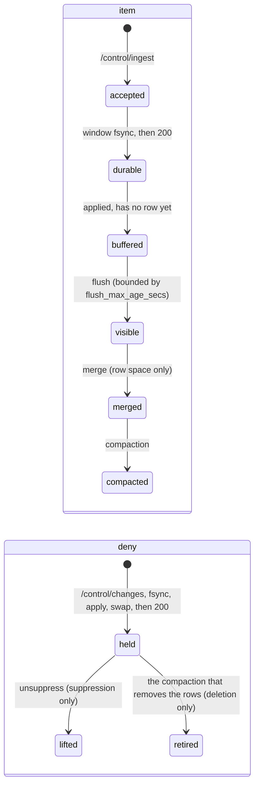
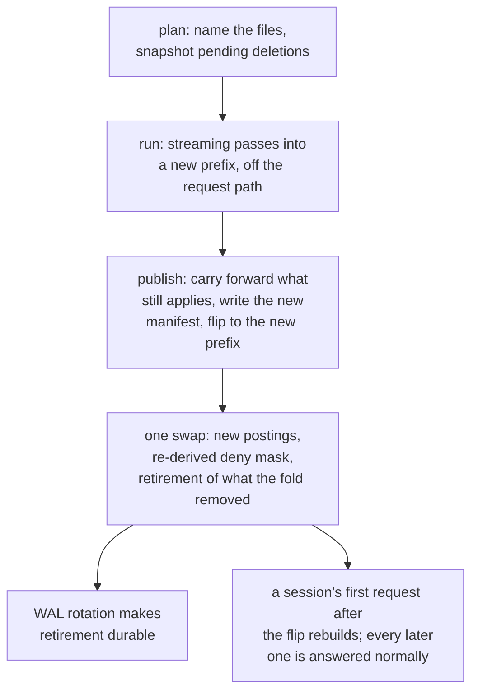

# The write path

The write path is how data enters a running Tessera and becomes part of the map. Rows arrive at
the control plane, are written to a log, and are published to viewers in stages. A viewer's
request reads from a published snapshot and never sees a write in progress.

There are two kinds of write. An **ingest** adds rows. A **deny** hides rows a viewer could
otherwise see: a **deletion** removes an item for good, and a **suppression** hides it until an
unsuppress lifts it. Both kinds pass through the same log and the same publication step. This
chapter follows an ingested item from arrival to its final form on disc, then follows a deny.

## An item's life

*The stages an item and a deny pass through. Each arrow is one event.*

| Stage | What it means |
|---|---|
| accepted | The rows are in the write-ahead log (WAL) and have entity ids. Nothing is visible yet |
| buffered | The rows wait in memory for the next flush |
| flushed | A flush has written them into a segment, a file on disc, and they are now visible to viewers |
| merged | A merge has combined small segments into larger ones. Nothing visible changes |
| compacted | A compaction has rewritten the whole partition into one segment, dropping the rows of items deleted since the last compaction |

A deny is in force from the moment it is acknowledged. It is recorded in the **overlay**, the
in-memory record of what is hidden, and leaves the overlay on exactly one event: an unsuppress
for a suppression, or the compaction that drops the rows for a deletion.

Every write passes through one thread per partition, the write executor, in the same order:

1. append the record to the WAL;
2. fsync it;
3. apply it to the generation being built;
4. swap the pointer to the new generation;
5. acknowledge the caller.

Ingest and denies queue separately. An ingest may be refused when the server is under load. A deny
never is, because refusing a security operation for load would leave an item visible when it
should be hidden (Denies, below).

## Generations

All serving state hangs off one pointer to an immutable generation. A generation names which
segments exist, the overlay, the rows buffered ahead of a flush, the dictionary, and the
row-space deny mask derived from the overlay. A request loads the pointer once, when it starts,
and answers entirely from what it names.

An ingest, a flush, a merge and a compaction fold each take effect by building a new generation
and swapping the pointer to it. Nothing before that swap is visible to any request.

## Ingest

### Admission

A request against `/control/ingest` is checked in order, before the server commits any work to
it:

1. The operator credential is checked.
2. The request body is capped at a fixed size, checked before it is decoded.
3. An admission limit bounds how many ingest requests run at once. Past that limit the request is
   refused rather than queued.
4. The body is decoded and validated against the view's declared columns, and the row count is
   capped.
5. Each item's access label is resolved to descriptor terms through the caller's plugin. An item
   with more descriptors than the declared bound is indexed anyway, with a warning. Refusing it
   would look like an authorisation decision, and a resource limit must not produce one. A
   descriptor no earlier item has used is given a temporary id that satisfies nothing, until a
   later flush promotes it into the durable dictionary.
6. A batch id, required on every request, resolves a retry: identical bytes under the same id
   replay the recorded result, and different bytes under the same id are refused.
7. Every external id in the batch is checked against ids already bound to a live item. A deleted
   item's old binding does not count as a collision, so a re-ingest under the same external id
   succeeds. A suppressed item's binding still collides, because suppression is temporary, and a
   byte-identical copy ingested past a suppression would defeat it.
8. If the buffer of rows awaiting a flush already holds its configured maximum, the request is
   refused with a retry interval.
9. Each row's coordinates are checked against the view's fixed bounds. A row outside them refuses
   the request before anything is acknowledged, written to the WAL, or allocated an entity id.

### The commit window

Rows arrive at the executor without an entity id. Allocation happens once per commit window, on
the executor rather than per request. The window's size reflects the server's own pace of arrival,
not how a client happened to chunk its upload.

Within one window, entity ids are assigned in order of each item's signature, its sorted,
deduplicated list of terms, and then by external id. This groups the postings for a term into
contiguous runs across the window's id range, which is how a term's posting list is stored on
disc. Nothing repairs this ordering later: a wider window produces longer runs, and a narrower one
does not.

The window closes when it reaches a configured row count, or when the server's incoming work is
observed empty, whichever comes first. There is no age-based delay. A delay can only close a
window earlier than one of those two triggers would, and it cannot help a single client sending
requests one at a time.

At close, the whole window is sorted and allocated from the id allocator in one call. One WAL
record per submission is appended, and one fsync covers the entire window. Only then is the
window applied to build a new generation, the pointer is swapped, and every waiting request is
acknowledged with its rows' `tessera_id`s. If the append or the fsync fails, the window applies
nothing: every waiter is refused, and a caller retries under the same batch id.

### What the writer observes

| Outcome | Meaning | Retry |
|---|---|---|
| 200 | Every row is durable in the WAL, with its identity allocated. It is not yet visible | Not needed |
| 409 | A duplicate external id, or the same batch id with different bytes. Nothing in the batch took effect | After fixing the request |
| 422 | Validation failed: an undeclared column, a wrong type, too many rows, or coordinates outside the view's bounds. Nothing took effect | After fixing the request |
| 429 | The server is declining the request for load, with a retry interval attached | After that interval |
| 500 | The WAL append or the fsync failed. Nothing was applied | With identical bytes |
| 503 | The executor is not running, or the partition is serving a manifest behind where it should be | Later |

### What the viewer observes

An accepted item has an entity id, and its authorisation is complete, but it has no row in any
segment yet. Every count, density figure and selection is a question about rows, so the item
contributes to none of them until a flush gives it one. Two checks that work in entity space
rather than row space are not affected: whether the item's descriptors satisfy a mask, and
drill-down. Drill-down on an item with no row returns the same unresolved answer as an identifier
naming nothing at all.

Other sessions learn only that something has changed, on their next response, never what changed
or which item (see Geometry and staleness, below).

## Flush

Flush turns rows waiting in the buffer into a published segment. This is what makes an ingested
item visible. It changes no authorisation state. It retires no overlay entry, drops no row, and
cannot make a hidden item visible again.

Flush runs on a fixed cadence, checked at the start of the executor's loop before anything else,
so a request that arrived after the cadence came due cannot delay it. An operator can pull the
next flush forward, and only one flush runs at a time.

Planning reads the current generation: the rows buffered for one view, in ascending order of
entity id. A row whose entity has since been deleted is never written. The entity id stays
allocated, and the deletion alone hides the item until a compaction fold removes it. A row whose
entity has since been suppressed is flushed as normal, because a flush that skipped it would leave
a later unsuppress with nothing to reveal.

Writing the segment files runs in the background, over inputs already captured on the executor, so
it never blocks ingest or a deny. When that work finishes, the executor publishes it against
whichever generation is current at that moment, not the one planning started against. A
suppression accepted while the flush was running is included in the manifest the flush writes.
Any ingest that arrived meanwhile is left in the buffer for the next flush.

Publication is one swap. The new segment is added, the buffer is reduced by exactly the rows this
flush consumed, and the row-space deny mask is re-derived against the larger row space. The moment
a suppressed or deleted item acquires a row is the moment it must appear in that mask.

A flush only ever appends rows and never rewrites an existing one, so a session's own cached view
of the map stays correct across a flush. What changes is how quickly a session picks up the new
rows.

| Case | Served from | When | Cost to the session |
|---|---|---|---|
| 1 | The live entry | The steady state | Nothing |
| 2 | The entry built one flush ago | A refresh has not finished yet | Nothing. Still correct, because a flush only adds rows |
| 3 | A fresh build | No cached entry exists, or the entry no longer applies | The full rebuild cost |

A background task refreshes every session's cached view after each flush, so a request does not
pay for the rebuild itself. A session whose refresh has not finished by the time it asks is served
the entry from before the flush, rather than made to wait. This is safe because a flush never
removes or renumbers a row.

An item's access label can name a descriptor no earlier item has used. Until a flush promotes it
into the durable dictionary, that descriptor cannot satisfy any mask. This keeps an unresolved
term from making an item visible before the server has committed to it. A session already open
when a promotion happens does not see the newly satisfiable item until it re-authorises. The
staleness signal below is what prompts it to.

## Merge

A merge bounds how many segments, posting tiers, external-id runs and dictionary entries a flush
leaves behind, each of which costs a viewport something to read past. Merge does not touch entity
space and does not change what is authorised.

Merge publishes in two parts, on the same cadence. Artefacts that do not move a row, posting
tiers, external-id runs, dictionary entries, coalesce as one change to the manifest. Live segments
merge as a separate swap. This second part shortens the row space and re-sorts rows within the
merged span, so a row id inside it names a different entity afterwards. Because of that, a merge
advances the same generation counter a flush does, and any cached row-based structure keyed on the
older value is rebuilt rather than reused.

A pending deletion is not dropped by a merge. Its row and its postings are carried into the merged
output unchanged, because only a compaction fold may drop a row. The deny mask is re-derived
against the merged row space rather than carried forward, because a denied row id inside the
merged span may now name a different entity.

## Compaction

Compaction is the one operation that may drop a row and its postings. It runs as a single pass
called a compaction fold, and it does three things nothing else in the write path can do:

- it is the only way a deletion's overlay record is ever removed (Rule F, in Denies below);
- it is the only way disc space a merge or a coalesce has orphaned is reclaimed;
- it is the only way a partition returns to one segment, one base posting tier, one external-id
  run and one locator. Flush and merge only ever add to those counts.

A fold takes a snapshot at the start of its run. The snapshot names which rows and postings to
remove, and which deletions to retire once they are gone. Between that snapshot and the fold's
publication, more flushes, merges and denies can still land. A deletion retires only if, once the
fold has published, nothing carried forward from before the fold still names that entity. Not its
row, not its postings, and not its external-id binding. An entity a flush gave a fresh row to
while the fold was running is not retired this round. The next fold takes it instead. Retiring
against the plan instead of against what publication actually removed would leave an entity whose
row survived retired anyway, with nothing left to hide it.

Retiring an overlay entry does not remove every record of it at once. The WAL still holds the
original delete, and a restart replays it. Until the WAL rotates past those records, a restart
brings the retired entry back. This causes no harm. The entity it names has no row and no postings
left for any request to find, so what a viewer sees does not change. The next fold clears the
entry again, at little further cost, because there is nothing left for it to remove.

A suppression is carried through a fold unchanged. Only an explicit unsuppress removes one
(Rule S).

A compaction fold runs off the request path, over files a viewport is also reading. Its duration
is not bounded. A slower fold that disturbs a live viewport less is preferred to a faster one that
disturbs it more. The one moment a fold is visible to a client is the flip. Because it
rewrites row space globally, every session's cached view of the map is invalid the instant the new
generation is swapped in. A session's first request after the flip takes an ordinary cache miss
and rebuilds, exactly as a newly opened session's request would. No request is turned away to
protect that rebuild. Nothing a client already holds stops resolving. A tile is a Morton prefix
and an item is a `tessera_id`, and both resolve against any generation. A fold moves the rows
behind an identifier without breaking the identifier itself.

| Gauge | What it measures |
|---|---|
| Un-retired deletions | How far the overlay has grown past what a fold could reduce |
| Live segment count, against a daily window | Read cost that degrades a viewport gradually, and can wait to be paid down |
| Live segment count, against a higher ceiling | The same read cost past the point where waiting for the window costs more than folding now |
| Dead bytes against named bytes | Disc space a merge or a coalesce has orphaned |
| Tombstoned rows against live rows | Rows every viewport still reads past that no one may see |

A fold is dispatched when any one of these crosses its threshold and a minimum interval has passed
since the last attempt. An operator may also request one directly. Only one fold runs at a time,
and a request arriving while one is running is refused rather than queued.

*A fold plans, runs and publishes without holding the executor except at the plan and the swap.
Retirement and the cache miss both happen at the swap.*

## Denies

`/control/changes` accepts three operations against an already-ingested item: delete, suppress,
and unsuppress. Editing an item's access label directly does not exist as an operation. Changing
what an item is labelled is a delete followed by a re-ingest under the same external id, with the
new label. A deleted item's binding does not block that re-ingest (Admission, step 7, above).

### Accepting a deny

A change names its item by an external id, resolved against the current map of live items, or by
a `tessera_id` presented together with the id set it was minted under. The id set is checked
first, before the `tessera_id` is inverted, because the inversion is keyed. A list gathered before
a key rotation would invert to different, live items under the new key. A stale id set is refused
outright.

The whole batch is validated and every address resolved before anything is accepted. If any one
address fails to resolve, the whole batch is refused and nothing is queued. An address that
resolves to an item already deleted or suppressed is accepted anyway. Applying a deny a second
time has no further effect, so a retried batch is safe to resend.

Only the entity id is written to the WAL, never a `tessera_id`. The address is resolved once, when
the request is accepted, into the entity it names, and that entity id is stable for the item's
life. A `tessera_id` is a keyed permutation of it: writing it to the WAL instead would mean a
replay after a key rotation could resolve it to a different item.

Denies are gathered into a window before any of them is written to the WAL, the same shape ingest
uses: append every record, then one fsync for the whole window, then one swap, then every waiter
in the window is acknowledged.

A deny is queued separately from ingest and is never refused for load. There is no route from this
queue to a 429. A partition that has stepped down still accepts a deny while it refuses ingest,
because a deny does not touch the segments a step-down protects.

### The overlay: two stores

The overlay holds two separate records of what is hidden, one for deletions and one for
suppressions, each a bitmap over entity ids. They are not one map with a status field. A single
map would let the most recent write decide an item's status. The sequence delete, suppress,
unsuppress would then leave the unsuppress as the last word and bring a deleted item back. Two
separate stores rule that out. The unsuppress can only change the suppression record, which the
deletion never touched.

| Rule | Applies to | Removed by | Why only one route |
|---|---|---|---|
| Rule S | Suppression | An explicit unsuppress, and nothing else | No rebuild or timer excludes a suppressed item on its own, so its invisibility depends entirely on this record for as long as the suppression stands. Any other removal route would let the item become visible again with no unsuppress ever issued |
| Rule F | Deletion | The compaction fold that removes the item's row and its postings, and nothing else | The row still exists in a segment until that fold runs. Removing the record any earlier would leave a segment reachable that still contains the item |

The row-space mask a request subtracts from its answer, `denied[view]`, is derived from the union
of the two stores. It is derived again in full at every geometry publication (a flush, a merge, or
a compaction fold), never patched by removing one row. Subtracting a single row could remove one
that a still-standing deletion also covers. How a request composes an answer against this mask
belongs to the access-control chapter.

### If the write-ahead log fails

If the fsync for a deny window fails, the executor first tries to repair it. It rewinds to the
last durable position and rewrites the affected records, because a second fsync on its own is not
enough to confirm the true state on every filesystem.

If the repair does not succeed, the window is applied unevenly, by operation rather than by
position in the batch. Every delete and every suppress is applied to the overlay anyway, because
those items must stay hidden even without a durability guarantee, and every waiter in the batch is
refused. Every unsuppress in the window is applied to nothing, because applying one without
durability could let an item back into view that a restart would still hide.

A caller that is refused must retry. Retrying is always safe, because applying a deny twice has no
further effect. A caller that never retries leaves the record past the WAL's last confirmed
position, so a restart discards it and the item becomes visible again. That is the only risk this
failure carries.

### Publication and recovery

An accepted deny marks the overlay as changed. The executor writes a side record of the whole
overlay at the close of a batch of deny windows, off the path that acknowledges the caller. A
floor on how long a busy queue can go without one means a queue that never fully empties still
publishes eventually.

This write takes the deletion and suppression bitmaps from the live overlay directly, never from
an earlier published record. Copying one forward could republish an unsuppress the live overlay
has already reversed.

On restart, the overlay is seeded from the newest side record that verifies, and then the WAL's
confirmed prefix is replayed over it, in that order. Where the two disagree, the later WAL record
wins. This order protects an unsuppress. Seeding after replay instead would let a crash between an
accepted unsuppress and the next published record put the suppression back. That would undo an
operation the caller was already told had succeeded.

### What the writer and the viewer observe

| Outcome | Meaning | Retry |
|---|---|---|
| 200 | The disposition is durable, and every request from now on, including the caller's own next one, already reflects it | Not needed |
| 404 | The address did not resolve to a live item. Nothing in the batch took effect. An item whose ingest is still in an open commit window also reads as unknown | After confirming the item exists |
| 409 | A stale id set | After re-resolving by external id |
| 422 | The batch failed validation. Nothing took effect | After fixing the request |
| 500 | Durability could not be confirmed. A delete or suppress in the failed window is already in force on this node despite the error. An unsuppress in it was not applied | Always safe |
| 503 | The executor is not running. Nothing was taken | Later |

The next request from any session after a deny is accepted excludes the item immediately. A
row-space answer subtracts it through the mask. Drill-down and label checks consult the overlay
directly. Nothing cached stands in the way, because the mask and the overlay are applied after any
cached result is composed.

## Restart and recovery

On restart, the server reads the newest manifest that verifies, seeds the overlay from its
deletion and suppression records, and then replays the WAL's confirmed prefix over it, in that
order. Where the two disagree, the later WAL record wins. This protects an unsuppress. Seeding
after replay instead would let a crash between an accepted unsuppress and the next published
record put the suppression back.

The entity id allocator resumes from whichever is larger, the manifest's recorded high point or
the value replay reaches, so an id already issued is never issued again. The buffer of rows
awaiting flush is rebuilt as exactly the replayed rows whose entity has no row in any segment,
rather than compared against a watermark. This predicate stays correct regardless of how flush and
allocation order have diverged from each other.

| Crash point | Recovery | At risk |
|---|---|---|
| Before any acknowledgement | The caller retries. The request was idempotent | Nothing |
| After the fsync, before the swap | Replay rebuilds the same state | Nothing |
| After acknowledgement | Replay rebuilds the same state | Nothing |
| Mid-flush, files written, no manifest | The files are orphaned and ignored. Replay re-flushes | Nothing |
| Mid-rotation of the WAL | The oldest-first deletion order leaves no gap | Nothing |
| A durability failure, then a restart | The undurable tail is discarded | An under-durable deny's hiding, which no acknowledgement ever claimed |
| Corruption below the WAL's confirmed point | The partition stays unready. An operator restores from the bundle and object storage | Availability. Deny state is bounded by the last published record |

## Geometry and staleness

Every response carries a stamp naming the generation it was answered from, and a request may
present one back. The stamp is advisory only. It never selects which generation answers a request,
it never expires, and presenting an old one never produces an error. What it buys a client is one
comparison against the current generation, reported back as a flag saying whether anything has
moved since.

This is safe because nothing a client holds depends on a particular generation to resolve. A tile
is a Morton prefix computed against bounds fixed when the view was built, so it names a region of
the grid rather than a set of rows. It resolves against any segment of any generation by the same
search. An item is a `tessera_id`, which recovers the entity it names independently of geometry.
The entity then resolves to a row through whichever generation answers the request. A client that
re-issues a request always gets a correct answer, only a more or less current one. There is
nothing for the server to keep alive on the client's behalf between requests.

A suppression or a deletion applies to every request from the moment it is accepted, whatever
stamp that request presents. The stamp carries no authorisation weight of any kind.

## What is not built

- **The label invalidation feed.** A deletion invalidates every label whose generating set held
  the deleted item, for every principal who could see it. The deny queue is the event that should
  trigger a notification, but neither the notification mechanism nor a consumer for it exists.
  Enforcement does not depend on it, because a label check always reads current state, but nothing
  announces the change to an interested client.
- **The replica freshness bound.** A limit on how long a replica may go on serving a manifest that
  predates a deny it should already carry. No replication exists yet, so there is nothing for the
  bound to apply to.
- **A wire representation of descriptor staleness.** A session that holds an unresolved descriptor
  when a flush promotes it becomes stale in a way distinct from the geometry stamp above. The
  condition is tracked on the session. A client has no way to read it directly.
- **A runtime limit on WAL size.** The configured hard limit is checked only at startup, against
  the worst case the configured queues could produce. Nothing measures the live log's size while
  the server runs.
- **The write-side page-cache hint for a compaction fold's own writes.** The read-side hint, which
  lets the kernel reclaim a fold's own reads quickly, exists. The equivalent for what a fold writes
  does not yet have a place in the code.
- **Cell-granular staleness.** The stamp above tells a client only that something has changed,
  never which cells. A protocol narrowing that to the affected regions has not been designed.
- **Entity id reuse after compaction.** An entity id freed by a fold that drops its row is not
  reissued to a later item. The allocator is append-only, and an id once retired stays retired.

## Where this is tested and where it lives

Coverage of the invariants this chapter turns on is stated in `conformance.md` §4.6 and nowhere
else. The properties this chapter states are pinned as integration tests across the write path's
crates:

- a re-bound external id across a flush and a restart;
- a row deleted before its first flush;
- a suppression that survives log rotation;
- ingest refused and flush withheld while a partition has stepped down;
- row-space structures that stay keyed to the correct generation across a merge and a compaction
  fold.

WAL recovery is tested separately: truncation at the confirmed offset, the sidecar's guards, and
fail-closed handling of corruption.

The write path lives in:

- `tessera-lifecycle`: the WAL, the overlay, allocation, the commit window;
- `tessera-engine`: flush, merge, coalesce, and the compaction passes and their publication;
- `tessera-store`: the on-disc fold, merge, and reclamation routines the engine drives;
- `tessera-server`'s control plane, which exposes the ingest, changes, flush and compact routes.
