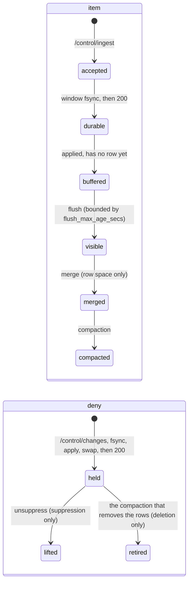
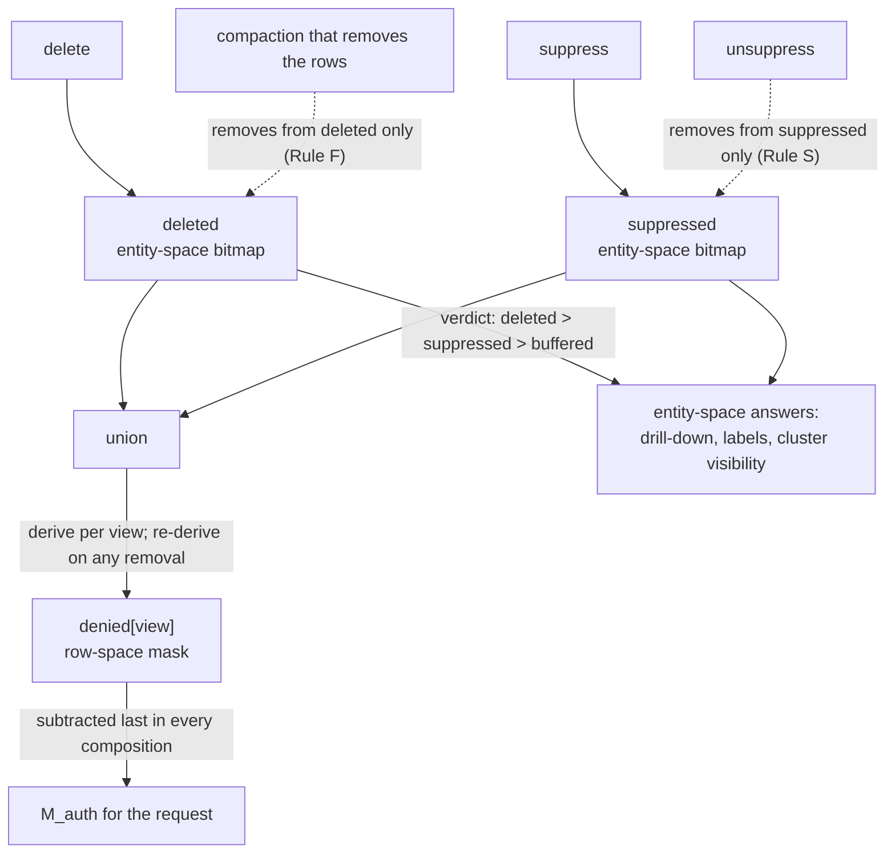

# The write path

An engineer sending a byte to `/control/ingest` or `/control/changes` wants to know what happens
to it between arrival and the moment a viewer's map changes. An assessor wants to know that a
deny takes effect, stays in effect, and survives a crash. This chapter answers both: admission,
the commit window, the write-ahead log (WAL), flush, the deny lane and its overlay, merge,
compaction, and restart.

Two kinds of write travel this path and never share a queue. An **ingest** adds items; because it
does work of unbounded duration (writing segment files), it MAY be refused when the server is
under load. A **deny** (delete, suppress, or unsuppress) changes what a viewer may see; refusing a
security operation for load would leave an item visible when it should already be hidden, so a
deny MUST NOT be refused for load. One thread per partition, the **write executor**, performs
every mutation, always in the order **append to the WAL, fsync, apply, swap the generation
pointer, then acknowledge**. That ordering is the property every guarantee below rests on.

All serving state hangs off one atomically-swappable pointer to an immutable **generation**:
which segments exist, the overlay, the buffered rows awaiting a flush, the dictionary, and the
row-space deny mask derived from the overlay. A request loads this pointer once, at its start,
and answers entirely from what it points to. A write is nothing until it produces a new
generation and swaps the pointer to it; everything else, including writing files and gathering a
window, is preparation for that one moment.

## The path whole

An item's life and a deny's life pass through the same executor and the same WAL, but on
different terms: an item accumulates state across several publications before a viewer can see
it, while a deny takes effect at the moment it is acknowledged and is removed by exactly one of
two specific events.



*An item gains state at each publication; a deny is in force at acceptance and leaves the overlay
only at its one designated event.*

What an acknowledgement means differs by kind.

An ingest acknowledgement is a durability receipt, not a visibility promise. An accepted item is
WAL-durable and its authorisation state is complete, but it has no row in any segment, and every
count, density figure, and selection is a row-space question, so the item contributes to nothing
a viewer can observe until a flush gives it a row. The bound on that gap is `flush_max_age_secs`
(§Flush).

A deny's acknowledgement asserts two things together: the record is durable (one fsync), and the
generation that carries it has already been swapped in, because the swap happens before the
acknowledgement. A caller's own next request already reflects its own accepted change. There is no
200 for a deny that carries only one of these two facts. Nothing else, a manifest write or storage
cleanup, has to happen first; everything after the acknowledgement is bookkeeping, not a
precondition.

A deletion's overlay entry survives until compaction removes the rows it names, and nowhere else.
Until a compaction run does that, the overlay grows under every accepted deletion. This is
correct, fail-closed behaviour, because an entry that has not retired can never let its item back
into view.

## Ingest

### Admission

A request against `/control/ingest` is checked before the server commits any work to it: an
operator credential; a byte cap on the request body (16 MiB by default), enforced before the body
is decoded; an admission semaphore bounding how many ingest requests run at once, which refuses
immediately with a 429 rather than queuing when it is exhausted; schema validation against the
view's declared columns and a row cap (10,000 rows by default); and a coordinate-bounds check
against the view's fixed quantisation, refused before anything is written and before an entity id
is allocated (the bounds are index configuration and do not change for a view's life, so a row
outside them can never enter this view at all).

Each item's access label is resolved to a set of descriptors through the caller's plugin. An item
whose descriptor count exceeds the declared bound is indexed anyway, with a warning: a predicate
with more terms usually means broader visibility, and a resource guard MUST NOT produce an
outcome that looks like an authorisation decision. A descriptor the server has never seen before
is given a temporary id that cannot yet satisfy anything; it becomes usable only when the flush
that carries the item promotes it into the durable dictionary (§Flush).

Two duplicate checks run before a batch is accepted: a **batch idempotency** check, keyed on a
required batch id hashing the request body (a retry with identical bytes replays the recorded
result, and different bytes under the same id are refused), and an **external-id duplicate**
check against every id currently bound to a live item. A holder whose entity has been deleted does
not count as a collision: a deleted item is forgotten at this boundary, and the service's
retention of a stale binding must never refuse a user's re-ingest. A **suppressed** holder still
collides, because suppression is temporary hiding, and a byte-identical re-ingest past a
suppression is exactly the gap this check exists to close.

If the ingest buffer already holds its configured maximum of rows awaiting a flush, the request is
refused with a 429 naming a retry interval. This is the intended backpressure when flush falls
behind arrival: between flush ticks the buffer is what grows.

A partition that has been stepped down refuses ingest at this boundary, before anything is
acknowledged or written to the WAL, and flush publishes nothing while the step-down stands.

### The commit window

Rows arrive at the executor unallocated. Entity-id assignment happens once per **commit window**,
on the executor rather than per request. This is what makes the scope of the sort described next a
server decision rather than a function of how a client happened to chunk its upload.

Within one window, entity ids are assigned in `(signature, external_id)` order, where an item's
signature is its sorted, deduplicated term list. This groups postings for a term into contiguous
runs across the window's id range, which is how a term's posting list is stored; nothing repairs
this ordering later, so the value of the sort is bounded by how much is gathered into one window.
The window closes when it reaches `commit_window_max_items` (10,000 rows by default) or when the
server's incoming work queue is observed empty, whichever comes first. There is no age-based
linger: a linger only closes a window earlier than one of those two triggers would, and cannot
help a single client sending requests one at a time.

At close: the whole window is signature-sorted and its rows are allocated entity ids from the
allocator's high-water mark in one call; one `IngestBatch` WAL record per submission is appended,
in order; then **one fsync covers the entire window**. This is group commit, trading N separate
syncs for one, and it is what makes a bulk load's WAL cost independent of how many requests it
arrived as. The executor then applies the window (clones the buffer with the new rows added,
builds one new generation), performs one swap of the generation pointer, and acknowledges every
held request with its rows' `tessera_id`s. If any append or the fsync fails, the window applies
nothing at all: every waiter is answered 500, and a caller retries under the same batch id.

```mermaid
sequenceDiagram
  participant W as writers
  participant H as handler
  participant E as executor
  participant L as WAL
  participant G as generation

  W->>H: change (ingest row, or delete / suppress / unsuppress)
  H->>E: enqueue, keep waiting
  Note over E: gather up to the window bound, in arrival order
  E->>L: append every record
  E->>L: fsync once
  alt fsync fails after repair
    E->>G: apply deletes and suppresses anyway; skip unsuppresses
    E-->>W: 500 to every waiter: retry
  else
    E->>G: apply to the overlay / buffer
    E->>G: swap the generation pointer
    E-->>W: 200 to every waiter
  end
```

*One fsync serves the whole window; every waiter is acknowledged against the same swap.*

### What the writer observes

At quiescence, latency is the WAL fsync plus queue time; under load, a submission waits behind the
window ahead of it. A 200 means every row in the batch is WAL-durable with its identity allocated,
and **not yet visible**. A 409 or 422 means the whole batch had no effect. A 429 names a retry
interval and means the server is declining the request for load, from the admission semaphore, the
command queue, or the buffer bound. A 500 means the WAL append or the fsync failed and nothing was
applied; the caller retries the identical bytes, and idempotency resolves it.

### What the viewer observes

Nothing, until the item's own flush. The item is fully authorised (it is already part of every
principal's underlying set) but has no row, and every count, density figure, and selection is a
row-space question, so it cannot appear in any of them yet. Drill-down on it resolves the same
"unknown" answer an identifier naming nothing at all would produce. Other sessions learn only that
something has changed, through a staleness stamp on their next response (§Geometry and
staleness), never what changed, and never which item.

## Flush

Flush is the mechanism that makes an ingested item visible. It changes no authorisation state, retires no overlay entry, drops no row, and can re-expose
nothing.

It runs on one cadence, `flush_max_age_secs` (90 seconds by default), evaluated at the top of the
executor's loop before anything else, so it is never delayed by work that arrived after it came
due. An operator can pull one forward with `POST /control/flush`, which runs through the same
path the tick uses, at the next loop iteration; there is no separate publish-immediately route. At
most one flush is ever in flight: a tick that arrives while one is already running is skipped,
because two concurrent flushes could each try to remove the same rows from the buffer.

Planning happens on the executor, against the live generation, and is a pure computation: the
buffered rows for one view, ascending by entity id. A row whose entity has since been deleted is
never written; the entity id stays allocated and the overlay entry alone hides the item,
permanently, until a compaction retires it. A row whose entity has since been suppressed is
flushed normally: suppression is reversible, and a flush that skipped it would leave a later
unsuppress with nothing to reveal.

The work itself (writing segment files, appending postings, promoting any descriptor the flush
carries that the dictionary has not seen before) runs on a background pool over inputs already
snapshotted on the executor, so it never blocks ingest or denies. When the work completes, the
executor publishes it by rebasing onto whichever generation is current at that moment, not the one
planning started against: a suppression accepted while the flush was running is folded into the
manifest the flush writes, and ingest that arrived during the same window is left in the buffer,
because the rebase removes only the rows the flush actually consumed.

Publication is one swap: the new segment is added, the buffer is reduced by exactly the rows this
flush consumed, and the row-space deny mask is re-derived against the enlarged row space. The
moment a suppressed or deleted item acquires a row is the moment it must be represented in that
mask.

A request in flight is unaffected by a flush landing underneath it, because a request loads its
generation once, at its start, and holds a reference to it for the request's whole duration; the
swap does not touch that reference. Flush only ever appends rows and never rewrites an existing
one, so a session's already-cached geometry stays correct across a flush too, which bounds what a
session pays for one:

- **The item appears**, in counts, density, and selection, on the response following the
  publication. A background task refreshes every actively-cached session's fragment and projection
  once per publication, so the request thread itself pays nothing for the rebuild.
- A session whose cache entry could not be refreshed in time is served the previous,
  one-generation-stale entry rather than rebuilding inline. This is sound for a flush
  specifically, and only for a flush: because a flush only appends, a stale entry never names the
  wrong row, and only misses rows that did not exist when it was built.
- Every response carries a generation stamp. A session presenting an earlier one is told, on its
  next response, that something has moved (`x-tessera-stale: 1`); advisory, never a refusal
  (§Geometry and staleness).

## Denies

`/control/changes` accepts three operations against an already-ingested item: **delete**,
**suppress**, and **unsuppress**. A fourth, editing an item's access label directly, does not
exist: an edit is a delete followed by a re-ingest under the same external id, with new labels,
and a deleted holder does not block that re-ingest. The endpoint refuses a request naming the
withdrawn operation with a 422 that names this flow. The re-ingested item is invisible for at most
one flush interval and is issued a new `tessera_id`; identity for a client is carried by the
external id and the `tessera_id` together, never by the entity id underneath them.

Delete and suppress differ in what they mean and in what removes them, never in how they are
accepted or applied.

| | Delete | Suppress |
|---|---|---|
| Effect | removed for good | hidden while it stands |
| Overlay store | `deleted` | `suppressed` |
| Removed by | the compaction fold that executes it (Rule F) | an explicit unsuppress (Rule S) |
| Reversible | only by a fresh ingest, as a new identity | yes |

### Accepting a deny

A deny names its item by one of two addresses: an `external_id`, resolved against the current
live map and then the bundle; or a `tessera_id` presented together with the idset it was minted
under. The idset is checked first, before the identifier is decoded, because identifiers are
keyed: a list gathered before a key rotation would decode under the new key to different, live
items, and denying the result would deny the wrong entities. A stale idset is refused outright
(409).

Validation covers the whole batch before anything is accepted: every address is resolved, and if
any one fails to resolve, the **entire batch** is refused and nothing is enqueued. An address that
resolves is accepted even if it already names a deleted or suppressed item; re-applying a deny to
an item already in that state has no further effect, so a retried batch is idempotent without any
extra bookkeeping.

**Only the entity id is written to the WAL, never a `tessera_id`.** The address is resolved once,
at admission, into the entity it names, and the WAL record carries that entity id, which is
stable for the item's life. A `tessera_id` is a keyed permutation of it, so if it were written to
the WAL instead, replay after a key rotation would decode it against the new key and could apply
the change to a different, live item.

The deny lane accepts a batch and never refuses one for load: there is no route from this lane to
a 429. A partition that has been stepped down still accepts denies while it refuses ingest,
because a deny threatens no segment the step-down is protecting.

### The overlay

The overlay is two independent stores, `deleted` and `suppressed`, one entity-space bitmap each,
not one map with a disposition field. Collapsing them into a single map would make the last write
win: the sequence delete, suppress, unsuppress would then leave whichever disposition was written
last, and an unsuppress following a delete could restore an item that should stay hidden forever.
Two separate stores make that sequence structurally unable to re-expose anything, because the
unsuppress mutates a store the deletion never touched.

A **row-space mask**, `denied[view]`, is derived per view from the union of the two stores and
subtracted last from every composed result, in one bitmap operation. Per-request cost therefore
does not grow with how many denies have ever been accepted; it depends only on how deep the
overlay currently is. Additions to the mask may be applied incrementally, because a window of
delete or suppress operations only grows the union, but **any removal re-derives the mask from
scratch**. Subtracting one row on an unsuppress, rather than recomputing, could subtract a row
that a still-standing deletion also denies, exposing an item that is supposed to remain hidden.
The entity-space stores stay authoritative for everything else: drill-down, label gating, and
cluster visibility answer from the overlay directly and never consult the row-space mask.



*Two stores, one derived mask, and two removal events, each acting on one store only.*

### Removing a deny: Rule S and Rule F

- **Rule S.** An entry leaves `suppressed` only by its own unsuppress. Nothing else may touch it:
  no rebuild of a fragment excludes a suppressed entity on its own, so the item's invisibility
  rests entirely on that overlay entry for as long as the suppression stands. Giving a
  suppression any other removal route, a time-based expiry for instance, means the entry
  eventually retires on its own and the item becomes visible again with no unsuppress ever
  issued.
- **Rule F.** An entry leaves `deleted` only in the compaction fold that executes it: the pass
  that actually removes the entity's row and its postings, publishing its own manifest. Before
  that fold runs, the row still exists in a segment, so retiring the entry any earlier would
  leave a fragment that still contains the deleted item reachable by a later request. A request
  resolves the fragment identity it will answer from exactly once, and a compaction fold rotates
  that identity as part of its publication, so no fragment built before the fold can be reached
  by key afterwards. A request is answered entirely from the geometry before the fold or entirely
  from the geometry after it, never a mixture. What a fold actually retires is computed from what
  its own publication demonstrably removed, not from what it planned to remove at the start
  (§Compaction).

### If the write-ahead log fails

The executor gathers up to 1,000 queued deny entries per window, then appends every record and
issues **one fsync for the whole window**, the same group-commit shape ingest uses. Batching
denies this way is what took a 1,000-item request from roughly 3.3 seconds (one fsync per item)
to about 32 milliseconds (measured).

If that fsync fails, the executor first tries to repair it: rewind to the last durable offset and
rewrite the affected records. A bare second fsync is not trusted on its own: on Linux a writeback
error can be reported once and then treated as resolved, so a second call can report success with
the data already gone. Rewriting the region is what makes the repair sound.

If the repair is exhausted, or the append itself failed and there was nothing to repair, the
window folds by operation, never by position in the batch:

- every `delete` and `suppress` in the window is applied to the overlay anyway (the items are
  hidden immediately), and every waiter in the batch still receives a 500;
- every `unsuppress` in the window is applied to **nothing**, because applying one without
  durability could let an item back into view that a restart would still hide.

These applied-anyway entries are **not** marked for the next manifest publication on purpose:
they are in force on the live node with no durable record behind them, and publishing them would
make a deny that was never acknowledged permanent in the restore path.

A caller answered 500 must retry; retrying is always safe, because applying a deny twice has no
further effect. If the caller never retries, the record lies past the WAL's last-synced offset, so
a restart discards it along with the rest of the undurable tail, and the item becomes visible
again. That is the only residual risk this failure carries.

### Publication and recovery

An accepted deny marks the overlay dirty. The executor publishes a side-manifest at the close of
each deny drain, off the acknowledgement path, with a floor of at least one publication every 64
windows under sustained arrival, so a drain that never fully empties still publishes eventually.
The write takes the manifest's `deny` and `tombstones` fields from the overlay's two bitmaps
**separately, never from their union**: a union would make every standing deletion look retirable
by an unrelated unsuppress. Neither field is ever copied forward from an older manifest, because
doing so could republish an unsuppress the live overlay has already reverted.

This publication is what a reader opening the bundle without replaying the WAL depends on. A
manifest carrying `deny` or `tombstones` fields is honoured before its files are even verified,
and a partition MUST NOT step past it to serve an older manifest that predates a deny it already
holds.

On restart, the overlay is seeded from the newest verifying manifest's deny state **before** the
WAL's durable prefix is replayed over it, and replay's records win where the two disagree. This
order protects an unsuppress specifically: it is the one operation whose later WAL record must
win over the manifest's seed, because seeding after replay instead would mean that a crash landing
between an accepted unsuppress and the next manifest publication puts the suppression back,
undoing an operation the caller was already told had succeeded.

### What the writer and the viewer see

A 200 tells the writer two things: the disposition is durable, and every request from now on,
including its own next one, already reflects it. A 500 tells the writer that durability could not
be confirmed; if the operation was a delete or a suppress, the item is already hidden on the node
that accepted it despite the error, and retrying is safe; if it was an unsuppress, nothing was
applied, and the item stays hidden until the caller retries.

A viewer's next request after a deny is accepted excludes the item immediately: row-based results
subtract it through the derived mask, and entity-space checks such as drill-down and label
visibility consult the overlay directly. No cache stands between a deny and a request that should
see it: the mask and the overlay are always applied after any cached artefact is composed, so no
fragment held in a cache can bake in the item's absence or its presence.

## Merge

Merge bounds what flush lets grow within one prefix: how many segments exist, how many delta
posting tiers, how many external-id runs, and how many dictionary extents. It changes nothing
about entity space and nothing about deny state.

Merge splits into two halves, published separately. The **entity-space half**, coalescing delta
tiers, external-id runs, dictionary extents, and the other per-entity artefacts, publishes as a
manifest edit and moves no row, so no cache key changes and no session pays anything for it. The
**row-space half**, merging live segments themselves, publishes as its own swap: it shortens the
extent list and re-sorts rows within the merged span, so a row id inside that span names a
different entity afterwards. Because of that, a merge advances the geometry version, which is the
only value a cached row-space structure may use as its key; every entry keyed on the previous
version is superseded rather than patched. A request racing the merge's own swap under the same
key is answered from a fresh build rather than risking a structure built from two different row
spaces.

A pending deletion is not dropped by a merge: its row and its postings are carried into the merged
output whole, because only compaction may drop a row (§Compaction). The deny mask is re-derived
against the merged row space and never carried forward, because a denied row id inside the merged
span may now name a different entity than it did before the merge.

Merge is selected the same way a flush segment is planned, evaluated on the same tick: the
executor takes the first window of adjacent, similarly-sized artefacts that fits within a
configured cap.

## Compaction

Compaction is the one operation permitted to drop a row and its postings, the one that reclaims
disc space a merge or a coalesce has orphaned, and the one that returns a partition-view to one
segment, one base postings tier, one external-id run, and one locator. It runs as a single pass
called a **compaction fold**, and it is the one operation in this chapter that bears on the
invariants directly: flush and merge change nothing about which entities are authorised, and only
compaction can.

**Why only compaction may retire a deletion.** A row survives flush and merge unchanged; the
overlay entry for a deleted item is the only thing hiding its row until something actually removes
it. Retiring that entry on a timer, or any signal short of the removal itself, would leave a
fragment reachable that still contains the row: drawn and counted for anyone who can see it. A
compaction fold is safe to retire against because it rewrites the row out of existence in the same
step that publishes: it writes under a new prefix, and the manifest digest naming that prefix
rotates the fragment identity, so no fragment built before the fold can be reached by key
afterwards. A single request resolves its fragment identity once, so it is answered entirely from
the geometry before the fold, or entirely from the geometry after it.

**What a fold retires is computed from what it actually removed, not from what it planned to
remove.** The fold takes its snapshot, which rows and postings to fold, at the start of its run,
and further flushes, merges, and denies may still land before it publishes. So an entity's
deletion retires from the overlay only if, once the fold has published, no carried-forward
artefact (segment, delta tier, or external-id run) still names it. An entity whose row survives
a fold, because, for instance, a flush landed a fresh copy of it while the fold was running,
simply is not retired this round; the next fold takes it. This keeps the rule fail-closed: at
worst, an item stays hidden by its overlay entry one round longer than strictly necessary, never
the reverse.

A suppression is carried forward through a compaction fold untouched. Only an explicit unsuppress
removes an entry from `suppressed` (Rule S, §Denies).

**Entity ids after a fold.** Not built yet: decision 0072 rules that an entity id is a slot, freed
by the compaction that drops its row and reusable by a later ingest, with a `tessera_id` carrying a
discriminator so that two occupants of one slot never share an identifier. Today the allocator is
append-only and an entity id is never reused, so a dropped row's id stays retired and the question
of a recycled slot does not arise.

**What a viewer pays.** Ingest, denies, and flush continue while a fold runs; merge and coalesce
are held back until the fold publishes, because their outputs would be orphaned by the flip that
follows and their own inputs are the fold's. A compaction fold streams the whole bundle through
the same memory-mapped files a live viewport reads from, so an unthrottled fold can push a
viewport's hot pages out of the page cache; the fold advises the kernel that its own reads are
sequential and can be reclaimed quickly, to limit that effect. A fold's duration is otherwise
unbounded on purpose: because it runs off the request path and against no deadline, a slower fold
that is gentler on a concurrent viewport is preferred over a faster, more disruptive one.

The one moment a fold is genuinely visible to a client is the flip. A fold rewrites row space
globally, so every session's cached projection is invalid the instant the new generation is
swapped in, and every cached fragment is invalid too, because the fragment identity has rotated.
The flip refuses nothing: a session takes an ordinary cache miss on its first request afterwards
and rebuilds, exactly as a newly-established session does; no request is shed to protect the
rebuild. Nothing a client already holds stops working: a tile is a Morton prefix and an item is a
`tessera_id`, and both resolve against any generation, so identifiers survive a fold even though
the rows behind them have moved.

**When it runs.** Compaction is not scheduled on a plain timer: a timer would run the most
expensive operation in the system against a bundle that may have nothing to reclaim. It is
dispatched instead when a work threshold crosses a configured limit: the count of un-retired
deletions, the number of live segments, the ratio of disc bytes to bytes the manifest names, or
the fraction of rows that are dead, and a minimum interval always floors how often it can fire.
Segment count carries two thresholds rather than one: a modest excess degrades a viewport's read
cost gradually, so it can wait for a daily window, but past a higher, always-on ceiling it fires
at any hour rather than making every viewer pay through a whole day waiting for the window to
open. An operator may also request a fold directly through `/control/compact`; only one fold runs
at a time, and a request arriving while one is running is refused rather than queued.

## Restart and recovery

On open: read `CURRENT`, verify `MANIFEST.json`'s digest, then, per partition, take the newest
side-manifest that is both fully written and verifies. Seed the overlay from that manifest's deny
and tombstone fields, then replay the WAL's durable prefix over it, **in that order**. This
ordering protects an unsuppress specifically: it is the one operation whose later WAL record must
win over the manifest's seed, because if the overlay were seeded after replay instead, a crash
landing between an accepted unsuppress and the next manifest publication would put the suppression
back, undoing an operation the caller was already told had succeeded.

The allocator's high-water mark seeds from whichever is larger, the manifest's recorded value or
the value replay reaches, across every rotation and restart, so an entity id already issued is
never issued a second time. The ingest buffer is reconstructed as exactly the replayed rows whose
entity has no row in any segment, rather than from a watermark comparison; this predicate stays
correct regardless of how many views exist or how far allocation order and flush order have
diverged from each other.

A record whose position lies past the WAL's last-synced offset is discarded on open, whatever its
checksum says, because nothing past that offset was ever acknowledged. A framing or checksum
failure **below** that offset is corruption of state that may include an acknowledged deny, and
the node fails closed: it stays unready, and the operator restores from the bundle and object
storage rather than serving a manifest that predates a deny it already holds.

## Geometry and staleness

Every response carries a stamp naming the generation it was answered from, and a request may
present one back. The stamp is advisory only: it never selects which geometry answers a request,
it never expires, and presenting a stale one never produces an error. What it buys a client is one
comparison against the live generation, reported back as a flag saying whether anything has moved
since. A suppression or a deletion applies to every request from the moment it is accepted,
whatever stamp that request presents. The stamp carries no authorisation weight of any kind.

## What is not built

- **The label invalidation feed.** A deletion invalidates every label whose generating set held
  the deleted item, for every principal who could see it; the deny lane is the event that should
  trigger a notification to interested clients, but neither the notification mechanism nor a
  consumer for it exists. Enforcement does not depend on it (a label check always reads current
  state), but nothing announces the change.
- **The replica freshness bound.** The time limit on how long a replica may go on serving a
  manifest that predates a deny it should already carry, once replication exists. No replication
  exists today, so there is nothing for the bound to apply to.
- **A wire representation of session-level descriptor staleness.** A session that holds an
  unresolved descriptor when a flush promotes a term becomes stale in a way distinct from the
  geometry staleness stamp above; the condition is computed and carried on the session, but a
  client has no way to read it directly.
- **A runtime ceiling on WAL size.** The configured hard limit is checked only at startup, against
  the worst case the configured queue bounds could produce; nothing measures the live log's size
  while the server runs.
- **The write-side page-cache hint for a compaction fold's own spooled writes.** The read-side
  hint, which tells the kernel a fold's own reads can be reclaimed quickly, exists; the equivalent
  for what a fold writes does not yet have a place in the code.
- **Cell-granular staleness.** The broadcast stamp in the previous section tells a client only
  that something has changed, never which cells. A protocol that narrows that to the affected
  Morton prefixes has not been designed.

## Where this is tested and where it lives

The conformance suite covers the invariants a masked count and a selected mark depend on directly:
I1, I2, I7, and I10, including their multi-view forms; where coverage stands is `conformance.md`
§4.6. The two invariants the write path turns on most directly, I9 (an entity id is issued once and
never reused) and I11 (a request resolves one generation and
uses it throughout), are covered in Rust rather than in the differential suite. Two of the
differential harness's interleaving scripts for deny retirement are permanently void, because they
tested the deletion-stamp mechanism Rule S and Rule F replaced; the remaining ones that exercise a
compaction fold wait on test-harness support (an observer for overlay entry state, a pause point
at the fold's snapshot) that has not been written yet.

The properties this chapter states are instead pinned as Rust integration tests, mostly in
`crates/tessera-engine/tests/`: `rebind.rs` (a delete followed by a re-ingest re-binds an external
id across flush, rotation, and restart, and a suppressed holder still collides); `rotation_e2e.rs`
(a row deleted before its first flush stops pinning the WAL, and the entity stays denied, freed of
its row, and unreused across reclamation); `flush_tick.rs` and `stepped_down.rs` (a deny-only node
still rotates its WAL and a suppression survives reclamation; ingest is refused and flush publishes
nothing while a partition is stepped down, and denies are not); `projection_patch.rs` (a flush
costs a live session no full rebuild); and `merge.rs`, `coalesce.rs`, `fold.rs`, `artifact_fold.rs`,
and `region_leaf.rs` (row-space artefacts stay keyed to the correct generation across a merge and a
compaction fold). WAL recovery (truncation at the last-synced offset, the sidecar's guards, and
fail-closed handling of corruption) is pinned in `crates/tessera-lifecycle/tests/wal.rs`.

The write path itself lives in `crates/tessera-lifecycle` (the WAL, the overlay, allocation, the
commit window), `crates/tessera-engine` (flush, merge, coalesce, and the compaction passes and
their publication), `crates/tessera-store` (the on-disc fold, merge, and reclamation routines the
engine drives), and `crates/tessera-server`'s control plane (`crates/tessera-server/src/control.rs`),
which exposes `/control/ingest`, `/control/changes`, `/control/flush`, and `/control/compact`.
