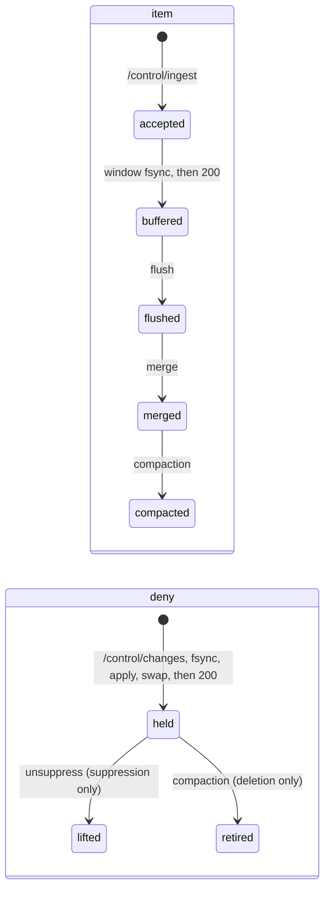
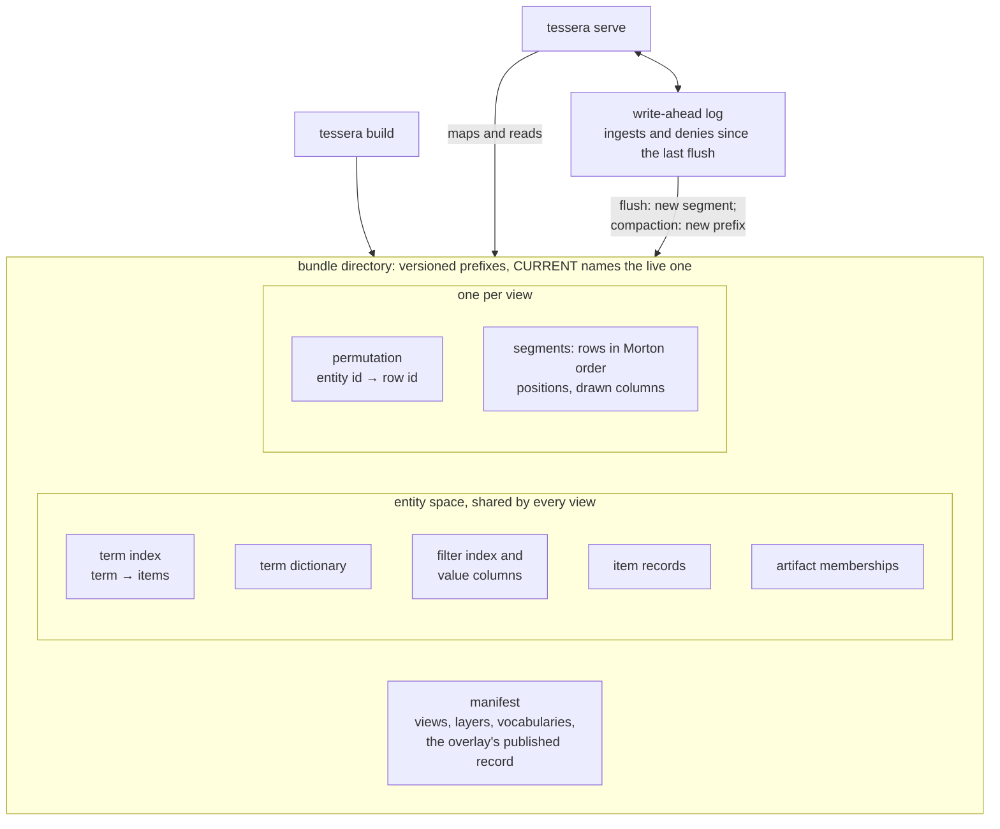

# The write path

The write path is how data enters a running Tessera and becomes part of the map. Rows arrive at
the control plane, are written to a log, and are published to viewers in stages. A viewer's
request reads from a published snapshot and never sees a write in progress.

There are two kinds of write. An **ingest** adds rows. A **deny** hides rows a viewer could
otherwise see: a **deletion** removes an item for good, and a **suppression** hides it until an
unsuppress lifts it. Both kinds pass through the same log and the same publication step. This
chapter follows an ingested item from arrival to its final form on disc, then follows a deny.

## An item's life

*The stages an item and a deny pass through. Each arrow is the event that causes the transition.*

An item has one entity id for life, permanent from the moment it is allocated: this is its
position in entity space, the corpus-wide record of its identity and access label, shared by every
view. It also has one row per view, its position in that view's file layout, called row space; a
row's position can move when files are rewritten, at a merge or a compaction, though never at a
flush, which only appends.

The stages exist because of how the map is stored. Rows are kept sorted by position on disc, so
that a screen tile is one contiguous run of rows, and a sorted file cannot take a new row in the
middle without being rewritten. So a new row is not written into the map directly. It waits in
memory with other new rows until a **flush** writes the batch out as its own sorted file, a
**segment**. Each flush adds a segment, and a request has to look in every segment, so from time
to time a **merge** combines small segments into larger ones. A deleted row cannot be removed from
a sorted file in place either, so a deletion is recorded in the overlay and the row stays on disc,
hidden, until a **compaction** rewrites the whole partition into one segment without it. This is
the same arrangement as a log-structured merge tree, the storage layout behind most write-heavy
databases; what Tessera adds is that the sort order is the map itself.

*What tessera build writes and tessera serve reads, and what the write path adds while serving.*

A deny is in force from the moment it is acknowledged. It is recorded in the **overlay**, the
in-memory record of what is hidden, and leaves the overlay on exactly one event: an unsuppress for
a suppression, or the compaction that drops the rows for a deletion.

## Generations

All serving state hangs off one pointer to an immutable generation. A generation names which
segments exist, the overlay, the rows buffered ahead of a flush, the dictionary, and the overlay's
row-space mask. A request loads the pointer once, when it starts, and answers entirely from what
it names.

An ingest, a flush, a merge and a compaction each take effect by building a new generation and
swapping the pointer to it. Nothing before that swap is visible to any request.

Every write passes through one thread per partition, the write executor, in the same order:

1. append the record to the WAL;
2. fsync it;
3. apply it to the generation being built;
4. swap the pointer to the new generation;
5. acknowledge the caller.

Only one partition exists in a deployment today, so this is one thread in total.

Ingest and denies queue separately. An ingest may be refused when the server is under load. A deny
never is, because refusing a security operation for load would leave an item visible when it
should be hidden.

## Ingest

### Admission

A request against `/control/ingest` is checked before the server commits any work to it. The
operator credential, the body size, the row count and the declared columns are checked first, and
a request that fails any of them takes no effect. Beyond those, four checks apply:

1. An admission limit bounds how many ingest requests run at once, and a buffer limit bounds how
   many rows may wait for a flush. Past either, the request is refused with a retry interval
   rather than queued.
2. Each item's access label is resolved to terms through the caller's plugin. A term is one unit
   of access: an item carries the terms its label resolves to, a viewer's token carries the terms
   they hold, and with the built-in plugin an item is visible to a viewer who holds at least one
   of its terms. An item with more terms than the declared bound is indexed anyway, with a
   warning, because refusing it would look like an authorisation decision and a resource limit
   must not produce one.
3. A batch id, required on every request, makes a retry safe: identical bytes under the same id
   replay the recorded result, and different bytes under the same id are refused.
4. Every external id in the batch is checked against ids already bound to a live item. A deleted
   item's old binding does not count as a collision, so a re-ingest under the same external id
   succeeds. A suppressed item's binding still collides, because suppression is temporary and a
   copy ingested past it would defeat it.

A row whose coordinates fall outside the view's frame causes the request to be refused before
anything is acknowledged, written to the WAL, or allocated an entity id.

### The commit window

Rows arrive at the executor without an entity id. Allocation happens once per commit window, on
the executor rather than per request.

Within one window, entity ids are assigned in order of each item's signature, its sorted,
deduplicated list of terms, and then by external id. This groups the items carrying a term into
contiguous runs of ids, which the term index stores far more compactly than scattered ids. Nothing
repairs this ordering later: a wider window produces longer runs, and a narrower one does not.

The window closes when it reaches a configured row count, or when the server's incoming work is
observed empty, whichever comes first.

At close, the whole window is sorted and allocated from the id allocator in one call. One WAL
record per submission is appended, and one fsync covers the entire window. Only then is the
window applied to build a new generation, the pointer is swapped, and every waiting request is
acknowledged with its rows' `tessera_id`s. If the append or the fsync fails, the window applies
nothing: every waiter is refused, and a caller retries under the same batch id.

### What the writer observes

| Outcome | Meaning | Retry |
|---|---|---|
| 200 | Every row is durable in the WAL, with its identity allocated. It is not yet visible | Not needed |
| 409 | A duplicate external id, or the same batch id with different bytes. Nothing in the batch took effect | After fixing the request |
| 422 | Validation failed: an undeclared column, a wrong type, too many rows, or coordinates outside the view's frame. Nothing took effect | After fixing the request |
| 429 | The server is declining the request for load, with a retry interval attached | After that interval |
| 500 | The WAL append or the fsync failed. Nothing was applied | With identical bytes |
| 503 | The executor is not running | Later |

### What the viewer observes

An accepted item has an entity id, and its authorisation is complete, but it has no row in any
segment yet. Every count, density figure and selection is a question about rows, so the item
contributes to none of them until a flush gives it one. Two checks are not affected, because they
work in entity space rather than row space: whether the item's terms satisfy a mask, and
drill-down. Drill-down on an item with no row returns the same unresolved answer as an identifier
naming nothing at all.

Other sessions learn only that something has changed, on their next response, never what changed
or which item.

## Denies

`/control/changes` accepts three operations against an already-ingested item: delete, suppress,
and unsuppress. Editing an item's access label directly does not exist as an operation. Changing
what an item is labelled is a delete followed by a re-ingest under the same external id, with the
new label. A deleted item's binding does not block that re-ingest (Admission, step 4).

### Accepting a deny

A change names its item by an external id, resolved against the current map of live items, or by
a `tessera_id` presented together with the idset it was minted under. The idset is checked first,
before the `tessera_id` is inverted, because the inversion is keyed: a list gathered before a key
rotation would invert to different, live items under the new key. A stale idset is refused
outright.

The whole batch is validated and every address resolved before anything is accepted. If any one
address fails to resolve, the whole batch is refused and nothing is queued. An address that
resolves to an item already deleted or suppressed is accepted anyway. Applying a deny a second
time has no further effect, so a retried batch is safe to resend.

Only the entity id is written to the WAL, never a `tessera_id`. The address is resolved once, when
the request is accepted, into the entity it names, and that entity id is stable for the item's
life. A `tessera_id` is a keyed permutation of it: writing it to the WAL instead would mean a
replay after a key rotation could resolve it to a different item.

Denies are gathered into a window before any of them is written to the WAL, the same shape ingest
uses: append every record, then one fsync for the whole window, then one swap, then every waiter
in the window is acknowledged.

A deny is queued separately from ingest and is never refused for load. There is no route from this
queue to a 429.

### The overlay: two stores

The overlay holds two separate records of what is hidden, one for deletions and one for
suppressions, each a bitmap over entity ids. They are not one map with a status field. A single
map would let the most recent write decide an item's status. The sequence delete, suppress,
unsuppress would then leave the unsuppress as the last word and bring a deleted item back. Two
separate stores rule that out. The unsuppress can only change the suppression record, which the
deletion never touched.

An entry **retires** when it leaves the overlay. Each store has exactly one route that does this:

| Applies to | Removed by | Why only one route |
|---|---|---|
| A suppression (Rule S) | An explicit unsuppress, and nothing else | No rebuild or timer excludes a suppressed item on its own, so its invisibility depends entirely on this record for as long as the suppression stands. Any other removal route would let the item become visible again with no unsuppress ever issued |
| A deletion (Rule F) | The compaction that removes the item's row and its term-index entries, and nothing else | The row still exists in a segment until that fold runs. Removing the record any earlier would leave a segment reachable that still contains the item |

The mask a request subtracts from its answer, `denied[view]`, is derived from the union of the two
stores. It is derived again in full at every geometry publication, a flush, a merge or a
compaction, never patched by removing one row: subtracting a single row could remove one that
a still-standing deletion also covers. How a request composes an answer against this mask belongs
to the access-control chapter.

The overlay is also written into the bundle's manifest from time to time, off the path that
acknowledges the caller. The manifest takes its deletion and suppression records from the live
overlay directly, never from an earlier manifest, because copying one forward could republish an
unsuppress the live overlay has already reversed.

Each record reaches the manifest as the bitmap itself, serialised and text-encoded into one field,
so the cost of publishing is the size of the set rather than a line per denied item. The two stay
in two fields, one for deletions and one for suppressions, for the reason they are two stores. A
field whose bytes do not decode is refused: the node will not serve that manifest, because a
damaged record says nothing about how many items it named, and reading it as an empty set would
put every one of them back on the map.

### If the write-ahead log fails

If the fsync for a deny window fails, the executor first tries to repair it. It rewinds to the
last durable position and rewrites the affected records, because a second fsync on its own is not
enough to confirm the true state on every filesystem.

If the repair does not succeed, what happens depends on the operation, not on where in the batch
it sat. Every delete and every suppress is applied to the overlay anyway, because those items must
stay hidden even without a durability guarantee, and every waiter in the batch is refused. Every
unsuppress in the window is applied to nothing, because applying one without durability could let
an item back into view that a restart would still hide.

A caller that is refused must retry. Retrying is always safe, because applying a deny twice has no
further effect. A caller that never retries leaves the record past the WAL's last confirmed
position, so a restart discards it and the item becomes visible again. That is the only risk this
failure carries.

### What the writer and the viewer observe

| Outcome | Meaning | Retry |
|---|---|---|
| 200 | The disposition is durable, and every request from now on, including the caller's own next one, already reflects it | Not needed |
| 404 | The address did not resolve to a live item. Nothing in the batch took effect. An item whose ingest is still in an open commit window also reads as unknown | After confirming the item exists |
| 409 | A stale idset | After re-resolving by external id |
| 422 | The batch failed validation. Nothing took effect | After fixing the request |
| 500 | Durability could not be confirmed. A delete or suppress in the failed window is already in force on this node despite the error. An unsuppress in it was not applied | Always safe |
| 503 | The executor is not running. Nothing was taken | Later |

The next request from any session after a deny is accepted excludes the item immediately. A
row-space answer subtracts it through the mask. Drill-down and label checks consult the overlay
directly. Nothing cached stands in the way, because the mask and the overlay are applied after any
cached result is composed.

## Flush

Flush turns rows waiting in the buffer into a published segment. This is what makes an ingested
item visible. It changes no authorisation state. It retires no overlay entry, drops no row, and
cannot make a hidden item visible again.

Flush runs on a fixed cadence, checked at the start of the executor's loop before anything else,
so a request that arrived after the cadence came due cannot delay it. An operator can pull the
next flush forward, and only one flush runs at a time.

Planning reads the current generation: the rows buffered for one view, in ascending order of
entity id. A row whose entity has since been deleted is never written. The entity id stays
allocated, and the deletion alone hides the item until a compaction removes it. A row whose
entity has since been suppressed is flushed as normal, because a flush that skipped it would leave
a later unsuppress with nothing to reveal.

Writing the segment files runs in the background, over inputs already captured on the executor, so
it never blocks ingest or a deny. When that work finishes, the executor publishes it against
whichever generation is current at that moment, not the one planning started against. A
suppression accepted while the flush was running is included in the manifest the flush writes.
Any ingest that arrived meanwhile is left in the buffer for the next flush.

Publication is one swap. The new segment is added, the buffer is reduced by exactly the rows this
flush consumed, and the mask is re-derived against the larger row space. The moment a suppressed
or deleted item acquires a row is the moment it must appear in that mask.

A flush only ever appends rows and never rewrites an existing one, so nothing a session has cached
about the map becomes wrong at a flush. A session picks up the new rows once the background refresh has reached it, usually by its next request; until then it is served the previous generation's answer, which is still correct. Every
response also carries a content key naming the generation it was answered from, travelling as an
ETag; presenting an old one back is never an error.

## Merge

A merge combines small segments into larger ones, so a request has fewer files to look inside. It
changes nothing a viewer can see, and does not touch entity space or what is authorised.

A merge shortens the row space it works over and re-sorts the rows within the merged span, so a
row id inside that span names a different entity afterwards. Rows outside the span are untouched.
A session's row-based structures keyed to the merged span are rebuilt rather than reused.

A pending deletion is not dropped by a merge. Its row and its term-index entries are carried into
the merged output unchanged; only a compaction may drop a row. The mask is re-derived against
the merged row space rather than carried forward, because a denied row id inside the merged span
may now name a different entity.

## Compaction

Compaction is the one operation that may drop a row and its term-index entries. It runs as a
single pass called a compaction, and it does three things nothing else in the write path can
do:

- it is the only way a deletion's overlay record is removed (Rule F);
- it is the only way disc space a merge has orphaned is reclaimed;
- it is the only way a partition returns to one segment and one term index. Flush and merge only
  ever add to those counts.

A fold takes a snapshot at the start of its run, naming which rows and term-index entries to
remove and which deletions to retire once they are gone. A deletion's overlay record is removed
only once the compaction that removed its row, its term-index entries and its external-id binding has
been published. Between the snapshot and the compaction's publication, more flushes, merges and denies
can still land: an entity a flush gave a fresh row to while the compaction was running is not retired
this round, and the next fold takes it instead. If retirement followed the plan rather than what
was actually removed, an entity whose row survived the compaction would lose the record hiding it.

The WAL is rotated from time to time, its oldest records dropped once every row they describe is
safely on disc. Retiring an overlay entry does not remove every record of it at once: the WAL
still holds the original delete, and a restart replays it. Until the WAL rotates past those
records, a restart brings the retired entry back. This causes no harm. The entity it names has no
row and no term-index entries left for any request to find, so what a viewer sees does not change.
The next fold clears the entry again, at little further cost, because there is nothing left for it
to remove.

A suppression is carried through a compaction unchanged. Only an explicit unsuppress removes one
(Rule S).

A compaction runs off the request path, over files a viewport is also reading. Its duration
is not bounded: nothing observes it directly, so the compaction is designed to disturb a live viewport
as little as possible rather than to finish quickly. The one moment a compaction is visible to a client
is the flip. Because it rewrites row space globally, every session's cached view of the map is
invalid the instant the new generation is swapped in. A session's first request after the flip
reads a projection the background pass has already rebuilt or, if the pass has not reached that session yet, rebuilds it then, exactly as a newly opened session's request would. No
request is turned away to protect that rebuild.

Nothing a client already holds stops resolving. A tile is a Morton prefix and an item is a
`tessera_id`, and both resolve against any generation; a compaction moves the rows behind an identifier
without breaking the identifier itself. Presenting an old content key is therefore never an error:
it names the generation a response was answered from and carries no authorisation weight, so a
client that re-issues a request always gets a correct answer, only a more or less current one. How
a client uses the comparison is covered in serving.

A fold is dispatched when un-retired deletions, segment count, orphaned disc space or tombstoned
rows cross a threshold, or on request. Only one fold runs at a time, and a request arriving while
one is running is refused rather than queued.

## Cached state and artifacts

The mask is re-derived at every stage that changes row space. Two more things a session depends on
follow the same pattern.

| | Flush | Merge | Compaction |
|---|---|---|---|
| A session's cached projection | Extended forward with the new rows; nothing already cached becomes wrong | Rebuilt for the rows inside the merged span; the rest is untouched, because only that span renumbers | Invalid everywhere at the flip. The next request reads a projection the background pass has already rebuilt or, if the pass has not reached that session yet, rebuilds it then, exactly as a newly opened session's request would |
| Artifacts | Untouched. A flush appends rows it does not hold | Untouched. A merge renumbers rows it does not hold | Rebuilt inside the compaction, the only operation that invalidates it |

*What each stage of the write path does to a session's cached row-space projection and to an
artifact's stored membership.*

## Restart and recovery

On restart, the server reads the newest manifest that verifies, seeds the overlay from its
deletion and suppression records, and then replays the WAL's confirmed prefix over it, in that
order. Where the two disagree, the later WAL record wins. This protects an unsuppress. Seeding
after replay instead would let a crash between an accepted unsuppress and the next published
record put the suppression back.

A partition keeps the newest manifest and the two before it; a publication deletes the rest.
Each one is complete current state rather than a change to the one before, so the newest carries
everything the deleted ones carried. Reading back through them is a step down to older state, and
a server that runs out of manifests to step to refuses to serve that partition rather than
reaching for one old enough to have forgotten a deny.

The entity id allocator resumes from whichever is larger, the manifest's recorded high point or
the value replay reaches, so an id already issued is never issued again. The buffer of rows
awaiting flush is rebuilt as exactly the replayed rows whose entity has no row in any segment,
rather than compared against a watermark. This predicate stays correct regardless of how flush and
allocation order have diverged from each other.

| Crash point | Recovery | At risk |
|---|---|---|
| Mid-flush, files written, no manifest | The files are orphaned and ignored. Replay re-flushes | Nothing |
| A durability failure, then a restart | The undurable tail is discarded | An under-durable deny's hiding, which no acknowledgement ever claimed |
| Corruption below the WAL's confirmed point | The partition stays unready. An operator restores from the bundle and object storage | Availability. Deny state is bounded by the last published record |

## What is not built

- **The label invalidation feed.** A deletion invalidates every label whose generating set held
  the deleted item, for every viewer who could see it. The deny queue is the event that should
  trigger a notification, but neither the notification mechanism nor a consumer for it exists.
  Enforcement does not depend on it, because a label check always reads current state, but nothing
  announces the change to an interested client.
- **The replica freshness bound.** A limit on how long a replica may go on serving a manifest that
  predates a deny it should already carry. No replication exists yet, so there is nothing for the
  bound to apply to.
- **A wire representation of term staleness.** A session opened before a flush promoted a new term
  into the dictionary cannot see items carrying that term until it re-authorises. The condition is
  tracked on the session, but a client has no way to read it.
- **Cell-granular staleness.** A content key reports only that something has changed, never which
  cells. A protocol narrowing that to the affected regions has not been designed.
- **Entity id reuse.** Ruled, not built: an entity id a compaction frees by dropping its row
  is never reissued to a later item. The allocator only grows, and an id once retired stays
  retired.

## Where this is tested and where it lives

Coverage of the invariants this chapter turns on is stated in `conformance.md` §4.6 and nowhere
else. The properties this chapter states are pinned as integration tests across the write path's
crates:

- a re-bound external id across a flush and a restart;
- a row deleted before its first flush;
- a suppression that survives log rotation;
- ingest refused under load, while a deny is still accepted;
- row-space structures that stay keyed to the correct generation across a merge and a compaction
  fold.

WAL recovery is tested separately: truncation at the confirmed offset, the sidecar's guards, and
fail-closed handling of corruption.

The write path lives in:

- `tessera-lifecycle`: the WAL, the overlay, allocation, the commit window;
- `tessera-engine`: flush, merge, and the compaction passes and their publication;
- `tessera-store`: the on-disc fold, merge, and reclamation routines the engine drives;
- `tessera-server`'s control plane, which exposes the ingest, changes, flush and compact routes.
