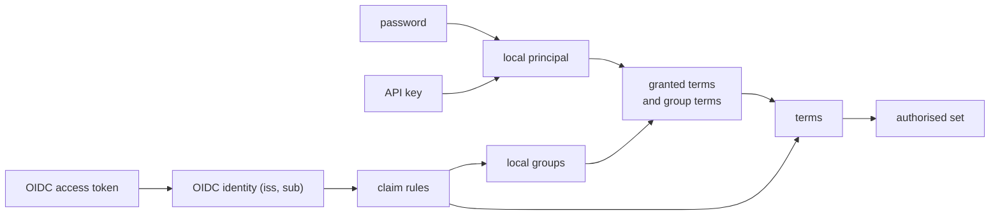
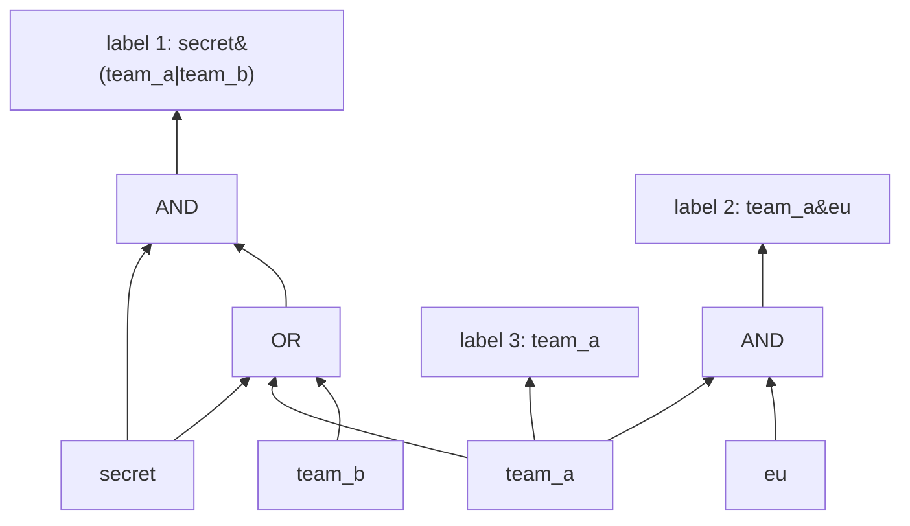

# Users, credentials and access expressions

A design proposal. Nothing in it is built. The service as built is described in
[system/access-control.md](system/access-control.md): three listeners, each gated by a shared
secret or a token, and a built-in plugin that passes a credential's terms through unchanged. This
note proposes what replaces that: principals stored by Tessera, standard ways to authenticate
them, permissions for what a principal may do, and Accumulo-style access expressions for what a
principal may see.

## Decisions

| Question | Decision |
|---|---|
| How a viewer authenticates | OIDC access tokens, local passwords, and API keys. An OIDC provider is optional. |
| Where identity data lives | A catalogue in SQLite, beside the bundle and independent of it. |
| What a principal may do | Four permissions over the whole database: `read`, `write`, `authorise-as`, `admin`. They are separate from terms. |
| What a principal may see | Terms, granted to local principals and groups, or derived from OIDC claims. |
| Access labels | Accumulo visibility expressions, without negation. The empty expression is refused, and `public` is reserved. |
| How labels are indexed | Each distinct label gets a label id. A label that is a disjunction of terms is indexed under each of its terms. Any other label is indexed under its label id, compiled into a shared expression DAG and evaluated bottom-up from a credential's terms. |
| The plugin | Removed. |
| OIDC users | Not stored. Claims map to terms and to local groups at each authorise. Permissions come only from rules that name a fixed local group. |
| A grant changes, or a password is set or cleared | Every session of every affected principal ends. |
| Writes to items the writer cannot see | Masked by the writer's own terms. A principal flagged `bypass` acts on the whole corpus. |
| A masked insert collides on a unique field with an item the writer cannot see | The collision is reported, as Postgres reports it. |
| The first administrator | The operator credential file becomes a built-in superuser. |

## Principals and credentials

A **principal** is who a request acts for. There are three kinds.

- A **local principal** is stored in the catalogue: a person or a service, with a name and a
  disabled flag.
- An **OIDC identity** is named by its issuer and subject, `(iss, sub)`. Tessera does not store it.
  Each authorise derives its terms and groups from the token's claims.
- The **superuser** is the holder of the operator credential. It is described under
  [Bootstrap](#bootstrap).

A principal proves who it is with one of three credentials.

| Credential | Held by | How Tessera checks it | What is stored |
|---|---|---|---|
| Password | Local person | argon2id against the stored hash. A password shorter than the configured minimum is refused when it is set. Failed attempts are limited per name presented. Accepted over TLS only. | The argon2id hash. |
| API key | Local person or service | A random secret with a public id prefix. The prefix finds the record and the secret is compared by SHA-256 in constant time. A key can carry an expiry and a narrower set of permissions than its principal. | The prefix, the hash, the expiry and the permissions. The secret is shown once, at creation. |
| OIDC access token | OIDC identity | The signature against the provider's published keys (JWKS), then issuer, audience, expiry and not-before. | The provider's configuration only. Validating a token needs no stored secret. |

An API key's secret carries enough entropy that a stolen hash cannot be reversed by guessing, so a
fast hash is enough. A password carries far less, so it takes argon2id.

A provider's JWKS URL uses `https`, or `http` to a loopback address (`localhost`, `127.0.0.1` or
`::1`). Any other `http` URL is refused when the provider is declared, because anyone on the network
path could substitute the keys and then sign a token for any identity. Setting the environment
variable `TESSERA_ALLOW_INSECURE_JWKS=1` accepts it, for a development provider on a private
network.

## The catalogue

The catalogue holds everything about identity and permission. It lives in a SQLite database in a
directory the operator configures, outside the bundle. Identity has a different lifetime from the
corpus: a rebuild creates a new bundle with a new identity key, and users, keys and grants carry
across it unchanged. Postgres divides its catalogues the same way, with roles in a catalogue shared
by the whole cluster.

It holds:

- local principals, with their password hashes and API keys;
- local groups and their members;
- the terms granted to each principal and each group;
- the permissions granted to each principal and each group, and the `bypass` flag;
- each OIDC provider declared through the API: issuer, audience, JWKS location, and the rules that
  map claims to terms and to local groups. A provider can also be declared in `tessera.toml`
  ([Surfaces](#surfaces)).

It does not hold sessions, which stay in memory, or the audit log, which is append-only and kept
separately.

The whole catalogue is loaded into memory at start, and no request reads SQLite. A change commits
to SQLite first, then updates the in-memory copy, then ends the sessions the change affects
([Sessions](#sessions)). A change that fails to commit changes nothing. SQLite supplies atomic
commit, recovery from a crash, and an integrity check, which a log written for this purpose would
have to reimplement. The file holds hashes and no reversible secret, and is created readable by the
service's user alone.

Every catalogue change can be made through the HTTP API, the TypeScript client, the Python client
and the CLI, and survives a restart.

## Permissions

A permission says what a principal may do. It applies to the whole database and is independent of
terms, which say what a principal may see.

| Permission | Allows |
|---|---|
| `read` | Authorising a session for itself, and every viewer request made with that session's token. |
| `write` | Insert, delete, suppress, unsuppress and annotate. Declaring, changing and dropping views, layers and attributes. All of it is masked by the principal's own terms ([Writes](#writes)). |
| `authorise-as` | Authorising a session for another principal: a named local principal, or an OIDC identity whose token the caller passes on. |
| `admin` | Every change to the catalogue. |

The four are independent. `admin` implies neither `read` nor `write`, so an account that manages
users can be one that sees nothing. The superuser ([Bootstrap](#bootstrap)) holds all four.

`authorise-as` is the permission an integrator's backend holds. It replaces the session credential.
A session it mints for a principal carries that principal's terms, and that principal's `read` and
`write`. A viewer who may annotate can therefore annotate through the integrator's application,
and the write is recorded as that viewer's. Postgres's `SET ROLE` and Elasticsearch's `run_as`
also give the caller the target's privileges. The session never carries the target's `admin`,
`authorise-as` or `bypass`, so a compromised backend can act as any viewer and cannot change who
exists, what they are granted, or write outside a viewer's terms.

`bypass` is a flag on a principal. A principal with `write` and `bypass` writes against the whole
corpus. It is intended for ingest pipelines that authenticate as themselves.

## From a credential to terms

The result of authenticating is a principal and a set of terms: the authorisations its session
holds.

- A local principal's terms are those granted to it directly, together with those granted to each
  group it belongs to.
- An OIDC identity's terms come from its provider's claim rules. A rule reads a claim and produces
  terms, or names a local group whose granted terms are then added. For example, a rule
  `groups[*] -> group:{value}` turns a `groups` claim of `["analysts", "eu"]` into the terms
  `group:analysts` and `group:eu`. A rule `tid -> local group tenant-{value}` adds the terms granted
  to the local group `tenant-7f3a`.
- A rule whose target is a template, holding `{value}`, reaches terms only: a term it produces, or
  the terms of the local group it names. The template must hold literal text beside `{value}`, so
  that a claim value cannot produce a bare name that collides with a local group made by hand or
  with `public`.
- An OIDC identity's permissions come only from a rule that names a fixed local group and the claim
  value it requires, such as `groups[*] == "tessera-admins" -> local group admins`. The identity
  receives that group's terms and permissions, except `bypass`. A claim value can therefore select
  a group that an administrator has named, and cannot choose a group by its own spelling. Vault's
  group aliases, Grafana's role mapping and Kubernetes role bindings each map an external group to
  an internal role explicitly in the same way. Where a provider can put stable group ids in its
  tokens, as Entra ID does, a rule should match the id: a display name can be chosen by whoever
  creates the group.

*How each kind of credential reaches a set of terms.*

## Access expressions

An access label is an Accumulo visibility expression over terms: `secret&(team_a|team_b)`. The
grammar is the one the `accumulo-access` project specifies.

- A term is written bare when it consists of letters, digits and `_ - . : /`. Any other term is
  written in double quotes, with `\"` and `\\` as escapes.
- `&` is conjunction and `|` is disjunction. Mixing the two needs brackets: `a&b|c` is refused and
  `(a&b)|c` is accepted.
- There is no negation. A label is therefore monotone: a principal holding more terms sees a
  superset of what a principal holding fewer sees. The authorised set's validity for a whole
  session, and the rule that a filter can hide and never reveal, both depend on this.

An expression is written wherever a label is written: an item's access column at a build and at
ingest, a view's `visibility`, an annotation layer's `visibility`, and a default. One parser reads
all of them, below both the build and the ingest paths.

- The empty expression is refused.
- `public` is a reserved word, written as the whole expression. It admits every viewer who can
  reach the view. It is refused inside a larger expression, where `public|x` would mean `public`
  and `public&x` would mean `x`. Every session holds it. A term that equals `public` ignoring case
  is refused wherever a term is written, in a label, a grant or a claim rule's output, so that
  `Public` cannot be mistaken for it.
- A term or a principal or group name that holds a control character is refused. Terms and names
  are otherwise compared exactly, after trimming, and are case-sensitive.
- `inherited` keeps its meaning for an annotation artifact with no label of its own: the artifact
  is gated by its layer's `visibility` and membership requirement, and its members and counts are
  still computed inside the viewer's visible set
  ([annotations](system/annotations.md)). It is refused everywhere else.

In the DAG below, `public` is a leaf that every session holds.

### Label ids

Each distinct label, after normalisation, gets a **label id**, and each item carries exactly one.
The label id is the item's permission signature: the build sorts entity ids by it, so the items
that share a label form one contiguous range. Item cards, masked writes and compaction read it.

Which postings an item appears in depends on the label's shape.

- A **disjunction of terms**, such as `user:ann|user:bob|group:x` or a single term, is indexed
  under each of its terms, as terms are indexed today. Holding any one of them admits the item, so
  the union of the held terms' postings is exactly the set these labels admit. Per-document sharing
  produces labels of this shape.
- **Any other label**, one holding a conjunction, is indexed under its label id and evaluated
  through the DAG below.

A probe of the two layouts measured authorise on a corpus of 9.3 million per-document labels at
100 to 800 ms through the DAG and 1.4 to 95 ms through term postings, and on 500,000 compartmented
labels at 20 to 95 ms through the DAG, which term postings cannot express
([probe](../probes/2026-09-30-label-dag-authorise/results.md)). Indexing each label by its shape
takes the faster figure for each.

Normalisation flattens nested conjunctions and disjunctions, sorts and removes duplicate operands,
and applies absorption, so that `a|(a&b)` becomes `a`. Two equivalent labels that normalise
differently get two label ids and evaluate identically. Normalisation therefore saves space and
affects no access decision.

Label ids are internal, as term ids are, and no response carries one. A compaction retires a label
id whose items have all been removed.

### The expression DAG

Every label is compiled into one shared directed acyclic graph. A leaf is a term. An inner node is
an AND or an OR over its children. Structurally identical subexpressions are one node, so `secret`
appears once however many labels mention it. Each node records its parents, and each label id
points at its root node.

*Three labels sharing the leaves `secret` and `team_a`.*

The DAG's size is linear in the total size of the distinct expressions, so an expression with many
disjuncts costs space in proportion to its length. Converting to disjunctive normal form would cost
space exponential in the number of disjuncts. A label longer than a configured number of nodes is
refused when it is written, with the count in the message.

### Authorising

At authorise, the service marks each of the credential's terms true and propagates upwards. An OR
node becomes true when its first child does. An AND node keeps a count and becomes true when every
child has. The authorised set is the union of the postings of every label whose root became true.

The DAG holds only the labels indexed under a label id. The authorised set is the union of the
postings of the credential's terms and of the labels whose root became true.

The pass visits only the nodes reachable from the credential's terms. A label that mentions none of
them cannot be true, because the expressions have no negation, so it is never visited. The cost is
proportional to the part of the DAG the credential reaches. This matters most for a corpus where
nearly every item has its own label, such as documents each shared with a few named people: a
principal's pass visits only the labels that name it.

Measured on a model, one thread: 3 to 15 ms at 100,000 compartmented labels and 20 to 95 ms at
500,000, for credentials holding 10 to 1,000 terms. Authorise runs once per session, so these
figures are paid at session start and never by a map request.

### What changes elsewhere

- A label created by ingest after a session authorised is evaluated against that session's stored
  terms by the background refresh, and joins its authorised set if true. A term unknown at
  authorise then widens the session once it appears.
- An item card shows, of the item's label, one clause the viewer satisfies. Walking the true nodes
  from the label's root gives it. The card never shows the whole expression, which could name terms
  the viewer does not hold.
- Containment for cluster labels reasons about sets of entities and their signatures, and applies
  unchanged with label ids as the signatures.
- The plugin trait in `tessera-plugin` is removed. The two functions it held become the parser on
  the item side and the catalogue on the credential side. Both use one vocabulary, so the service
  can report terms that some label names and no grant or claim rule can produce, and the reverse.
- The bundle's format changes and its version is bumped.

## Sessions

A token is a random bearer string, as it is today. The session behind it records the principal,
local or `(iss, sub)`, and the terms it resolved to.

Any catalogue change that could change a principal's terms or permissions ends every session of
every principal it affects. This includes changes that widen access. The affected clients receive
`403 expired-token` and authorise again. The changes are:

- a term or a permission granted to or removed from a principal or a group;
- a principal added to or removed from a group;
- a principal disabled or deleted;
- a password set or cleared;
- an API key revoked, which ends the sessions authorised with that key;
- a change to an OIDC provider's configuration or claim rules, which ends every session authorised
  through that provider.

An OIDC identity's grants come from its token, which Tessera cannot see change. Its sessions end
when the token lifetime configured in `token_max_lifetime` passes, or when its provider's
configuration changes.

Deletion and suppression apply to open sessions exactly as they do today, through the overlay.

## Writes

A write is masked by the writer's own terms unless the writer has `bypass`.

- Deleting, suppressing or unsuppressing an item whose label the writer does not satisfy returns
  the answer for an item that does not exist, and does the same work.
- Inserting an item, or publishing an annotation, with a label the writer does not satisfy is
  refused, and the message says which label.
- Declaring a view or a layer with a `visibility` the writer does not satisfy is refused in the same
  way. Changing or dropping a view or a layer the writer cannot reach returns the answer for one
  that does not exist.
- An insert whose unique field collides with an item the writer cannot see is refused as a
  collision. The refusal tells the writer that an item with that value exists, and nothing else
  about it. Postgres's row-level security has the same property and documents it. Scoping
  uniqueness to what each writer can see would let two items share a value that is meant to
  identify one.

Checking a write evaluates each affected item's label against the writer's terms, from the label's
root node upwards, so the writer's authorised set is never built.

## Bootstrap

The operator credential, read from the file or environment variable named in `tessera.toml`,
authenticates a built-in superuser that has every permission and `bypass`. The superuser is not in
the catalogue. The API cannot disable it or change its credential. Changing the file and restarting
rotates it. An empty catalogue therefore still has an administrator, who creates the first local
principals and grants.

## Surfaces

The HTTP API gains the catalogue's verbs first, and the TypeScript client, the Python client and
the CLI each reach all of them:

- create, disable and delete a local principal, and set its password;
- create and revoke an API key;
- create and delete a group, and add and remove members;
- grant and revoke terms and permissions, and set `bypass`;
- declare, change and remove an OIDC provider and its claim rules;
- list a principal's sessions, and end them.

An OIDC provider can also be declared in `tessera.toml`, so that a service starts with it in
place. A provider declared there is read-only: the API lists it and refuses to change or remove
it, and editing the file and restarting changes it. The service refuses to start when a provider's
name is declared both in the file and in the catalogue.

## Listeners

The three listeners stay, and each accepts the credentials of the callers it serves.

| Listener | Accepts | Serves |
|---|---|---|
| Viewer | A session token. A password, an API key or an OIDC access token at the login endpoint, which returns a session token. | Viewer requests, and writes made with a session token that carries `write`. |
| Session | A principal with `authorise-as`, by API key. | `POST /session/authorise`, naming the principal to authorise, and `POST /session/revoke`. |
| Control | An API key, or the operator credential. | Writes, and the catalogue's verbs. |

The session listener stays separate because the credential that reaches it acts as any viewer. It
belongs to an integrator's backend and is not exposed to a browser.

## Audit

Each authorise, each refused authentication and each catalogue change is appended to an audit log
kept outside the catalogue. An authorise record holds the time, the principal, the kind of
credential and the API key's prefix where there is one, the listener, and the number of terms the
session resolved to. It does not hold the terms, which can themselves be sensitive. A catalogue
change records who made it and what it changed.

## Limits

- An expression may hold at most a configured number of DAG nodes, 1,024 by default. Adding a label
  to the DAG costs time quadratic in its length: the probe measured 15.7 ms at 1,024 nodes and
  8.1 s at 16,384. The longest label in the probe's corpora held 66.
- A password is at least a configured number of characters long, fifteen by default, the length
  NIST SP 800-63B requires for a password that is the only factor. No composition rule is applied.
- Ten failed password attempts for one name within fifteen minutes refuse further attempts for that
  name until the fifteen minutes have passed. A refused attempt answers as a wrong password does.
  Both numbers are configurable.

## Where the code lives

A new crate, `tessera-catalogue`, holds the SQLite catalogue, credential checks and the mapping
from a principal to its terms and permissions. It depends on nothing that can see a row id or an
entity id, and `scripts/check-layers.sh` denies it `tessera-store`, `tessera-authz` and
`tessera-engine`. The server depends on it and hands the engine a set of terms. The expression
parser, normalisation and the DAG belong in `tessera-authz`, beside the index they replace.
`tessera-plugin` is deleted.
