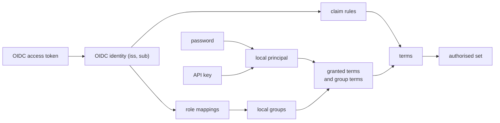
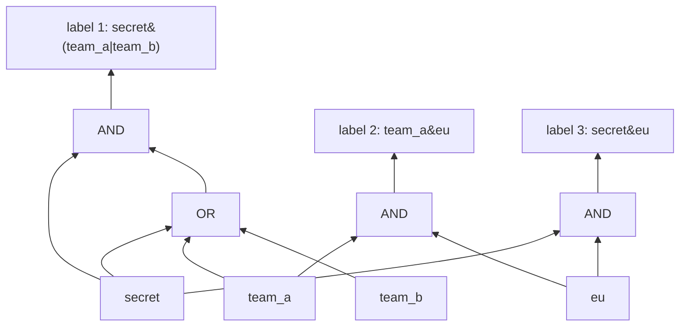

# Users, credentials and access expressions

A design note, part built. It proposes principals stored by Tessera, standard ways to
authenticate them, permissions for what a principal may do, and Accumulo-style access expressions
for what a principal may see. The catalogue, the three listeners' credentials, sessions and their
ending, the catalogue's verbs over HTTP, the CLI and the TypeScript and Python clients, access
expressions and their index, and the removal of the plugin are built, and
[system/access-control.md](system/access-control.md) describes them; where the build differs from
this note, the note says so at the claim. **Not built yet:** writes masked by the writer's terms,
writes with a session token on the viewer listener, and the audit log. Until masked writes are
built, a principal with `write` writes against the whole corpus whether or not it holds
`write-all`. While writes are unmasked, a principal with `write` can upsert an item it cannot see,
by its unique value, and change its label. Granting `write` therefore grants what `read-all`
grants wherever a view has a unique field.

## Decisions

| Question | Decision |
|---|---|
| How a viewer authenticates | OIDC access tokens, local passwords, and API keys. An OIDC provider is optional. |
| Where identity data lives | A catalogue in SQLite, beside the bundle and independent of it. |
| What a principal may do | Six permissions over the whole database: `read`, `write`, `authorise-as`, `admin`, `read-all` and `write-all`. They are separate from terms. |
| What a principal may see | Terms, granted to local principals and groups, or derived from OIDC claims. |
| Access labels | Accumulo visibility expressions, without negation. The empty expression is refused, and `public` is reserved. |
| How labels are indexed | Each distinct label gets a label id. A label that is a disjunction of terms is indexed under each of its terms. Any other label is indexed under its label id, compiled into a shared expression DAG and evaluated bottom-up from a credential's terms. |
| The plugin | Removed. |
| OIDC users | Not stored. Claim rules turn claims into terms at each authorise. An administrator maps exact terms to local groups, which give their permissions and terms. |
| A grant changes, or a password is set or cleared | Every session of every affected principal ends. |
| Writes to items the writer cannot see | Masked by the writer's own terms. A principal holding `write-all` acts on the whole corpus. Not built yet: the mask. Every writer acts on the whole corpus, and can upsert an item it cannot see by its unique value and change its label. |
| A masked insert collides on a unique field with an item the writer cannot see | The collision is reported, as Postgres reports it. |
| The first administrator | The operator credential file becomes a built-in superuser. |

## Principals and credentials

A **principal** is who a request acts for. There are three kinds.

- A **local principal** is stored in the catalogue: a person or a service, with a name and a
  disabled flag.
- An **OIDC identity** is named by its issuer and subject, `(iss, sub)`. Tessera does not store it.
  Each authorise derives its terms and groups from the token's claims.
- The **superuser** is the holder of the operator credential. It is described under
  [Bootstrap](#bootstrap).

A principal proves who it is with one of three credentials.

| Credential | Held by | How Tessera checks it | What is stored |
|---|---|---|---|
| Password | Local person | argon2id against the stored hash. A password shorter than the configured minimum is refused when it is set. Failed attempts are limited per name presented. The server accepts it over plain HTTP, so a deployment that takes passwords terminates TLS in front of the viewer listener. | The argon2id hash. |
| API key | Local person or service | A random secret with a public id prefix. The prefix finds the record and the secret is compared by SHA-256 in constant time. A key can carry an expiry and a narrower set of permissions than its principal. | The prefix, the hash, the expiry and the permissions. The secret is shown once, at creation. |
| OIDC access token | OIDC identity | The signature against the provider's published keys (JWKS), then issuer, audience, expiry and not-before, and the `typ` header where it is present. | The provider's configuration only. Validating a token needs no stored secret. |

An API key's secret carries enough entropy that a stolen hash cannot be reversed by guessing, so a
fast hash is enough. A password carries far less, so it takes argon2id.

Password checks have their own admission limit: as many at once as the service has compute
threads, which is one per core unless configured otherwise, and as many again waiting. A check
past that is answered `429` with `Retry-After`, before the name is looked up, so an unknown name
meets the same limit, the same work and the same answer as a known one. The service's blocking
thread pool is sized to hold these checks beside every admitted viewer and ingest request, so a
flood of logins cannot take the threads those requests need.

An access token is refused when its JOSE header carries a `typ` other than `JWT`, `at+jwt` or
`application/at+jwt`, compared without regard to case. RFC 9068 types an access token `at+jwt`.
Other typed JWTs, such as a logout token (`logout+jwt`), are refused. An OpenID Connect ID token
usually carries `typ: JWT` or no `typ`, so the header cannot tell it apart from an access token.
What refuses it is the audience: an ID token's `aud` is the client's id, so a provider whose
`audience` names the API, and not a client, refuses it. A deployment that sets `audience` to a
client id accepts that client's ID tokens as access tokens.

Two providers may not have the same issuer and audience. A token from either would verify against
both, and which claim rules and role mappings applied would depend on the order the providers
were tried in. One rule in the catalogue refuses such a provider, whether it is declared through
the API or in `tessera.toml`. Providers with the same issuer and different audiences are allowed,
and a token whose `aud` names more than one of their audiences is refused, because nothing in it
says which provider's rules apply.

A provider's JWKS URL uses `https`, or `http` to a loopback address (`localhost`, `127.0.0.1` or
`::1`). Any other `http` URL is refused when the provider is declared, because anyone on the network
path could substitute the keys and then sign a token for any identity. Setting the environment
variable `TESSERA_ALLOW_INSECURE_JWKS=1` accepts it, for a development provider on a private
network.

The service fetches a provider's keys when a token first needs them and keeps them for an hour. A
token naming a key the held set lacks fetches the set again. Each URL is fetched at most once
every ten seconds, and one fetch at a time; a fetch completes and stores its keys even when the
request that started it has gone away. When a refetch fails, the keys of the last successful fetch
stay in use until they are 24 hours old. After that, every token of that provider is refused until
a fetch succeeds, so a key the provider has withdrawn is not trusted indefinitely while its JWKS
URL is unreachable.

## The catalogue

The catalogue holds everything about identity and permission. It lives in a SQLite database in a
directory the operator configures, outside the bundle. Identity has a different lifetime from the
corpus: a rebuild creates a new bundle with a new identity key, and users, keys and grants carry
across it unchanged. Postgres divides its catalogues the same way, with roles in a catalogue shared
by the whole cluster.

It holds:

- local principals, with their password hashes and API keys;
- local groups and their members;
- the terms granted to each principal and each group;
- the permissions granted to each principal and each group;
- each OIDC provider declared through the API: issuer, audience, JWKS location, and the rules that
  turn claims into terms, and the role mappings from exact claim values to local groups. A
  provider can also be declared in `tessera.toml` ([Surfaces](#surfaces)).

It does not hold sessions, which stay in memory, or the audit log, which is append-only and kept
separately.

The whole catalogue is loaded into memory at start, and no request reads SQLite. A change commits
to SQLite first, then updates the in-memory copy, then ends the sessions the change affects
([Sessions](#sessions)). A change that fails to commit changes nothing. SQLite supplies atomic
commit, recovery from a crash, and an integrity check, which a log written for this purpose would
have to reimplement. The file holds hashes and no reversible secret, and is created readable by the
service's user alone.

Every catalogue change can be made through the HTTP API, the TypeScript client, the Python client
and the CLI, and survives a restart.

## Permissions

A permission says what a principal may do. It applies to the whole database and is independent of
terms, which say what a principal may see.

| Permission | Allows |
|---|---|
| `read` | Authorising a session for itself, and every viewer request made with that session's token. |
| `write` | Insert, delete, suppress, unsuppress and annotate. Declaring, changing and dropping views, layers and attributes. Flushing and compacting. All of it is masked by the principal's own terms ([Writes](#writes)). Not built yet: the mask, so a write acts on the whole corpus. While writes are unmasked, a principal with `write` can upsert an item it cannot see, by its unique value, and change its label. Granting `write` therefore grants what `read-all` grants wherever a view has a unique field. |
| `authorise-as` | Authorising a session for another principal: a named local principal, or an OIDC identity whose token the caller passes on. |
| `admin` | Every change to the catalogue, and the service's status. |
| `read-all` | With `read`, a session whose authorised set is every item and which satisfies every label. |
| `write-all` | With `write`, writes against the whole corpus, unmasked. |

The six are independent. `admin` implies neither `read` nor `write`, so an account that manages
users can be one that sees nothing. `read-all` and `write-all` widen `read` and `write` and do
nothing alone. All six are granted to a principal or a group in the same way, and an OIDC identity
receives them through a role mapping as it receives any other. The superuser
([Bootstrap](#bootstrap)) holds all six.

`admin` can grant any permission to any principal, itself included, so a principal holding
`admin` can make itself hold `read-all` and `write-all`. `admin` is therefore equivalent to every
permission, and is granted as such.

A session holding `read-all` holds no terms and satisfies every index key, including one a flush
promotes after the session was authorised. Its authorised set is the union of every posting at
the corpus's current watermark, rebuilt at each publication as every session's set is brought
forward, so an item placed under a new term or a new label joins it when that publication
reaches the session. Every `read-all` session at one watermark shares one cached union. The
visible set is that union minus the overlay, so a deletion or a suppression applies to it as to
any session. It satisfies every view's, group's, layer's and artifact's own label and every
layer's default label, including a label no item carries, and an artifact's membership
requirement still applies. Its item card shows, of each label, what a session holding every term
is shown.

Flushing and compacting need `write`, as a write does, because a write sent with `?wait=visible`
flushes. They do not need `admin`, so an ingest pipeline, which ends a commit with a flush, holds
`write` and nothing more. The service's status needs `admin`.

`authorise-as` is the permission an integrator's backend holds. It replaces the session credential.
A session it mints for a principal carries that principal's terms, and that principal's `read` and
`write`. **Not built yet:** writes with a session token, and the audit log. No route takes a
write with a session token, so a viewer cannot annotate through the integrator's application, and
no write is recorded as any viewer's. When both are built, a viewer who may annotate can annotate
through the integrator's application, and the write is recorded as that viewer's. Postgres's `SET ROLE` and Elasticsearch's `run_as`
also give the caller the target's privileges. The session never carries the target's `admin`,
`authorise-as`, `read-all` or `write-all`, so a compromised backend can act as any viewer and
cannot change who exists, what they are granted, read past a viewer's terms, or write outside
them.

A session a principal authorises for itself, at login, carries its `read`, `write`, `read-all`
and `write-all`. No session carries `admin` or `authorise-as`.

## From a credential to terms

The result of authenticating is a principal and a set of terms: the authorisations its session
holds.

- A local principal's terms are those granted to it directly, together with those granted to each
  group it belongs to.
- An OIDC identity's terms come from its provider's claim rules. A claim rule reads a claim and
  produces terms, and does nothing else. The standard rule, `groups[*] -> {value}`, passes each
  value of the `groups` claim through as a term, so a claim of `["analysts", "eu"]` gives the terms
  `analysts` and `eu` and a label is written with the names the identity provider uses. A template
  may add text, as `groups[*] -> group:{value}` does.
- A produced term goes through the same rules as any term. A rule whose template could only
  produce `public`, or holds a control character, is refused when the provider is declared. At
  authorise, a produced term is trimmed, and one that is `public` in any case or holds a control
  character is dropped.
- An administrator declares **role mappings** for a provider: a claim path and an exact value
  mapped to a local group, such as `groups[*]: tessera-admins -> admins`. An identity whose
  `groups` claim holds `tessera-admins` receives the group's permissions and the terms granted to
  it, `read-all` and `write-all` among them where the group holds them. The mapping reads the
  claim itself and ignores the terms the
  claim rules produce. The identity still holds those terms: with the standard rule it also holds
  the term `tessera-admins`. A mapping matches a whole value exactly, and only in the claim it
  names. A `department` claim that users can edit, set to `tessera-admins`, does not match.
  Elasticsearch's role mappings, Vault's group aliases and Grafana's role mapping each match a
  named claim to an internal role in the same way.
- A claim is trusted as the identity provider asserts it. Where users can create or name their
  own groups at the provider, anyone who creates a group called `secret` holds the term `secret`,
  and anyone who creates `tessera-admins` matches a mapping on the `groups` claim. Such a
  deployment maps stable group ids, as Entra ID can put in its tokens, or gives its template a
  prefix so that provider-made terms cannot collide with terms granted locally.

*How each kind of credential reaches a set of terms.*

## Access expressions

An access label is an Accumulo visibility expression over terms: `secret&(team_a|team_b)`. The
grammar is the one the `accumulo-access` project specifies.

- A term is written bare when it consists of letters, digits and `_ - . : /`. Any other term is
  written in double quotes, with `\"` and `\\` as escapes.
- The label as a whole is trimmed. Whitespace inside it is refused between tokens, as Accumulo
  refuses it, and a quoted term is taken exactly as written: `"a "` and `a` are different terms. A
  grant or claim value is trimmed, so a term with leading or trailing whitespace can appear in a
  label and cannot be granted, and an item carrying only such a term is visible to nobody.
- `&` is conjunction and `|` is disjunction. Mixing the two needs brackets: `a&b|c` is refused and
  `(a&b)|c` is accepted.
- There is no negation. A label is therefore monotone: a principal holding more terms sees a
  superset of what a principal holding fewer sees. The authorised set's validity for a whole
  session, and the rule that a filter can hide and never reveal, both depend on this.

An expression is written wherever a label is written: an item's access column at a build and at
ingest, a view's `visibility`, an annotation layer's `visibility`, and a default. One parser reads
all of them, below both the build and the ingest paths.

- The empty expression is refused.
- `public` is a reserved word, written as the whole expression. It admits every viewer who can
  reach the view. It is refused inside a larger expression, where `public|x` would mean `public`
  and `public&x` would mean `x`. Every session holds it. A term that equals `public` ignoring case
  is refused in a label, a grant or a claim rule's template, and dropped from a claim value at
  authorise, so that `Public` cannot be mistaken for it.
- A term or a principal or group name that holds a control character is refused. Terms and names
  are otherwise compared exactly, after trimming, and are case-sensitive.
- `inherited` keeps its meaning for an annotation artifact with no label of its own: the artifact
  is gated by its layer's `visibility` and membership requirement, and its members and counts are
  still computed inside the viewer's visible set
  ([annotations](system/annotations.md)). It is refused everywhere else.

An item labelled `public` is in every session's authorised set, and the label never enters the
DAG.

### Label ids

Each distinct label, after normalisation, gets a **label id**, and each item carries exactly one.
The label id is the item's permission signature: the build sorts entity ids by it, so the items
that share a label form one contiguous range. Item cards, masked writes and compaction read it.

Which postings an item appears in depends on the label's shape.

- A **disjunction of terms**, such as `user:ann|user:bob|group:x` or a single term, is indexed
  under each of its terms, as terms are indexed in the current system. Holding any one of them admits the item, so
  the union of the held terms' postings is exactly the set these labels admit. Per-document sharing
  produces labels of this shape.
- **Any other label**, one holding a conjunction, is indexed under its label id and evaluated
  through the DAG below.

A probe of the two layouts measured authorise on a corpus of 9.3 million per-document labels at
100 to 800 ms through the DAG and 1.4 to 95 ms through term postings, and on 500,000 compartmented
labels at 20 to 95 ms through the DAG, which term postings cannot express
([probe](../probes/2026-09-30-label-dag-authorise/results.md)). Indexing each label by its shape
takes the faster figure for each.

Normalisation flattens nested conjunctions and disjunctions, sorts and removes duplicate operands,
and applies absorption, so that `a|(a&b)` becomes `a`. Two equivalent labels that normalise
differently get two label ids and evaluate identically. Normalisation therefore saves space and
affects no access decision.

Label ids are internal, as term ids are, and no response carries one. A compaction retires a label
id whose items have all been removed.

**As built:** an item carries a list of labels, as the access column and `access` always allowed,
and admits a principal who satisfies any one of them. It is indexed under the union of its labels'
keys: each term of a disjunction of terms, and one key of its own for each label holding a
conjunction, whose dictionary ordinal is that label's id. The permission signature is the item's
sorted set of keys, so two items share a signature exactly when their labels give them the same
keys. The DAG is derived from those keys in the dictionary, and nothing else stores it. **Not
built yet:** retiring a key at compaction; the dictionary keeps every key it has issued.

### The expression DAG

Every label that holds a conjunction is compiled into one shared directed acyclic graph. A leaf is a term. An inner node is
an AND or an OR over its children. Structurally identical subexpressions are one node, so `secret`
appears once however many labels mention it. Each node records its parents, and each label id
points at its root node.

*Three labels sharing the leaves `secret`, `team_a` and `eu`.*

The DAG's size is linear in the total size of the distinct expressions, so an expression with many
disjuncts costs space in proportion to its length. Converting to disjunctive normal form would cost
space exponential in the number of disjuncts. A label that holds a conjunction and is longer than a
configured number of nodes is
refused when it is written, with the count in the message. **Not built yet:** configuring the
number; it is 1,024.

### Authorising

At authorise, the service marks each of the credential's terms true and propagates upwards through
the DAG. An OR node becomes true when its first child does. An AND node keeps a count and becomes
true when every child has. The authorised set is the union of the postings of the credential's
terms, which admit every item whose label is a disjunction of terms, and the postings of every
label in the DAG whose root became true.

The pass visits only the nodes reachable from the credential's terms. A label that mentions none of
them cannot be true, because the expressions have no negation, so it is never visited. The cost is
proportional to the part of the DAG the credential reaches, and to the number of labels that
become true: each true label adds its own postings. That second cost is why labels that are
disjunctions of terms, such as per-document sharing where nearly every item has its own label, are
kept out of the DAG.

Measured on a model, one thread, as medians: 3 to 15 ms at 100,000 compartmented labels and 20 to
95 ms at 500,000, for credentials holding 10 to 1,000 terms, with a p99 of up to 170 ms. Authorise runs once per session, so these
figures are paid at session start and never by a map request.

### What changes elsewhere

- A label created by ingest after a session authorised is evaluated against that session's stored
  terms by the background refresh, and joins its authorised set if true. A term unknown at
  authorise then widens the session once it appears. **Not built yet:** the session keeps the keys
  it resolved at authorise, so it sees less than its terms admit until it authorises again, never
  more. The engine can tell, from the keys promoted since, whether a session is behind, and
  nothing outside its tests asks.
- An item card shows each held term of the item's labels that are a single term or a disjunction
  of terms, and, for each of its labels holding a conjunction that the viewer satisfies, one clause
  of it in held terms: at each disjunction the satisfied operand with fewest terms, then the first
  in byte order (built). A held term that appears only inside a conjunction is not shown on its
  own. The card never shows the whole of such a label, which could name terms the viewer does not
  hold.
- Containment for cluster labels reasons about sets of entities and their signatures, and applies
  unchanged with label ids as the signatures.
- The plugin trait in `tessera-plugin` is removed (built). The two functions it held become the
  parser on the item side and the catalogue on the credential side. Both use one vocabulary, so the service
  can report terms that some label names and no grant or claim rule can produce, and the reverse.
- The bundle's format changes and its version is bumped (built: 30, and the WAL's 32).
- Pages in `docs/system/` that this note changes, and which are rewritten when it is built:
  - [write-path](system/write-path.md), where an item's permission signature is its sorted list of
    terms. Here it is the label id.
  - [access-control](system/access-control.md), which says the service never refreshes a grant on
    its own. Here a catalogue change ends the affected sessions.
  - [security](system/security.md), whose control plane is trusted with every item. Here writers are
    principals masked by their own terms, and the unique-field rule under [Writes](#writes) replaces
    its rule that a lookup by value answers an invisible holder as absent.

## Sessions

A token is a random bearer string, as it is in the current system. The session behind it records the principal,
local or `(iss, sub)`, and the terms it resolved to.

Any catalogue change that could change a principal's terms or permissions ends every session of
every principal it affects. This includes changes that widen access. The affected clients receive
`403 expired-token` and authorise again. The changes are:

- a term or a permission granted to or removed from a principal or a group;
- a principal added to or removed from a group;
- a principal disabled or deleted;
- a password set or cleared;
- an API key revoked, which ends every session authorised with that key, including the sessions an
  integrator minted for other principals through `authorise-as` with it;
- a change to an OIDC provider's configuration, claim rules or role mappings, or to the terms or
  permissions of a local group one of its role mappings names, which ends every session authorised
  through that provider.

A session never outlives what authorised it. A session authorised with an API key that has an
expiry ends when the key expires. An OIDC identity's grants come from its token, which Tessera
cannot see change, so its session ends at the token's own expiry (`exp`), at the lifetime
configured in `tessera.toml`'s `token_max_lifetime` if that is sooner, or when its provider's
configuration changes.

Deletion and suppression apply to open sessions through the overlay, as they do in the current
system.

## Writes

A write is masked by the writer's own terms unless the writer holds `write-all`. **Not built
yet:** the mask. A principal with `write` writes against the whole corpus whether or not it holds
`write-all`, and every rule in this section is the design for masked writes. A write is therefore
trusted with every item, as the operator is. While writes are unmasked, a principal with `write`
can upsert an item it cannot see, by its unique value, and change its label. Granting `write`
therefore grants what `read-all` grants wherever a view has a unique field.

- Deleting, suppressing or unsuppressing an item whose label the writer does not satisfy returns
  the answer for an item that does not exist, and does the same work.
- Inserting an item, or publishing an annotation, with a label the writer does not satisfy is
  refused, and the message says which label.
- Declaring a view or a layer with a `visibility` the writer does not satisfy is refused in the same
  way. Changing or dropping a view or a layer the writer cannot reach returns the answer for one
  that does not exist.
- An insert whose unique field collides with an item the writer cannot see is refused as a
  collision. It is never treated as an update of that item, and the refusal carries no
  `tessera_id`. It tells the writer that an item with that value exists, and nothing else about it.
  Postgres's row-level security has the same property and documents it. Scoping uniqueness to what
  each writer can see would let two items share a value that is meant to identify one.
- Declaring a view or a layer under a name that a view or layer the writer cannot reach already
  holds is refused as a collision in the same way.

Checking a write evaluates each affected item's label against the writer's terms, from the label's
root node upwards, so the writer's authorised set is never built.

## Bootstrap

The operator credential, read from the file or environment variable named in `tessera.toml`,
authenticates a built-in superuser that has every permission, `read-all` and `write-all`
included. The superuser is not in the catalogue. The API cannot disable it or change its
credential. Changing the file and restarting rotates it. An empty catalogue therefore still has an
administrator, who creates the first local principals and grants. The service refuses to start
when the credential is empty or holds only white space, since an empty bearer would then
authenticate as the superuser.

On the session listener the operator credential has two forms of its own, which an API key holding
`authorise-as` may not use.

- `{"terms": [...]}` mints a session holding exactly those terms and `read`, for no principal of
  the catalogue. Nothing is stored, so no catalogue change ends it. A local operator uses it to
  read as a set of terms without creating principals.
- `{"read_all": true}` mints a session of the superuser itself. It carries `read` and `read-all`,
  so its authorised set is every item. The Python client's `db.viewer()` with no terms reads with
  it.

## Surfaces

The HTTP API gains the catalogue's verbs first, and the TypeScript client, the Python client and
the CLI each reach all of them:

- create, disable and delete a local principal, and set its password;
- create and revoke an API key;
- create and delete a group, and add and remove members;
- grant and revoke terms and permissions;
- declare, change and remove an OIDC provider and its claim rules;
- list a principal's sessions, and end them.

An OIDC provider can also be declared in `tessera.toml`, so that a service starts with it in
place. A provider declared there is read-only: the API lists it and refuses to change or remove
it, and editing the file and restarting changes it. The service refuses to start when a provider's
name is declared both in the file and in the catalogue.

## Listeners

The three listeners stay, and each accepts the credentials of the callers it serves.

| Listener | Accepts | Serves |
|---|---|---|
| Viewer | A session token. A password, an API key or an OIDC access token at the login endpoint, which returns a session token. | Viewer requests. Not built yet: writes made with a session token that carries `write`. The viewer listener serves no writes. |
| Session | A principal with `authorise-as`, by API key, or the operator credential. | `POST /session/authorise`, naming the principal to authorise, and with the operator credential a set of terms or the superuser itself, and `POST /session/revoke`. |
| Control | An API key, an OIDC access token, or the operator credential. | Writes, flush and compaction, status, and the catalogue's verbs. |

An OIDC access token on the control listener is checked as it is at login, and its permissions come
from its role mappings, so administration can be granted through single sign-on.

The session listener stays separate because the credential that reaches it acts as any viewer. It
belongs to an integrator's backend and is not exposed to a browser.

## Audit

**Not built yet:** the audit log. Nothing below is recorded. Each authorise, each refused authentication and each catalogue change is appended to an audit log
kept outside the catalogue. An authorise record holds the time, the principal, the kind of
credential and the API key's prefix where there is one, the listener, and the number of terms the
session resolved to. It does not hold the terms, which can themselves be sensitive. A catalogue
change records who made it and what it changed.

## Limits

- An expression that holds a conjunction may hold at most a configured number of DAG nodes, 1,024
  by default. A disjunction of terms never enters the DAG and has no limit. Adding a label
  to the DAG costs time quadratic in its length: the probe measured 0.8 ms at 515 nodes, 15.7 ms at
  2,051 and 8.1 s at 32,771. The longest label in the probe's corpora held 66.
- A password is at least a configured number of characters long, fifteen by default, the length
  NIST SP 800-63B requires for a password that is the only factor. No composition rule is applied.
- Ten failed password attempts for one name within fifteen minutes refuse further attempts for that
  name until the fifteen minutes have passed. A refused attempt answers as a wrong password does.
  Both numbers are configurable. The limit counts attempts per name, from any address, so anyone
  who knows a principal's name can lock it out of password login by sending ten wrong passwords
  every fifteen minutes. The principal's API keys and its sessions are unaffected. Per-address
  limiting is not built.
- Password checks run at most one per compute thread at once, with as many waiting; past that a
  login by password is answered `429`.

## Where the code lives

A new crate, `tessera-catalogue`, holds the SQLite catalogue, credential checks and the mapping
from a principal to its terms and permissions. It depends on nothing that can see a row id or an
entity id, and `scripts/check-layers.sh` denies it `tessera-store`, `tessera-authz` and
`tessera-engine`. The server depends on it and hands the engine a set of terms. The expression
parser and normalisation are in `tessera-types`, and the DAG and the index over labels are in
`tessera-authz` (built). A leaf crate, `tessera-access`, holding the parser and the DAG together,
is not built yet. `tessera-plugin` is deleted (built).
